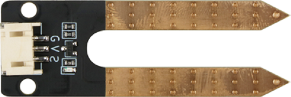
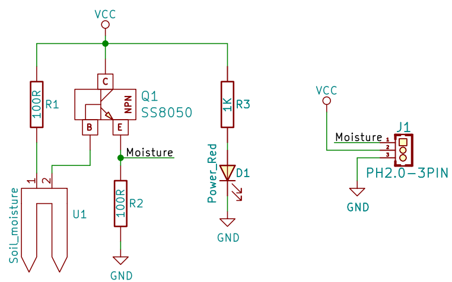
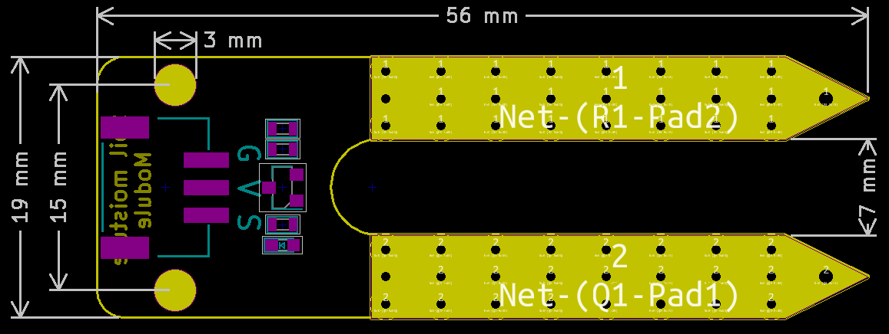

# 土壤湿度传感器规格书

## 实物图



## 概述

​  土壤湿度传感器模块有两个铜条是传感器探头。 将它们插入土壤时，它们可以检测到水分。 土壤湿润，导电性越好，反映出它们之间的电阻越低。土壤干燥,导电性就相对差一点,因此他们之间的电阻越高。 它是模拟传感器，因此我们通过模拟输入获得电压值。因为土壤的湿度可以分为几个等级，当我们使用土壤湿度传感器做一个自动浇花系统的时候，将方便的使用。

## 原理图



<a href="zh-cn/ph2.0_sensors/sensors/soil_moisture_sensor/soil_moisture_schematic.pdf" target="_blank">点击此处查看原理图</a>

## 模块参数

| 引脚名称 |           描述            |
| :------: | :-----------------------: |
|    G     |            GND            |
|    V     |            VCC            |
|    S     | 土壤湿度越湿,模拟值则越大 |

- 供电电压:3v3/5V

- 连接方式:3PIN防反接杜邦线

- 模块尺寸: 56 x 19mm

- 安装方式: M3螺钉固定

## 机械尺寸图



## Arduino示例程序

```c++
void setup() {
  Serial.begin(9600);  // 初始化串口通信
  pinMode(A3, INPUT);  // 设置水深传感器引脚为输入
}

void loop() {
  Serial.print(analogRead(A3));  // 打印水深传感器模拟值
  delay(200);                    // 延时200毫秒
}
```

## MicroPython示例程序

### Esp32 MicroPython示例程序

```python
from machine import ADC,Pin
import time

analog_pin = 15  # 定义水深传感器模拟接口引脚

p1 = ADC(analog_pin)
      
while True:
    analog_value = p1.read_u16()  # 读取水深传感器模拟值
    print("Analog Data:", analog_value)  # 打印水深传感器模拟值
    time.sleep_ms(200)
```

### micro:bit MicroPython示例程序

```python
from microbit import *

analog_pin = pin1  # 定义水深传感器模拟接口引脚

while True:
    analog_value = analog_pin.read_analog()  # 读取水深传感器模拟值
    print( analog_value)  # 打印水深传感器模拟值
    sleep(0.2)
```

## MakeCode示例程序

<a href="https://makecode.microbit.org/_e1XeY08vy2kx" target="_blank">动手试一试</a>
