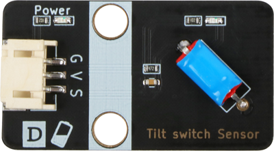
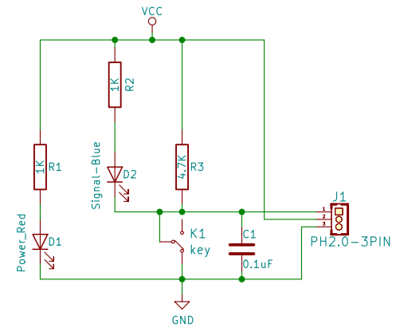

# 四项倾斜开关

## 实物图



## 概述

倾斜开关模块也称为珠形开关，钢球开关，实际上是一种振动开关。它有不同的名称，但工作原理保持不变。滚珠通过与金属板接触或不接触来控制电路的连接或断开。简单地说，就像打开或关闭灯一样，如果开关接触内部的金属板，灯将亮，当开关离开时，灯将熄灭。与金属端子接触或在开关中用小珠子改变光的行进路径将能够产生传导效应。

## 原理图

<a href="zh-cn/ph2.0_sensors/sensors/tilt_switch_sensor/tilt_switch_sensor_schematic.pdf" target="_blank">查看原理图</a>



## 模块参数

| 引脚名称 | 描述         |
| -------- | ------------ |
| G        | GND          |
| V        | VCC          |
| A        | 模拟信号引脚 |
| D        | 数字信号引脚 |

- 供电电压:3v3/5V

- 连接方式:4PIN防反接杜邦线

- 模块尺寸:40 x 22.5 mm

- 安装方式:M4螺钉兼容乐高插孔固定

## 机械尺寸


## Arduino示例程序

<a href="zh-cn/ph2.0_sensors/sensors/tilt_switch_sensor/tilt_switch_sensor.zip" download>下载示例程序</a>

```c++
#define DIGITAL_PIN 7  // 定义倾斜传感器数字引脚
#define ANALOG_PIN A0  // 定义倾斜传感器模拟引脚

int analog_value = 0;   // 定义数字变量,读取倾斜传感器模拟值
int digital_value = 0;  // 定义数字变量,读取倾斜传感器数字值

void setup() {
  Serial.begin(9600);          // 设置串口波特率
  pinMode(DIGITAL_PIN, INPUT);  // 设置倾斜传感器数字引脚为输入
  pinMode(ANALOG_PIN, INPUT);   // 设置倾斜传感器模拟引脚为输入
}

void loop() {
  analog_value = analogRead(ANALOG_PIN);     // 读取倾斜传感器模拟值
  digital_value = digitalRead(DIGITAL_PIN);  // 读取倾斜传感器数字值
  Serial.print("Analog Data:  ");
  Serial.print(analog_value);  // 打印倾斜传感器模拟值
  Serial.print("Digital Data:  ");
  Serial.println(digital_value);  // 打印倾斜传感器数字值
  delay(200);
}
```

## MicroPython示例程序

### Esp32 MicroPython示例程序

```python
from machine import ADC, Pin
import time

analog_pin = 15  # 定义模拟引脚
digital_pin = 14  # 定义数字引脚

p1 = ADC(analog_pin)
p2 = Pin(digital_pin, Pin.IN)

while True:
    analog_value = p1.read_u16()
    print("Analog Data:", analog_value)  # 打印模拟值
    print("Digital Data:", p2.value())  # 打印数字值
    time.sleep_ms(200)
```

### micro:bit MicroPython示例程序

```python
from microbit import *

while True:
    p1 = pin1.read_analog()
    p2 = pin2.read_digital()
    print("Analog Data:", p1)  # 打印模拟数据
    print("Digital Data:", p2)  # 打印数字数据
    sleep(1000)
```

## MakeCode示例程序

<a href="https://makecode.microbit.org/_5Roamecfp27z" target="_blank">动手试一试</a>
