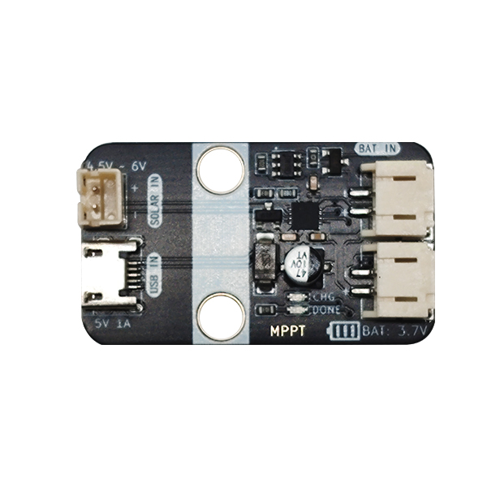

# MPPT_Module太阳能充电模块

## 模块实物图

## 概述

MPPT_Module是一款可通过太阳能发电板及micro USB数据线给电池充电的模块。当太阳光照射到电池板上时，光子与半导体材料相互作用，产生电子-空穴对，从而形成电流，电流通过板上集成的管理芯片给电池充电，也可以通过PH2.0接口外接出去给其他系统使用。板载两颗高亮LED，绿色LED用以指示正在充电，蓝色LED则指示电池电量已经充满。

MPPT_Module无需外部控制，即插即用。使用非常便利。除此之外，MPPT_Module集成电池管理芯片，防止电池过充或过放，能有效保护电池，延长电池使用寿命，拥有PH2.0防反插接口。

此设备可以应用于户外活动、旅行、小型电子设备供电、和家庭等多个领域等。

### 原理图

<a href="zh-cn/ph2.0_sensors/smart_module/MPPT_Module/MPPT_Module.pdf" target="_blank">点击下载MPPT_Module原理图</a>

### 芯片规格书

<a href="zh-cn/ph2.0_sensors/smart_module/MPPT_Module/MPPT_Chip.pdf" target="_blank">点击下载MPPT_Chip规格书</a>

### 尺寸图

待补充

## 模块参数

- 工作电压：4.5-6V
- 工作电流：180mA
- 最大功率：1.5W
- 接 口：PH2.0间距接口、micro USB接口，micro USB可作为充电输入端，2pin为太阳能充电板接口及充电输出接口。
- 工作稳定温度范围：-20℃ ~ +70℃
- 尺 寸：22.4*38.4mm，兼容乐高积木和M4螺丝固定孔

## 接口定义

| 接口名称 | 描述        |
| -------- | :---------- |
| micro USB | micro USB充电供电接口 |
| SOLAR IN | 太阳能充电板接口 |
| BAT IN | 电池输入接口 |
| BAT 3.7 | 充电输出接口          |

## Arduino示例程序（C/C++）

待补充

## Micropython示例程序

待补充

## Mixly图形化示例

待补充

## Mind+图形化示例

待补充
