# NLCS11颜色识别模块

## 模块实物图

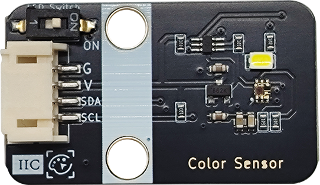

## 概述

NLCS11是一款基于颜色的光到数字的转换器，它结合了光电二极管、电流放大器、模拟电路和数字信号处理器。

为了提高精度，让颜色管理更加准确。板载自带一个高亮LED，可以让传感器在低环境光的情况下依然能够正常使用，实现“补光”的功能，可以通过LED Switch开关对它进行打开或关闭。颜色识别传感器模块采用I2C通信，拥有PH2.0防反插接口，使用便利。

NLCS11设备可进行色温测量、亮度传感。内部状态机提供了将设备置于色温测量之间的低功率状态的能力，非常低的平均功耗。

此设备可以应用于亮度传感器、彩色温度传感器、小笔记本、穿戴设备、工业及医疗等领域。

### 原理图

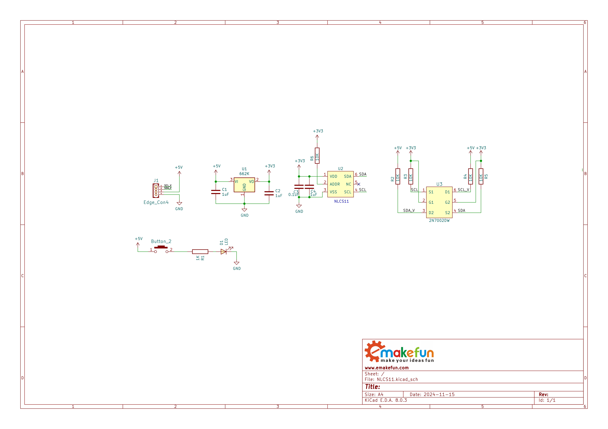

<a href="zh-cn/ph2.0_sensors/smart_module/color_sensor_nlcs11/NLCS11_sch.pdf" target="_blank">点击下载NLCS11原理图</a>

### 芯片规格书

<a href="zh-cn/ph2.0_sensors/smart_module/color_sensor_nlcs11/NLCS11_datasheet.pdf" target="_blank">点击下载NLCS11数据手册规格书</a>

### 尺寸图

待补充

## 模块参数

- 工作电压：3.3-5V
- 工作电流：65uA
- 检测距离：3-10mm
- 时钟频率：0-400KHZ
- 接 口：IIC接口和2.0间距接口
- 温度范围：-30℃ ~ +70℃
- 通信方式:  IIC通信，地址0x43
- 尺 寸：22.4*38.4mm，兼容乐高积木和M4螺丝固定孔

## 引脚定义

| 引脚名称 | 描述        |
| -------- | ----------- |
| G        | GND     |
| V        | VCC  |
| SDA      | SDA |
| SCL      | SDL |

## 模块测试

### 接线

| Arduino Uno | NLCS21 |
| ----------- | ------ |
| VCC           | VCC      |
| GND           | GND      |
| A5          | SCL    |
| A4          | SDA    |

即将颜色识别模块插入I2C接口即可。

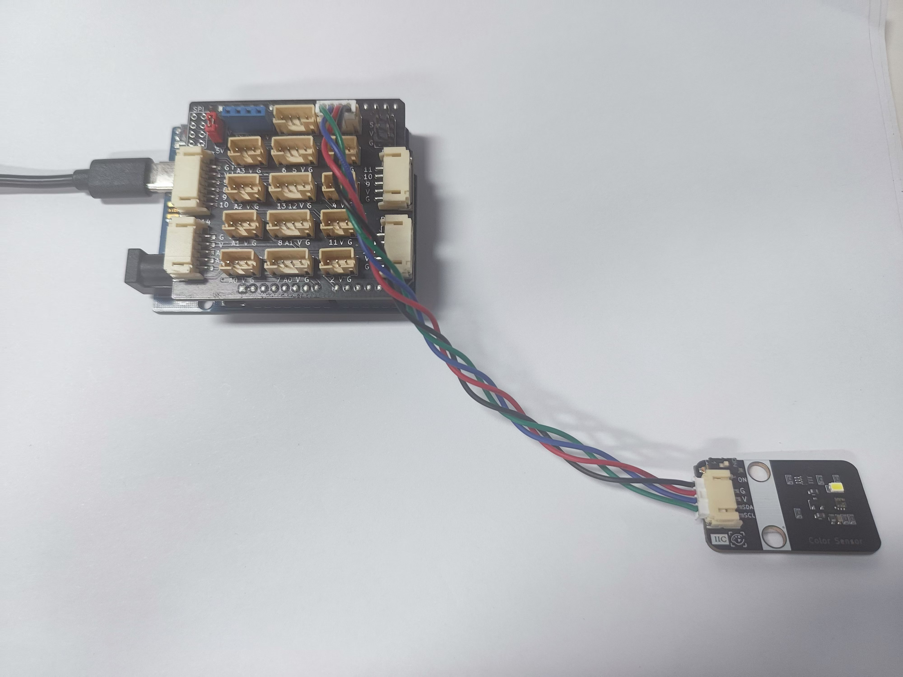

### 测试

1.将[资料](#jump)中的Arduino库导入Arduino中

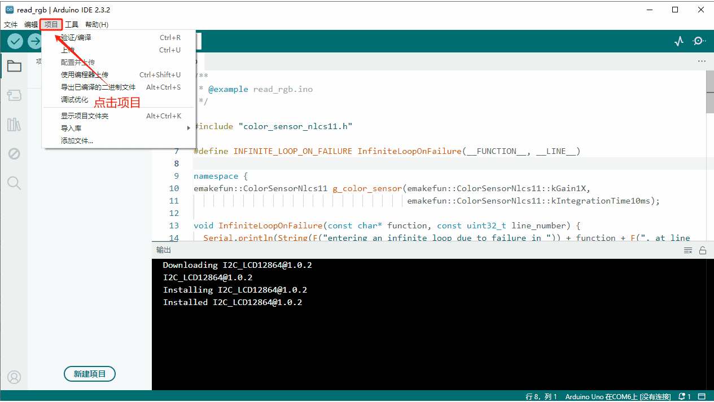

2.选择开发板Arduino Uno，
工具->开发板->Arduino AVR Boards->Arduino Uno

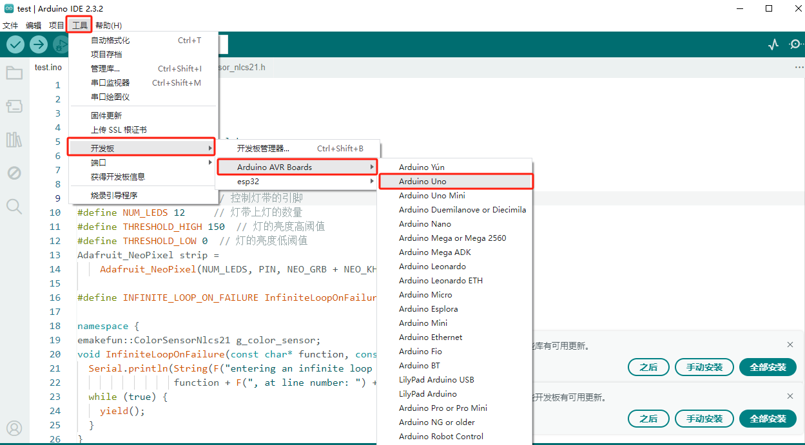

3.将主板通过USB线插入电脑，并在Arduino IDE上选择相应COM口。

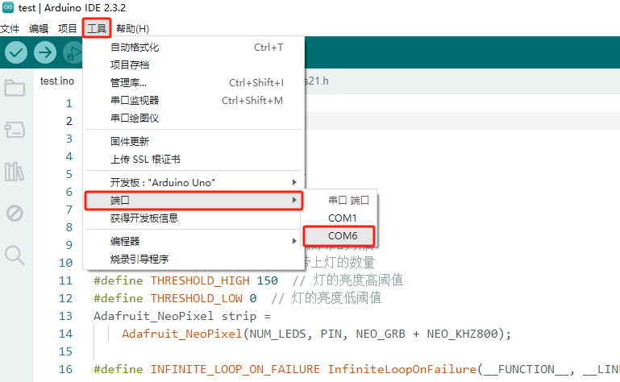

4.将程序烧录至主板

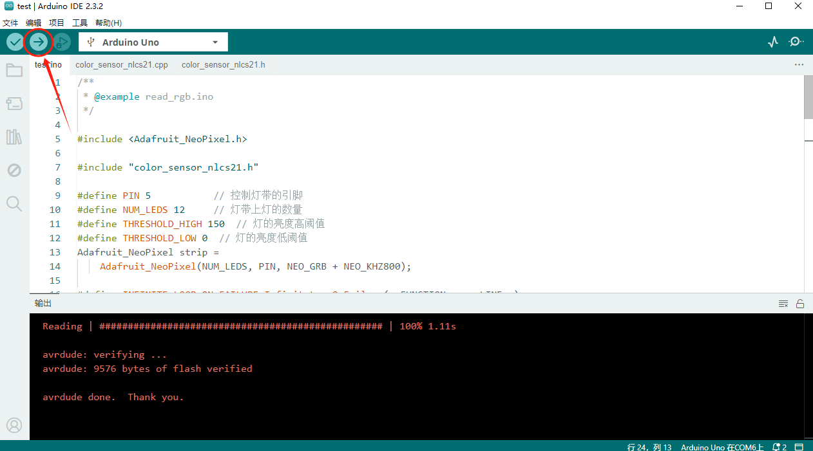

5.打开串口监视器，并选择波特率为115200

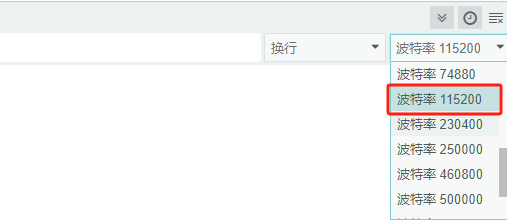

6.测试RGB读值

将颜色识别传感器放至红色面板上（距离尽量近些，约1~2CM）只要测试R丶G丶B相应的读值明显变大即识别成功。

可以观察到R值为170左右，明显变大，则识别出红色。

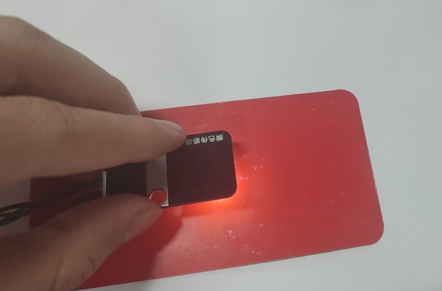

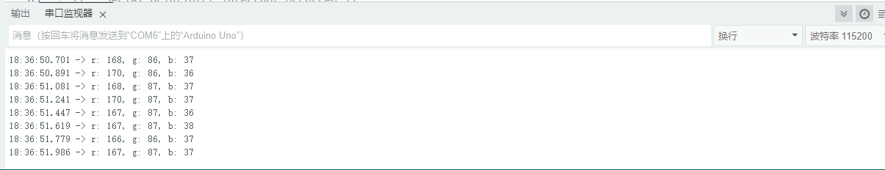

将颜色识别传感器放至绿色面板上的读值，g值达到200左右，明显变大，成功识别出绿色。

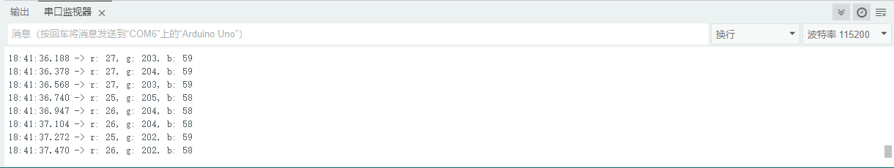

将颜色识别传感器放至蓝色面板上的读值，b值从30几变成130多，明显变大，成功识别出蓝色。

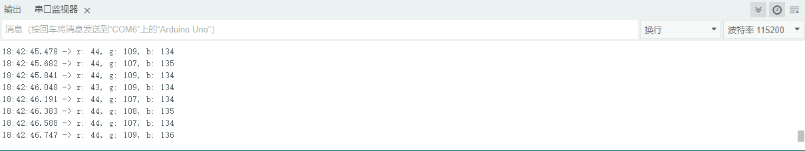

## 开发板

| 支持开发板系列 |
| :------------- |
| Arduino UNO R3 |
| Arduino Nano   |
| ESP32          |
| micro:bit      |

## 资料下载

| 资料目录                                                     |
| ------------------------------------------------------------ |
| Arduino库和示例程序（C/C++）                                 |
| ESP32库和示例程序（C/C++，MicroPython）                      |
| micro:bit库和示例程序（MicroPython,MakeCode）[点击查看Makecode示例程序](https://makecode.microbit.org/S81407-77066-42131-87420) 用户库网址：<https://github.com/emakefun-makecode-extensions/emakefun_nlcs11> |
| NLCS11原理图                                                 |
| NLCS11数据手册                                               |

<a href="zh-cn/ph2.0_sensors/smart_module/color_sensor_nlcs11/data_collection.zip" download>上述资料点击此处下载</a>
