# esp8266-mqtt物联网无线模块


## 一、概述

esp8266-mqtt无线模块是emakefun公司基于乐鑫科技的wifi芯片ESP8266基础上重新研发的串口转wifi的物联网模块，该模块采用AT配置方式来支持wifi无线通信，AT指令全面兼容<a href="https://www.espressif.com/sites/default/files/documentation/4a-esp8266_at_instruction_set_cn.pdf" target="_blank">乐鑫官方指令库（V3.0.0）</a>，在此基础上添加了MQTT指令，并且全部封装成scratch，mixly，Makecode图形化编程块支持arduino，micro:bit。 总而言之，这个模块就像一个无线网卡，但它不仅仅能连接Wi-Fi，还能理解和使用物联网中常用的通信方式，让您的设备轻松接入互联网，实现**远程控制和数据交换**。

## 二、模块特点及参数

特点

- 内置低功率 32 位 CPU：可以兼作应用处理器

- 内置协议：TCP/IP 协议栈

- 加密类型：WPA WPA2/WPA2–PSK

- 支持乐鑫官方AT标准指令集

- 支持连接标准MQTT协议和TTL串口到无线的应用

参数

- 工作电压：5V

- 接口速率：9600 bps

- 无线频率：2.4GHz

- 接口类型：PH2.0-4Pin (G V TX TX)

- 无线模式：IEEE802.11b/g/n

- SRAM：160KB

- 外置Flash：4MB

- 支持低功耗：<240mA

- 模块尺寸：4 * 2.1cm

- 安装方式：M4螺钉螺母固定

- LED指示灯：**Link网络连接指示灯（该灯常亮表示Wifi连接正常）和MQTT服务器连接指示灯（该灯常亮表示MQTT连接正常）**

## 三、硬件接口

### 3.1 引脚说明

| 引脚名称 | 描述    |
|:----:|:-----:|
| G    | GND   |
| V    | 5V    |
| TX   | 串口发送端 |
| RX   | 串口接收端 |

### 3.2 机械尺寸图


## 四、功能说明


- **主控设备**通过串口：

发送AT指令配置模块（Wi-Fi/MQTT参数）

发送/接收传感器数据或控制指令

- **ESP8266-MQTT模块**：

执行AT指令配置网络连接

将串口数据转换为MQTT协议

作为双向通信枢纽，通过Wi-Fi连接MQTT Broker

- **MQTT Broker**：

接收模块发布的消息并转发给订阅者

将订阅的云端/设备消息转发给模块

- **物联网应用层**：

订阅设备数据主题

发布控制指令主题

进行数据存储/展示/分析

## 五、AT 指令详解

### 5.1 指令类型

| 类型   | 指令格式         | 描述                          |
| ---- | ------------ | --------------------------- |
| 测试指令 | AT+< x >=?   | 该命令⽤于该命令⽤于查询设置指令的参数以及取值范围。  |
| 查询指令 | AT+< x >?    | 该命令⽤于返回参数的当前值。              |
| 设置指令 | AT+< x >=<…> | 该命令⽤于设置⽤户⾃定义的参数值。           |
| 执⾏指令 | AT+< x >     | 该命令⽤于执⾏受模块内部程序控制的变参数不可变的功能。 |

**注意：**

• 不是每条 AT 指令都具备上述 4 种类型的命令。

• [ ] 括号内为缺省值，不必填写或者可能不显示。

• 使⽤双引号表示字符串数据 ”string”，例如：AT+CWSAP="ESP756290","21030826",1,4

• 默认波特率为 115200。

• AT 指令必须⼤写，并且以回⻋换⾏符结尾（CR LF）。

### 5.2 指令汇总

| 序号  | 指令                                 | 描述                                              |
| --- | ---------------------------------- | ----------------------------------------------- |
| 1   | AT+CWMODE=1                        | 重置                                              |
| 2   | AT+RST                             | 复位                                              |
| 3   | AT+CWJAP_DEF="EmakeFun","12345678" | 连接wifi                                          |
| 4   | AT+MQTTUSERCFG                     | 配置 MQTT 用户属性                                    |
| 5   | AT+MQTTCONNCFG                     | 配置 MQTT 连接属性                                    |
| 6   | AT+MQTTCONN                        | 连接指定 MQTT broker                                |
| 7   | AT+ALIYUN_MQTTCONN?                | 连接指定的阿里云MQTT broker                             |
| 8   | AT+MQTTPUB                         | 在 LinkID上通过 topic 发布数据 data，< br >data 为字符串消息   |
| 9   | AT+MQTTPUBRAW                      | 在 LinkID 上通过 topic 发布数据 data，< br > data 为二进制数据 |
| 10  | AT+MQTTSUB                         | 订阅指定连接的 MQTT 主题, 可重复多次< br >订阅不同 topic          |
| 11  | AT+MQTTUNSUB                       | 取消订阅指定连接的 MQTT 主题, 可多次< br >取消不同订阅 topic        |
| 12  | AT+MQTTCLEAN                       | 关闭 MQTT Client 为 LinkID 的连接, 并释< br >放内部占用的资源   |

### 5.3 AT指令详解

#### 1.AT+CWMODE=1  重置模块

| 指令：AT+CWMODE=1            |
| ------------------------- |
| **功能：**重置MQTT模块，对内部进行参数重置 |
| **响应：**OK或ERROR           |

**举例：**AT+CWMODE=1

**结果：**将示例复制在串口发送后，串口返回  OK

#### 2.AT+RST  复位

| 指令：AT+RST           |
| ------------------- |
| **功能：**复位MQTT模块     |
| **响应：**固件版本信息或ERROR |

**举例：**AT+RST

**结果：**将示例复制在串口发送后，串口返回 固件版本信息

#### 3.AT+CWJAP_DEF="EmakeFun","12345678"  连接Wifi

| 指令：AT+CWJAP_DEF="EmakeFun","12345678"                |
| ---------------------------------------------------- |
| **功能：**连接wifi                                        |
| **响应：**OK（模块Link灯常亮表示连接WIFI）或ERROR（模块Link灯闪烁表示连接服务器） |

| 代码       | 含义                         | 举例       |
| -------- | -------------------------- | -------- |
| EmakeFun | 当前只支持 0                    | 0        |
| 12345678 | CA ID, 目前支持一套 CA 证书, 参数为 0 | 12345678 |

**举例：**AT+CWJAP_DEF="EmakeFun","12345678"

**结果：**将示例复制在串口发送后，串口返回  OK，同时Link灯常亮

#### 4.AT+MQTTUSERCFG - 配置 MQTT 用户属性

| 指令：AT+MQTTUSERCFG=LinkID,scheme,"client_id","username","password",cert_key_ID,CA_ID,"path" |
| ------------------------------------------------------------------------------------------ |
| **功能：**设置 MQTT 用户配置                                                                        |
| **响应：**OK（模块MQTT灯常亮）或ERROR（模块MQTT灯不亮）                                                      |

| 代码          | 含义                                           | 举例        |
| ----------- | -------------------------------------------- | --------- |
| LinkID      | 当前只支持 0                                      | 0         |
| scheme      |                                              | 1         |
| "client_id" | 对应 MQTT client ID, 用于标志 client 身份, 最长 256 字节 | ESP8266   |
| "username"  | 用于登录 MQTT broker 的 用户名, 最长 64 字节             | kxmqttp1  |
| "password"  | 用于登录 MQTT broker 的 密码, 最长 64 字节              | public985 |
| cert_key_ID | 证书 ID, 目前支持一套 cert 证书, 参数为 0                 | 0         |
| CA_ID       | CA ID, 目前支持一套 CA 证书, 参数为 0                   | 0         |
| "path"      | 资源路径, 最长 32 字节                               |           |

**举例：**AT+MQTTUSERCFG=0,1,"ESP8266","kxmqttp1","public985",0,0,""

**结果：**将示例复制在串口发送后，串口返回  OK，模块MQTT灯常亮

#### **5.AT+MQTTCONNCFG - 配置 MQTT 连接属性**

| 指令：AT+MQTTCONNCFG=LinkID,keepalive,disable_clean_session,"lwt_topic","lwt_msg",lwt_qos,lwt_retain |
| ------------------------------------------------------------------------------------------------- |
| **功能：**设置 MQTT 连接配置                                                                               |
| **响应：**OK或ERROR                                                                                   |

| 代码                    | 含义                                          | 举例       |
| --------------------- | ------------------------------------------- | -------- |
| LinkID                | 当前只支持 0                                     | 0        |
| keepalive             | MQTT PING 超时时间,范围为 [60, 7200], 单位为秒. 默认 120 | 120      |
| disable_clean_session | MQTT 清理会话标志, 参数为 0 或 1, 默认为 0               | 0        |
| "lwt_topic"           | 主题 topic, 最长 64 字节                          | Emakefun |
| "lwt_msg"             | 主题 message, 最长 64 字节                        | 12345678 |
| lwt_qos               | 主题 QoS, 参数可选 0, 1, 2, 默认为 0                 | 0        |
| lwt_retain            | 主题 retain, 参数可选 0, 1, 默认为 0                 | 0        |

**举例：**AT+MQTTCONNCFG=0,120,0,topic,msg,0,0

**结果：**将示例复制在串口发送后，串口返回  OK

#### **6.AT+MQTTCONN - 连接服务器的IP地址**

| 指令：AT+MQTTCONN=LinkID,"host",port,reconnect |
| ------------------------------------------- |
| **功能：**连接指定 MQTT broker                     |
| **响应：**OK或ERROR                             |

| 代码        | 含义                  | 举例             |
| --------- | ------------------- | -------------- |
| LinkID    | 当前只支持 0             | 0              |
| "host"    | MQTT域名，IP地址         | 47.111.117.220 |
| port      | MQTT端口，一般情况下默认1833  | 1833           |
| reconnect | 0 代表不重连MQTT，1 会一直重连 | 0              |

**举例：**AT+MQTTCONN=0,"47.111.117.220",1883,0

**结果：**将示例复制在串口发送后，串口返回  OK

#### **7.AT+ALIYUN_MQTTCONN?**

| 指令：AT+ALIYUN_MQTTCONN="host",port,"ProductKey","DeviceName","DeviceSecret" |
| -------------------------------------------------------------------------- |
| **功能：**连接指定的阿里云MQTT broker                                                 |
| **响应：**OK或ERROR                                                            |

| 代码             | 含义                                                                    | 举例           |
| -------------- | --------------------------------------------------------------------- | ------------ |
| "host"         | 连接阿里云的MQTT broker 域名, 详情请参考阿里云域名格式                                    | 192.168.1.17 |
| port           | 连接 MQTT broker 端口, 最大 65535 默认 1883                                   | 1883         |
| "ProductKey"   | 设备所属产品的ProductKey，即物联网平台为产品颁发的全局唯一标识符                                 | 0            |
| "DeviceName"   | 设备在产品内的唯一标识符。DeviceName与设备所属产品的ProductKey组合，作为设备标识，用来与物联网平台进行连接认证和通信。 | 0            |
| "DeviceSecret" | 物联网平台为设备颁发的设备密钥，用于认证加密。需与DeviceName成对使用                               |              |

**举例：**AT+MQTTCONN="192.168.1.17",1883,0,0,

**结果：**将示例复制在串口发送后，串口返回  OK

#### **8.AT+MQTTPUB**

| 指令：AT+MQTTPUB=LinkID,"topic","data",qos,retain                                |
| ----------------------------------------------------------------------------- |
| **功能：**在 LinkID上通过 topic 发布数据 data, 其中 data 为字符串消息, 若要发布二进制,请使用 AT+MQTTPUBRAW |
| **响应：**OK或ERROR                                                               |

| 代码      | 含义                                                    | 举例     |
| ------- | ----------------------------------------------------- | ------ |
| LinkID  | 当前只支持 0                                               | 0      |
| "topic" | 发布主题, 最长 64 字节                                        | topic  |
| "data"  | 发布消息, data 不能包含 \0, 请确保整条 AT+MQTTPUB 不超过 AT 指令的最大长度限制 | test   |
| qos     | 发布服务质量, 参数可选 0,1,2, 默认为 0                             | 0      |
| retain  | 发布 retain                                             | retain |

**举例：**AT+MQTTPUB=0,"topic","test",0,retain

**结果：**将示例复制在串口发送后，串口返回  OK

#### **9.AT+MQTTPUBRAW**

| 指令：AT+MQTTPUBRAW=LinkID,"topic",length,qos,retain                    |
| -------------------------------------------------------------------- |
| **功能：**在 LinkID 上通过 topic 发布数据 data, 其中 data 为二进制数据                  |
| **响应：**OK或ERROR,等待用户输入 length 大小数据, 之后响应如下:+MQTTPUB:FAIL或+MQTTPUB:OK |

| 代码      | 含义                        | 举例     |
| ------- | ------------------------- | ------ |
| LinkID  | 当前只支持 0                   | 0      |
| "topic" | 发布主题, 最长 64 字节            | topic  |
| length  | 要发布消息长度, 长度受限于当前可用内存      | 2      |
| qos     | 发布服务质量, 参数可选 0,1,2, 默认为 0 | 0      |
| retain  | 发布 retain                 | retain |

**举例：**AT+MQTTPUBRAW=0,"topic",2,0,retain

**结果：**将示例复制在串口发送后，串口返回  OK

#### **10.AT+MQTTSUB**

| 指令：AT+MQTTSUB=LinkID,"topic",qos                                                                                                                             |
| ------------------------------------------------------------------------------------------------------------------------------------------------------------ |
| **功能：**订阅指定连接的 MQTT 主题, 可重复多次订阅不同 topic                                                                                                                      |
| **响应：**OK或ERROR，当收到对应主题订阅的 MQTT 消息时, 将按照如下格式打印消息内容+MQTTSUBRECV:LinkID,"topic",data_length,data  如果订阅已订阅过的主题, 仍无条件向 MQTT broker 订阅, Log 口打印 ALREADY SUBSCRIBE |

| 代码      | 含义                        | 举例    |
| ------- | ------------------------- | ----- |
| LinkID  | 当前只支持 0                   | 0     |
| "topic" | 订阅主题, 最长 64 字节            | topic |
| qos     | 订阅服务质量, 参数可选 0,1,2, 默认为 0 | 0     |

**举例：**AT+MQTTSUB=0,"topic",0

**结果：**将示例复制在串口发送后，串口返回  OK

#### **11.AT+MQTTUNSUB**

| 指令：AT+MQTTUNSUB=LinkID,"topic"            |
| ----------------------------------------- |
| **功能：**取消订阅指定连接的 MQTT 主题, 可多次取消不同订阅 topic |
| **响应：**OK或ERROR                           |

| 代码      | 含义             | 举例    |
| ------- | -------------- | ----- |
| LinkID  | 当前只支持 0        | 0     |
| "topic" | 订阅主题, 最长 64 字节 | topic |

**举例：**AT+MQTTUNSUB=0,"topic"

**结果：**将示例复制在串口发送后，串口返回  ERROR

#### **12.AT+MQTTCLEAN**

| 指令：AT+MQTTCLEAN=LinkID                         |
| ---------------------------------------------- |
| **功能：**关闭 MQTT Client 为 LinkID 的连接, 并释放内部占用的资源 |
| **响应：**OK或ERROR                                |

| 代码     | 含义      | 举例  |
| ------ | ------- | --- |
| LinkID | 当前只支持 0 | 0   |

**举例：**AT+MQTTCLEAN=0

**结果：**将示例复制在串口发送后，串口返回  OK

## **六、Arduino 应用场景**

### **6.1 AT串口测试**

<a href="zh-cn/ph2.0_sensors/smart_module/esp8266_mqtt/AT_test.zip" download>下载最新示例程序</a>

```c++
#include "Arduino.h"
#include "SoftwareSerial.h"

SoftwareSerial serial1(5, 6);  // TX-5，RX-6

void setup() {
  Serial.begin(115200);  // 用于调试的串口
  serial1.begin(9600);   // 设备 ESP 的波特率可能不同
}

void loop() {
  if (serial1.available()) {  // 检查 ESP 是否在发送消息
    while (serial1.available()) {
      int c = serial1.read();  // 读取下一个字符
      Serial.write((char)c);   // 将数据写入串口监视器
    }
  }

  if (Serial.available()) {
    // 等待让所有输入命令在串口缓冲区中
    delay(10);

    // 以字符串形式读取输入命令
    String cmd = "";
    while (Serial.available()) {
      cmd += (char)Serial.read();
    }

    // 打印命令并发送到 ESP
    Serial.println();
    Serial.print(">>>> ");
    Serial.println(cmd);

    // 将读取的字符发送到 ESP
    serial1.print(cmd);
  }
}
```

如果 serial1 (连接 MQTT 模块) 接收到数据，程序会将这些数据读取出来并通过 Serial (调试监视器) 打印出来。

如果 Serial (调试监视器) 接收到数据，程序会将这些数据读取出来并通过 serial1 发送给 MQTT 模块。

总的来说，AT串口测试程序允许用户通过 Arduino 的串口监视器与 ESP8266 MQTT 模块进行 AT 指令交互。

### **6.2 连接 Wi-Fi 网络并进行 MQTT 通信**

#### 6.2.1 ArduinoUno主控板

**设备接线**

| 引脚名称 | 描述     | Arduino uno |
| ---- | ------ | ----------- |
| G    | GND地线  |             |
| V    | 5V电源引脚 |             |
| TX   | 串口发送端  | 5           |
| RX   | 串口接收端  | 6           |


以下给出Mixly、Arduino IDE两种示例程序，用户可根据需求选择下载到主控设备。

**Mixly示例程序**

在Mixly编程界面右上角点击设置——导入库，选择EmakeFun的库文件从云端导入。<a href="zh-cn/ph2.0_sensors/smart_module/esp8266_mqtt/uno-mixly示例程序.zip" download>示例程序下载</a>

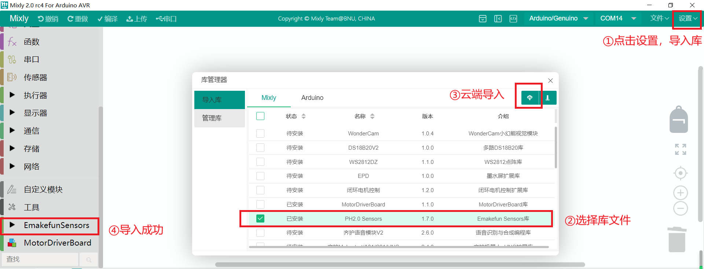

参照示例编写程序，在此我们用Emakefun公司的服务器为例。

点击左侧导入的库，在智能模块中找出MQTT相关编程指令。

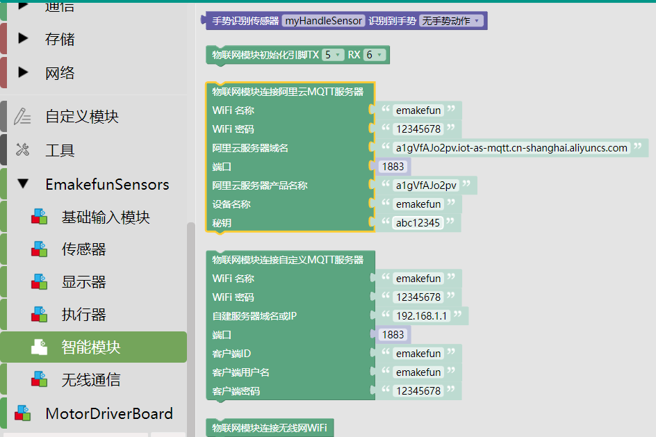

示例程序。

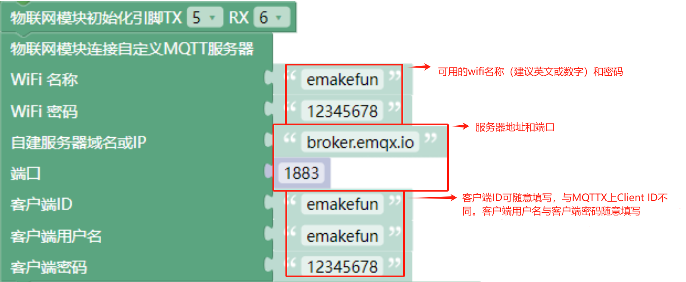

服务器域名 **broker.emqx.io** 为默认服务器，对应端口1883（使用了该服务器就请用提供的参数）。

上传完程序，将硬件断电后重连，等待MQTT模块连接上wifi和服务器，连接成功现象为MQTT模块上的两个指示灯Link和MQTT都长亮。

硬件接收服务器信息示例。

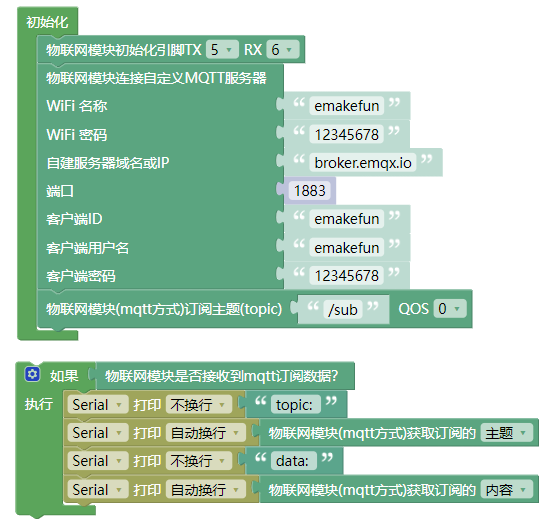

硬件发送信息到服务器示例。

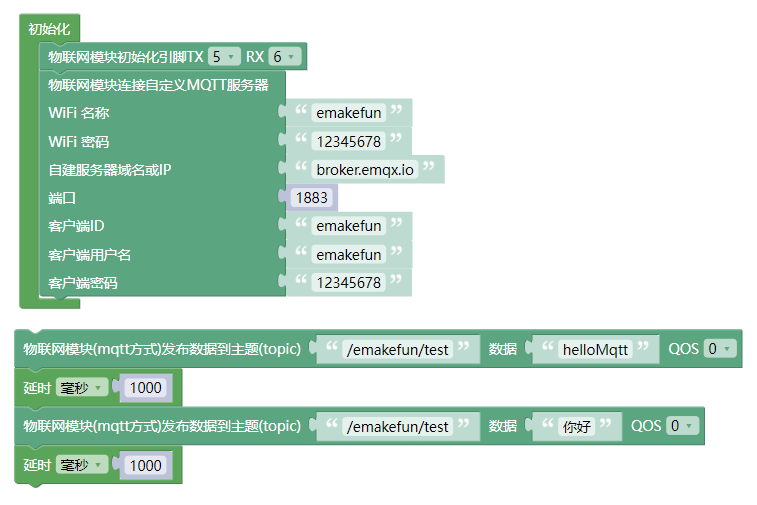

**Arduino IDE示例程序**

<a href="zh-cn/ph2.0_sensors/smart_module/esp8266_mqtt/uno-IDE示例程序.zip" download>Arduino IDE示例程序下载</a>

硬件接收服务器信息示例。

```c++
#include <SoftwareSerial.h>

#include "WiFiEsp.h"                  // 引入 WiFiEsp 库
#include "WifiEspMqtt.h"

SoftwareSerial esp8266_serial(5, 6);  // MQTT模块接口，TX对应5，RX对应6

WiFiEspMqtt esp8266;
char ssid[] = "K30";                  // wifi名称
char passwd[] = "12345678";           // wifi密码
char mqtt_host[] = "broker.emqx.io";  // 服务器地址
uint16_t mqtt_port = 1883;            // 端口，固定值1883
char mqtt_client_id[] = "emakefun";   // 客户端ID，随意填
char mqtt_username[] = "kxmqttp1";    // 账号和密码
char mqtt_password[] = "public985";

void setup() {
  esp8266_serial.begin(9600);                                          // 初始化串口通信
  WiFi.init(&esp8266_serial);                                          // 初始化 WiFi 模块
  WiFi.begin(ssid, passwd);                                            // 连接 WiFi 网络
  esp8266.mqtt_usercfg(mqtt_client_id, mqtt_username, mqtt_password);  // 配置 MQTT 用户信息
  esp8266.mqtt_connect(mqtt_host, mqtt_port, 0);                       // 连接到 MQTT 服务器
  Serial.begin(115200);                                                // 初始化串口通信
  esp8266.mqtt_sub(String("/emakefun/topic_1").c_str(), 0);            // 订阅指定主题
}

void loop() {
  if (esp8266.mqtt_receive()) {            // 如果接收到 MQTT 信息
    Serial.println(esp8266.mqtt_message);  // 打印接收到的信息
  }
}
```

硬件发送信息到服务器示例。

```c++
#include <SoftwareSerial.h>

#include "WiFiEsp.h"
#include "WifiEspMqtt.h"

SoftwareSerial esp8266_serial(5, 6);  // MQTT模块接口，TX对应5，RX对应6
WiFiEspMqtt esp8266;

char ssid[] = "K30";                  // wifi名称
char passwd[] = "12345678";           // wifi密码
char mqtt_host[] = "broker.emqx.io";  // 服务器地址
uint16_t mqtt_port = 1883;            // 端口，固定值1883
char mqtt_client_id[] = "emakefun";   // 客户端ID，随意填
char mqtt_username[] = "kxmqttp1";    // 账号和密码，必须为提供的2选1
char mqtt_password[] = "public985";

void setup() {
  esp8266_serial.begin(9600);
  WiFi.init(&esp8266_serial);
  WiFi.begin(ssid, passwd);
  esp8266.mqtt_usercfg(mqtt_client_id, mqtt_username, mqtt_password);
  esp8266.mqtt_connect(mqtt_host, mqtt_port, 0);
}

void loop() {
  esp8266.mqtt_public("test/a", String("你好").c_str(), 0);  // 要发送的信息，test/a为主题，“你好”为内容
  delay(1000);
  esp8266.mqtt_public("test/a", String("Emakefun").c_str(), 0);
  delay(1000);
}
```

#### 6.2.2 MicroBit主控板

**设备接线**

| 引脚名称 | 描述     | Micro:bit |
| ---- | ------ | --------- |
| G    | GND地线  |           |
| V    | 5V电源引脚 |           |
| TX   | 串口发送端  | 14        |
| RX   | 串口接收端  | 15        |


**Microsoft在线编程示例**

[Microsoft在线编程网址](https://makecode.microbit.org/#)：<https://makecode.microbit.org/#>

打开网址，新建项目，命名为“硬件接收服务器信息”。


如上图，打开编程界面后，我们需要导入MQTT库文件，点击“+拓展”，在弹出的界面添加如下网址<https://github.com/emakefun/pxt-mqtt，回车，点击出现的库。>


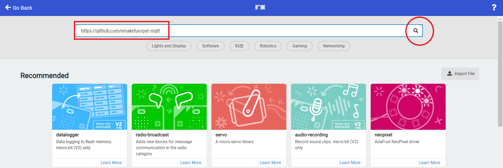

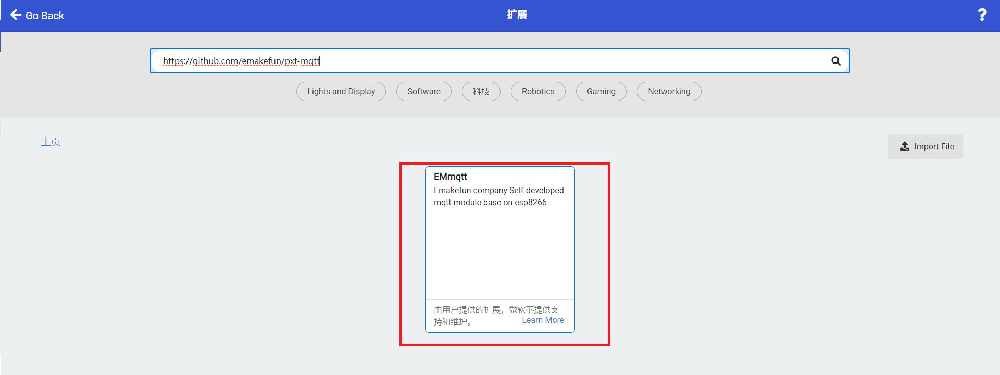


注意！！！在使用MQTT模块时，下载完程序后请彻底断电再重启！使用时建议外接电源。

硬件接收服务器信息示例。[https://makecode.microbit.org/_EfEEqtLmuc56](https://makecode.microbit.org/_CrAX2VaKWTXF)

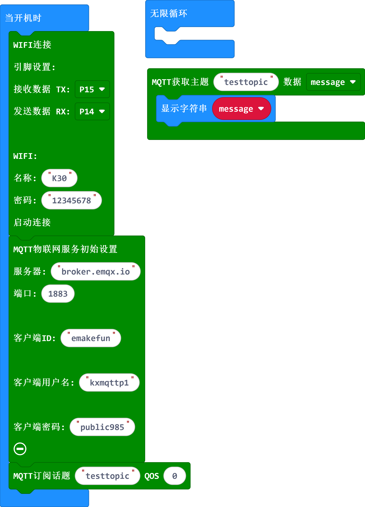

硬件发送信息到服务器示例。[https://makecode.microbit.org/_Lx299LKwK7k2](https://makecode.microbit.org/_hrvXisUEkKW0)

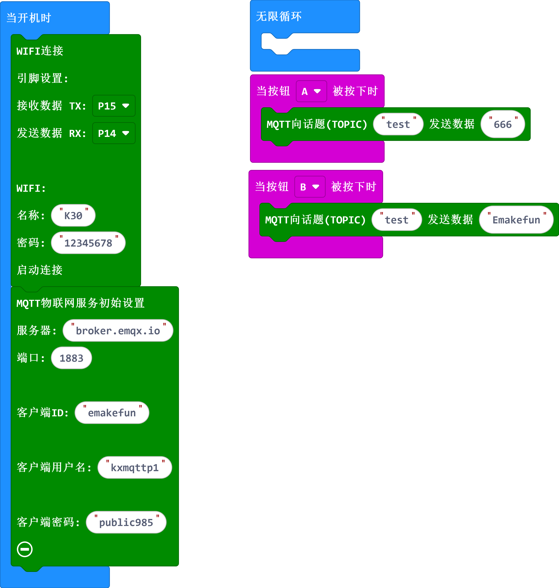

#### 6.2.3 软件配置

    以上硬件程序上传成功，MQTT模块两个指示灯都常亮，我们就可以通过以下工具进行测试，注意：硬件程序中订阅的主题，需在工具中发布，硬件发布的主题，需在工具中订阅，从而达到两个设备相互通信的效果。

[下载安装MQTTX工具]( [MQTTX Download](https://mqttx.app/downloads) )——


打开程序后新建服务器，点击“New Connection”

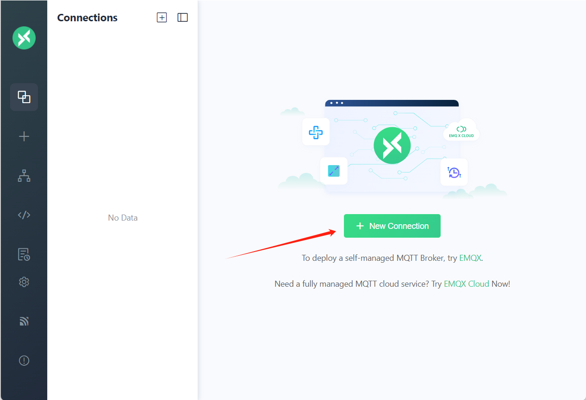

工具服务名称（本示例命名为test，可以任意填写）

Username和Password可以任意填写。注意：MQTTX工具中Client ID与硬件程序中的client ID必须不相同，否则会产生冲突、反复重新连接。

点击”连接“。

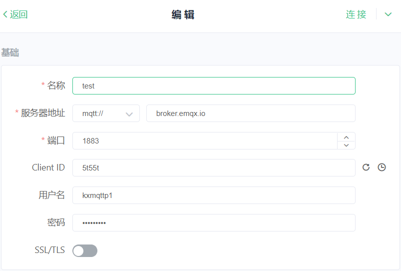

连接成功后，点击“添加订阅”。

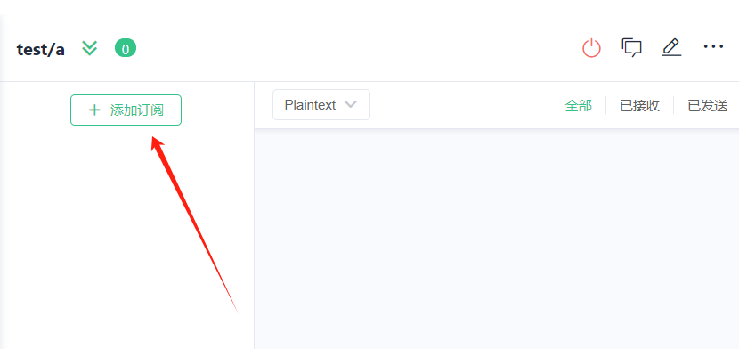

MQTTX工具订阅硬件发布的主题。添加topic; 这里需填写硬件程序中发布的主题。（本示例命名为test/a）

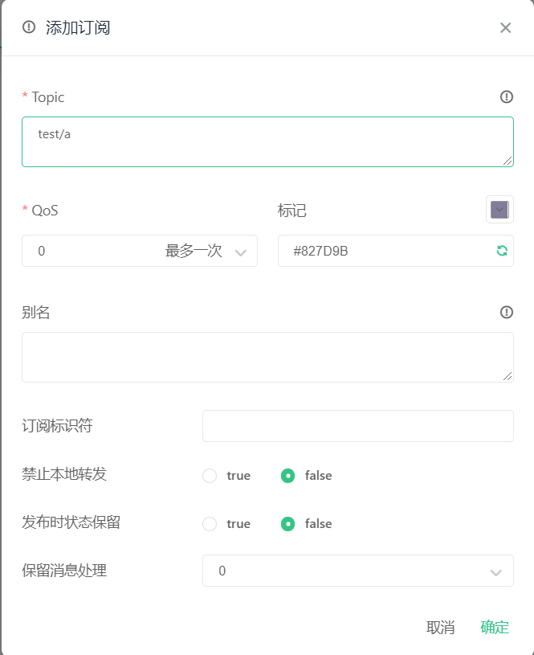

MQTTX工具给硬件发送数据：上面填写硬件程序中订阅的主题（本示例命名为/emakefun/topic_1）


#### 6.2.4 实验现象

硬件接收服务器的信息，在“消息”中填写主题，发送数字或文字，编程软件的串口会打印出信息

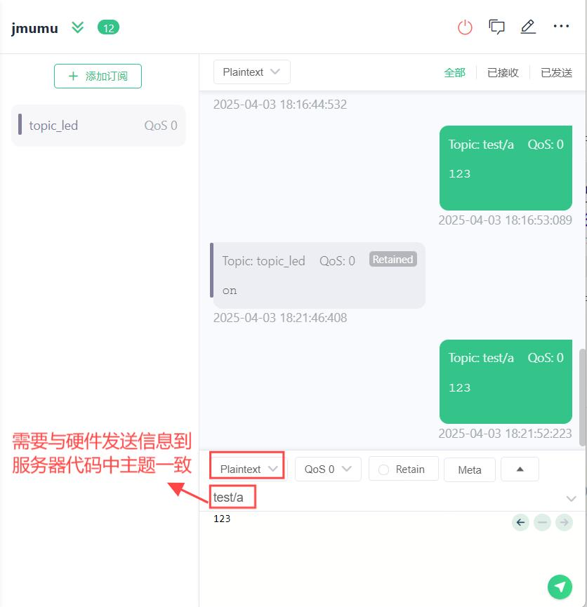

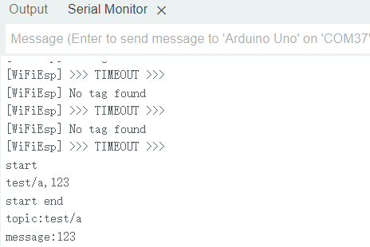

硬件发送信息到服务器。在“主题”中填写主题，点击订阅，会提示订阅成功；然后让硬件发送信息，可以看到订阅消息列表中收到相关的消息。（若使用MicroBit主板示例程序，则按下A显示“666”，按下B显示“Emakefun”）

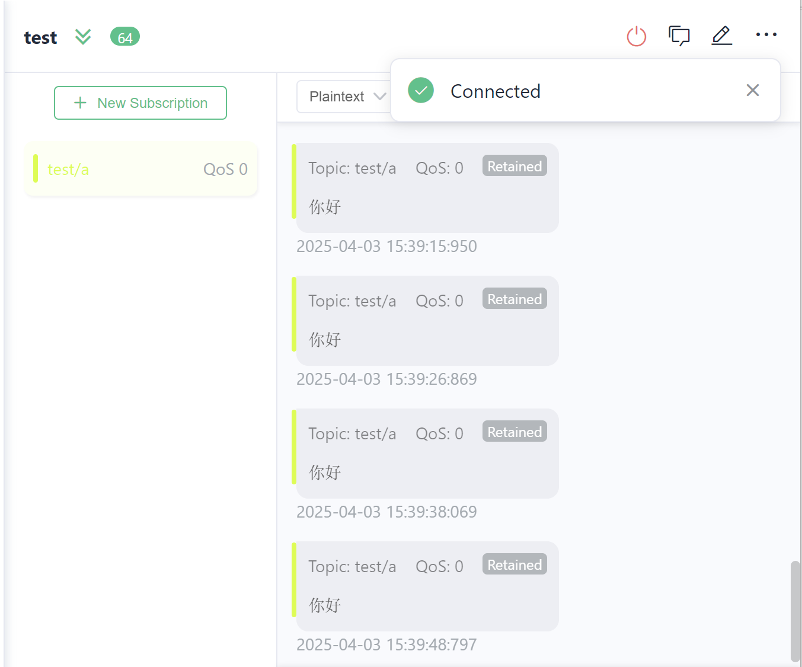
