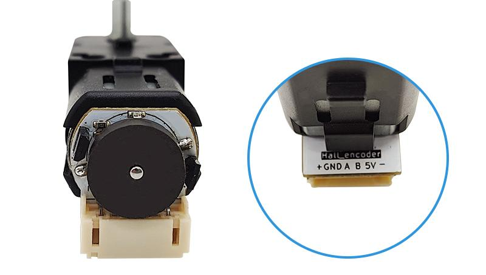
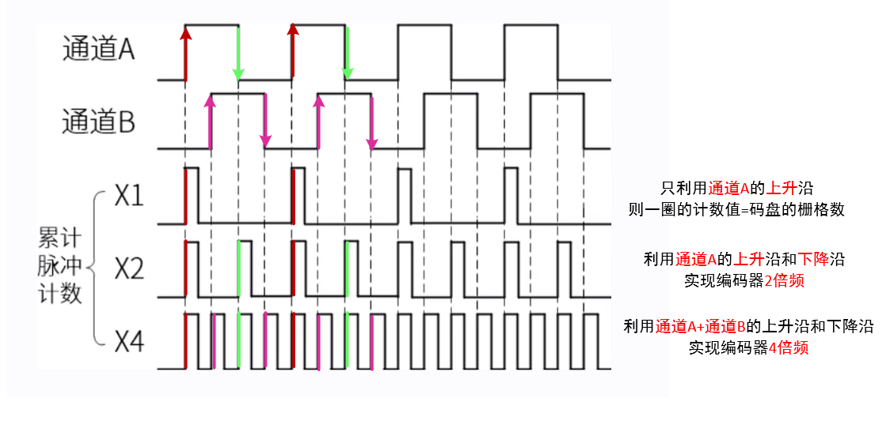

# hall_encoder_sensor编码电机模块

## 模块实物图



## 概述

编码电机是一款可通过霍尔传感器丶磁盘及减速电机组成的可精准控制的减速直流电机。它通过内置的编码器将机械运动转换为数字信号，从而实现对位置、速度和加速度等参数的精确测量。

编码电机模块采用1:90的减速比，拥有更大的扭矩，载重能力大幅提升。3-12V的宽输入电压适应更多不同系统，减速前空载转速达10000RPM，减速后空载转速达113RPM，扭矩达1.0kg·cm，堵转扭矩1.8kg。提供全金属轴和半金属轴两种选择：全金属轴载重能力更强，半金属轴噪音更小，其余参数基本相同。AB相霍尔编码器可输出两路90°正交正弦波，既可以用于测速（读取AB相脉冲个数），也可用于读取编码电机的状态（读取AB相位差）。红色LED灯指示编码器工作状态，PH2.0防反接接口。

此设备可以应用于机器人技术、智能小车、医疗设备、数控机床等多个领域。

### 原理图

无

### 芯片规格书

无

### 尺寸图

待补充

## 模块参数

- 工作电压：DC 3-12V
- 空载电流：100mA
- 空载转速：113RPM
- 额定负载电流：500mA
- 额定负载转速：59RPM
- 额定负载扭矩：1.0kg·cm
- 堵转电流：0.82A
- 堵转扭矩：1.8kg·cm
- 接 口：PH2.0间距接口。
- 编码器供电：3.3-5V
- 减速比：1：90
- 编码盘：12PPR

## 接口定义

| 接口名称  | 描述             |
| -------- | ---------------- |
| -        | 直流减速电机负极  |
| 5V       | 编码器供电正极    |
| B        | 编码器B相输出     |
| A        | 编码器A相输出     |
| GND      | 编码器供电地线    |
| +        | 直流减速电机正极  |

## 编码器原理说明

编码器是一种用来测量机械旋转或位移的传感器。是一种用来测量机械旋转或位移的传感器。它能够测量机械部件在旋转或直线运动时的位移位置或速度等信息，并将其转换成一系列电信号。

### 编码器主要分类

#### 按工作原理分类

编码器根据工作原理主要分为光电编码器和磁电编码器两大类。光电编码器利用光电效应，通过码盘和光电传感器检测光通断变化；磁电编码器则基于霍尔效应或磁阻效应，通过磁环和磁性传感器检测磁场变化。两种编码器各有优劣：光电编码器精度高但易受环境影响，磁电编码器抗干扰强但分辨率相对较低。

#### 按输出信号分类

根据输出信号类型，编码器可分为增量式和绝对式。增量式编码器输出连续的脉冲序列，需要计数器和参考点；绝对式编码器则输出每个位置唯一的数字编码，断电后位置信息不丢失。这一根本区别决定了它们在不同应用场景中的选择。

### 编码器基本参数

#### 分辨率

分辨率是指编码器能够分辨的最小单位。对于增量式编码器，其分辨率表示为编码器转轴旋转一圈所产生的脉冲数，即每转脉冲数（PPR）。对于绝对式编码器，内部码盘所用的位数就是它的分辨率，单位是位 (bit)，具体还分单圈分辨率和多圈分辨率。

#### 精度

精度是指编码器每个读数与转轴实际位置间的最大误差，通常用角度、角分或角秒表示。例如，有些绝对式编码器参数会标注±20″，这表示编码器输出的读数与转轴实际位置之间存在正负20角秒的误差。

#### 最大响应频率

最大响应频率是编码器电子部分能可靠工作的最高信号频率，它决定了编码器所能支持的最高电机转速。

其计算公式为：最大响应频率 = （电机转速 × 分辨率） / 60。

#### 信号输出形式

对于增量式编码器，每个通道的信号独立输出，输出电路形式通常有集电极开路输出、推挽输出、差分输出等。对于绝对式编码器，由于是直接输出几十位的二进制数，为了确保传输速率和信号质量，一般采用串行输出或总线型输出，例如同步串行接口 (SSI)、RS485等，也有一部分是并行输出，输出电路形式与增量式编码器相同。

### 增量式编码器工作原理

磁电增量式编码器利用霍尔效应，将位移转换成计数脉冲。其结构包含磁盘、霍尔传感器和信号转换电路三部分。磁盘由交替排布的S极和N极磁极组成，与电动机同轴旋转。霍尔传感器检测磁场变化并输出脉冲信号，通常有A、B两相（有时还有Z相），两相安装位置形成一定夹角，使输出信号存在90°相位差。

光电增量式编码器利用光电系统，将位移转换成计数脉冲。其码盘上有两圈线槽，当码盘转动时，内外圈线槽依次透光，光电检测装置检测光线通断变化产生脉冲。由于内外圈遮光和透光存在时间差，形成A、B两通道信号的相位差。


编码器输出两路相位差90°的方波信号（A相和B相），这种设计称为"正交编码"。方向辨别基于A、B两相信号的先后顺序：当A相信号超前B相信号时为正转（例如顺时针），当B相信号超前A相信号时为反转（例如逆时针）。

**倍频技术**

脉冲计数就是通过产生的信号的边沿计数，将编码器的物理分辨率进行倍频，从而获得更精细的位置信息。

- 如果只使用通道A计数，并且只捕获通道A的上升沿（或下降沿），则一圈的计数值=码盘旋转一圈产生的脉冲数，即为1倍频（没有倍频）。
- 如果只使用通道A计数，并且捕获了通道A的上升沿和下降沿，则编码器转一圈的计数值翻倍，实现2倍频。
- 如果既使用通道A计数，又使用通道B计数，且都捕获了上升沿和下降沿，则实现了4倍频。



### 位置控制

#### 相对位置测量

相对位置测量是编码器最基本的位置控制应用。通过累计脉冲数量，系统可以计算从起始点开始的位移量。这种方法简单直接，适用于传送带输送、打印进给等不需要绝对参考点的场合。计算方式为：位移量 = 脉冲计数 ÷ (PPR × 倍频数)。

#### 绝对位置获取

绝对位置获取为控制系统提供了更高的可靠性和便利性。增量式编码器需要通过回零操作建立参考点，这个过程虽然增加了系统启动时间，但在许多应用中是可以接受的。绝对式编码器则可以直接读取当前位置编码，无需回零操作，特别适合机器人关节、数控机床刀库等需要断电位置保持的应用。

#### 多点定位

系统预设多个目标位置，每个位置对应特定的脉冲数值或编码值。控制器实时比较当前位置与目标位置，计算位置偏差，然后驱动执行机构向减少偏差的方向运动。

### 速度测量方法

#### M法（频率法）速度测量

M法通过测量固定时间间隔内的脉冲数量来计算速度。这种方法基于一个简单的原理：单位时间内的脉冲数与转速成正比。控制器设定固定的采样周期（如10ms、100ms），在每个采样周期结束时读取脉冲计数器的值，计算该周期内的脉冲增量，然后转换为转速值。

速度计算公式为：转速(RPM) = (脉冲增量 × 60) ÷ (采样时间 × PPR × 倍频数)。

例如，在100ms采样周期内测得400个脉冲增量，编码器为1000 PPR且使用四倍频，则转速 = (400 × 60) ÷ (0.1 × 1000 × 4) = 60 RPM。

#### T法（周期法）速度测量

T法通过测量单个脉冲或固定数量脉冲的时间周期来计算速度。这种方法基于另一个基本原理：转速与脉冲周期成反比。控制器使用高精度计时器测量相邻两个脉冲上升沿之间的时间间隔，或测量固定数量脉冲（如10个）的总时间。

速度计算公式为：转速(RPM) = 60 ÷ (脉冲周期 × PPR × 倍频数)。

例如，测得单个脉冲周期为0.1秒，编码器为1000 PPR且使用四倍频，则转速 = 60 ÷ (0.1 × 1000 × 4) = 0.15 RPM。

#### M/T法（混合法）速度测量

M/T法结合了M法和T法的优点，实现了全速度范围内的高精度测量。这种方法同时测量脉冲数量和时间周期：在一个预定的时间窗口内，既统计脉冲数量，又精确测量这段时间的实际长度。

具体实现通常采用两个计数器：一个用于脉冲计数，一个用于高频时钟计数。测量开始时同时启动两个计数器，当脉冲计数器达到预设值时停止两个计数器。通过脉冲数和实际时间计算速度，公式为：转速(RPM) = (脉冲数 × 60 × 时钟频率) ÷ (时钟计数值 × PPR × 倍频数)。

### Arduino 编码器脉冲计数读取示例程序

#### 接线如下

| ESP32   | 编码器      |
| ------- | ---------- |
| VCC     | V          |
| GND     | G          |
| 15      | A          |
| 17      | B          |

#### 示例程序如下

```c++
namespace {
const uint8_t kEncoderPinA = 15;  // 编码器A相信号输入引脚
const uint8_t kEncoderPinB = 17;  // 编码器B相信号输入引脚

volatile int32_t g_encoder_count = 0;

// 中断服务函数 - 处理A相信号上升沿，当A相信号出现上升沿时，会执行此函数
void handleEncoderInterrupt() {
  // 读取B相信号电平并判断方向
  if (digitalRead(kEncoderPinB) == LOW) {
    // B相为低电平，正转方向，计数增加
    ++g_encoder_count;
  } else {
    // B相为高电平，反转方向，计数减少
    --g_encoder_count;
  }
}
}  // namespace

void setup() {
  Serial.begin(115200);

  // 配置编码器输入引脚，启用内部上拉电阻
  pinMode(kEncoderPinA, INPUT_PULLUP);
  pinMode(kEncoderPinB, INPUT_PULLUP);

  // 设置中断，检测A相信号的上升沿
  attachInterrupt(digitalPinToInterrupt(kEncoderPinA), handleEncoderInterrupt, RISING);

  Serial.println("开始读取脉冲...");
}

void loop() {
  Serial.print("脉冲计数: ");
  Serial.println(g_encoder_count);
  Serial.print("编码器转动角度: ");
  Serial.print(g_encoder_count * 360.0 / 12);
  Serial.println(" 度");

  delay(1000);
}
```

#### 程序功能说明

此示例程序演示了如何读取增量式编码器的脉冲信号，并通过串口监视器显示脉冲计数值。程序使用中断方式检测编码器A相信号的变化，根据B相信号的状态判断旋转方向，实现正转计数增加、反转计数减少。

#### 程序运行说明

烧录完成后，打开串口助手，设置波特率为115200，点击“打开串口”按钮，等待程序运行。

手动转动编码器，串口显示当前的脉冲计数以及转动角度。

顺时针转动编码器，脉冲计数和转动角度增加。

逆时针转动编码器，脉冲计数和转动角度减少。

**注意：脉冲计数和转动角度的正负仅代表转动方向。**

#### 程序原理

程序使用中断检测A相信号的上升沿（从低电平变为高电平的瞬间）。每当检测到A相上升沿时，中断服务函数会立即检查B相信号的电平状态：

- 当B相为低电平时：判断为正转（顺时针），计数器增加
- 当B相为高电平时：判断为反转（逆时针），计数器减少

这种判断基于增量式编码器正交信号的相位关系。在正交编码中，A、B两相信号有90°相位差，正转和反转时两者的相位关系相反。具体到检测A相上升沿的情况：

- 正转时：A相上升沿时刻，B相为低电平
- 反转时：A相上升沿时刻，B相为高电平

## Arduino示例程序（C/C++）

待补充

## Micropython示例程序

待补充

## Mixly图形化示例

待补充

## Mind+图形化示例

待补充
