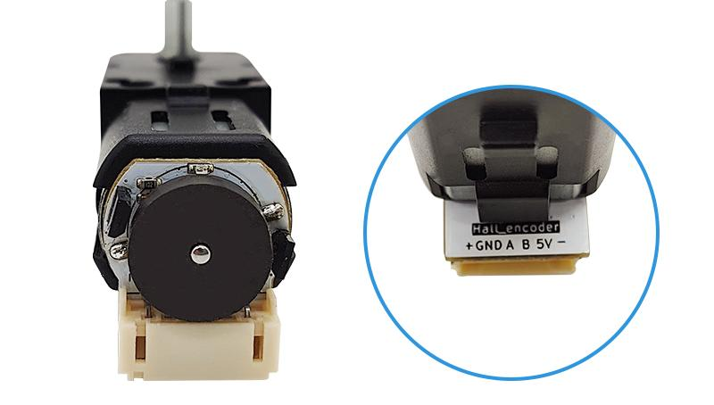

# hall_encoder_sensor编码电机模块

## 模块实物图

## 概述

编码电机是一款可通过霍尔传感器丶磁盘及减速电机组成的可精准控制的减速直流电机。它通过内置的编码器将机械运动转换为数字信号，从而实现对位置、速度和加速度等参数的精确测量。

编码电机模块1：90的减速比，拥有更高大的扭矩，载重能力大幅提升。3 -12V的宽输入电压适应更多不同系统，减速钱空载转速达10000RPM，减速后空在转速达113RPM，扭矩达1.0kg*cm，堵转扭矩1.8kg，更有全金属轴和半金属轴，全金属轴载重能力更强，半金属轴噪音更小，其余参数基本相同。AB相霍尔编码器可输出两路90°正交正弦波，既可以用于测速（读取AB相脉冲个数），也可用于读取编码电机的状态（读取AB相位差）。红色LED灯指示编码器工作状态，PH2.0防反接接口。

此设备可以应用于机器人技术、智能小车、医疗设备、和数控机床等多个领域等。

### 原理图

无

### 芯片规格书

无

### 尺寸图

待补充

## 模块参数

- 工作电压：DC 3 - 12V
- 空载电流：100mA
- 空载转速：113RPM
- 额定负载电流：500mA
- 额定负载转速：59RPM
- 额定负载转速：1.0KG
- 堵转电流：0.82A
- 堵转扭矩：1.8KG
- 接 口：PH2.0间距接口。
- 编码器供电：3.3-5V
- 减速比：1：90
- 编码盘：12PPR

## 接口定义

| 接口名称 | 描述        |
| -------- | :---------- |
| - | 直流减速电机负极 |
| 5V | 编码器供电正极 |
| B | 编码器B相输出 |
| A | 编码器A相输出 |
| GND | 编码器供电地线 |
| + | 直流减速电机正极 |

## Arduino示例程序（C/C++）

待补充

## Micropython示例程序

待补充

## Mixly图形化示例

待补充

## Mind+图形化示例

待补充
