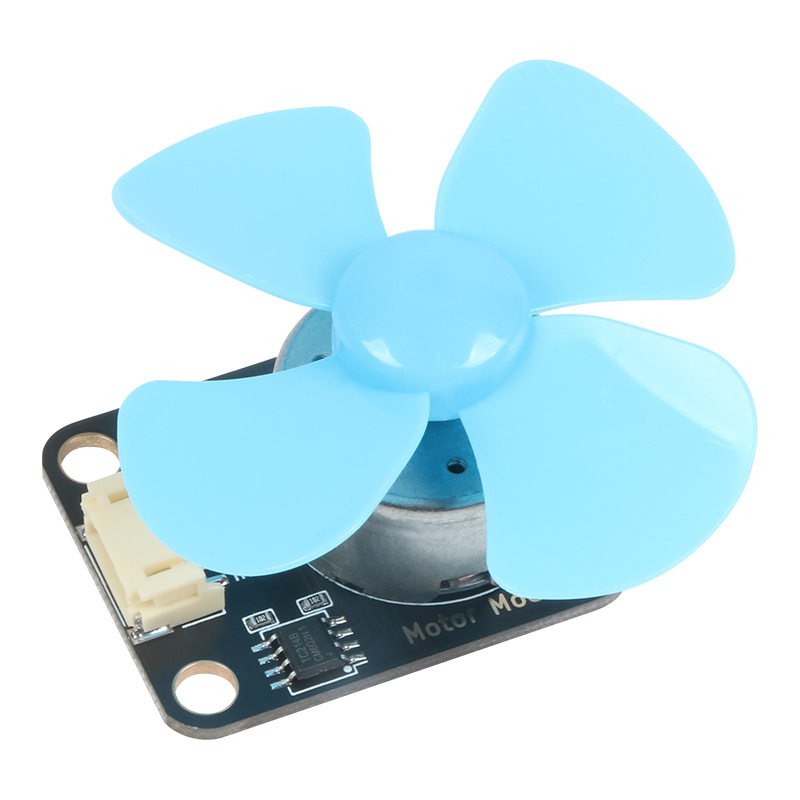
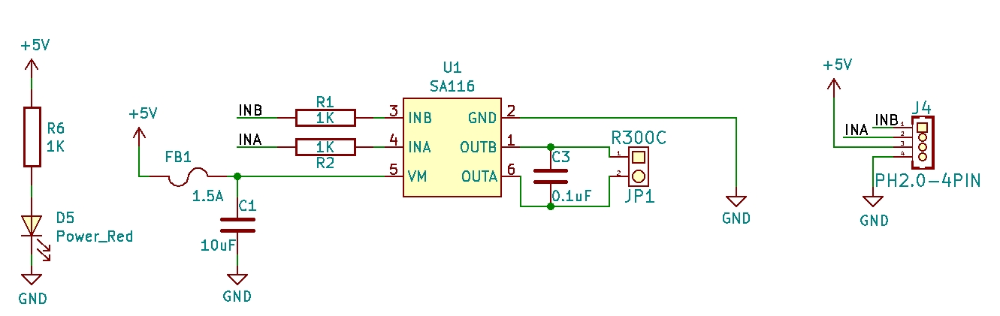
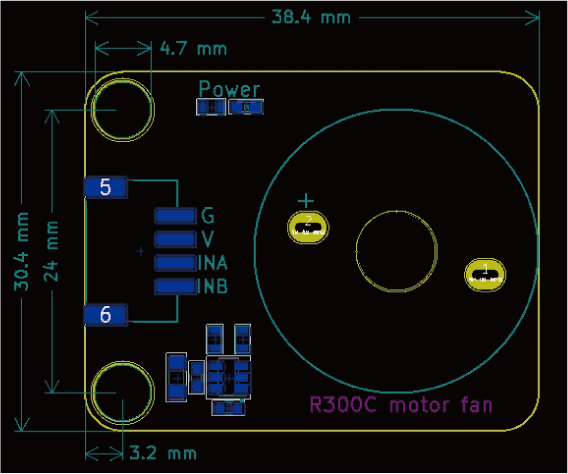

# R300C电机风扇模块

## 模块图



## 概述

​		可控制正反转，配有兼容乐高的安装孔，兼容舵机，舵盘。搭配优质螺旋浆，可轻松吹灭20cm处的打火

机火焰，可用于救火机器人的制作，机器人设计开发必备。

## 原理图



## 模块参数

* 1.供电电压:5V
* 2.连接方式:4PIN防反接杜邦线
* 3.模块尺寸:38.4*30.4mm
* 4.安装方式:M4螺钉兼容乐高插孔固定

| 引脚名称 | 描述       |
| -------- | ---------- |
| G        | GND 地线 |
| V        | 5V电源引脚   |
| INA | PWM输入 |
| INB     | PWM输入 |

## 机械尺寸



## 3D图纸
<a href="zh-cn/ph2.0_sensors/actuators/highPowerMotorModule/Drawing/BigMotor_Module.step" download>点击下载STEP文件</a>

<a href="zh-cn/ph2.0_sensors/actuators/highPowerMotorModule/Drawing/BigMotor_Module.wrl" download>点击下载WRL文件</a>

<a href="zh-cn/ph2.0_sensors/actuators/highPowerMotorModule/Drawing/BigMotor_Module.dxf" download>点击下载DXF文件</a>

## 示例程序

```c
#define INB 6  // 定义电机B端口
#define INA 5  // 定义电机A端口

void setup() {
  pinMode(INB, OUTPUT);  // 设置电机B端口为输出模式
  pinMode(INA, OUTPUT);  // 设置电机A端口为输出模式
}

void loop() {
  analogWrite(INA, 255);  // 设置电机A端口为高电平
  analogWrite(INB, 0);    // 设置电机B端口为低电平
  delay(2000);            // 2s之后电机反转
  analogWrite(INA, 0);    // 设置电机A端口为低电平
  analogWrite(INB, 255);  // 设置电机B端口为高电平
  delay(2000);            // 电机反转2s然后正转
}
```
