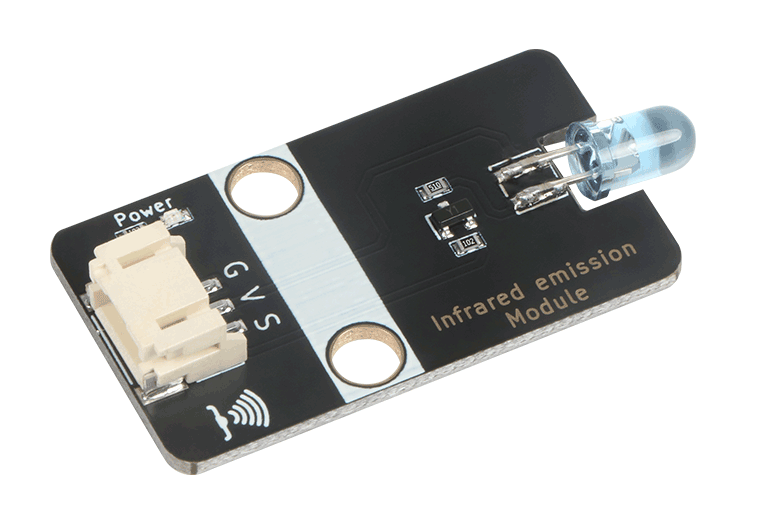
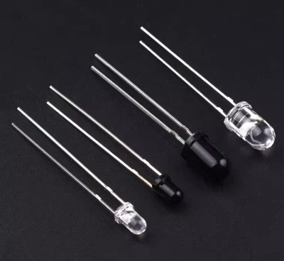
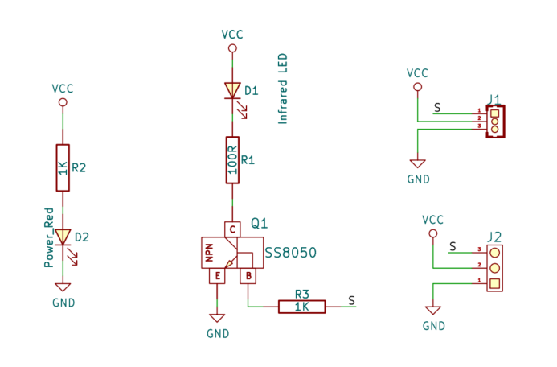
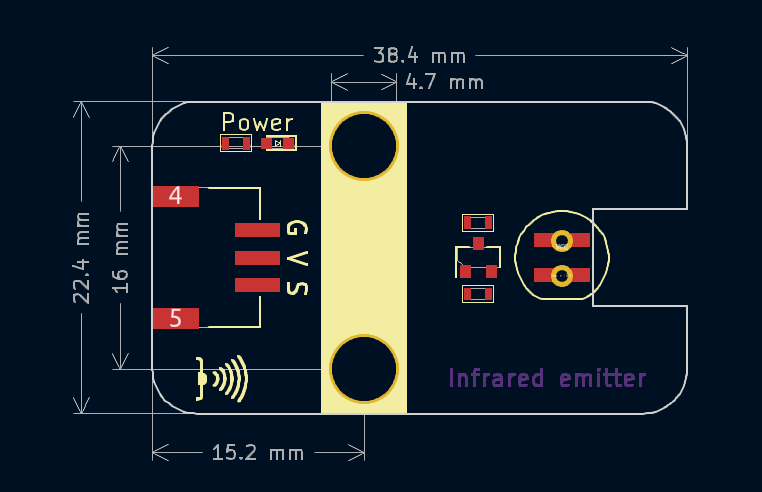
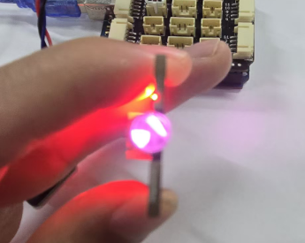
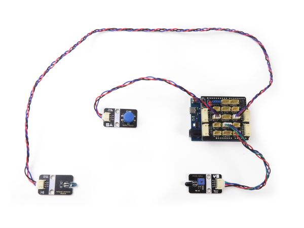
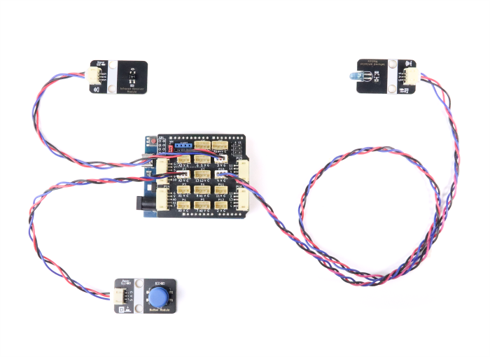
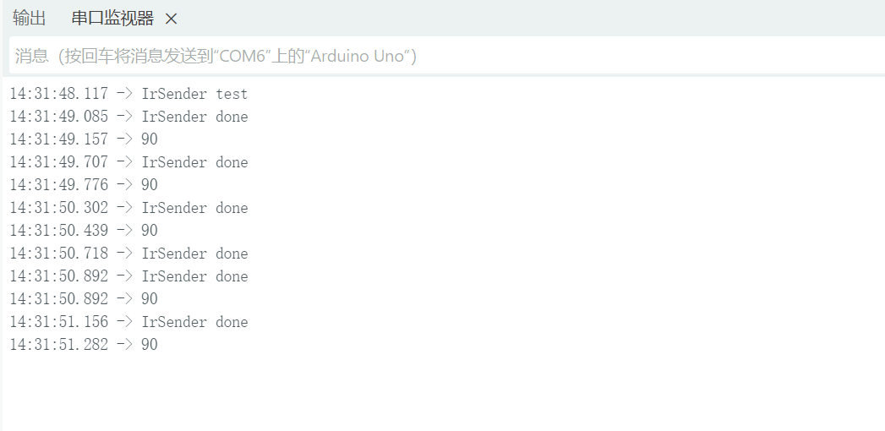

# 红外发送模块



## 概述

​	在地球上充满了各种波长的电磁波，所谓的可见（色）光就是人眼可见的电磁波谱，其波长为 380~770nm。众所周知，电磁波是可以用来通信的，为了避免遥控器发射的光造成人眼不适，故选用人眼不可见的红外线（Infrared）波长，目前业界遥控器发射头几乎都选用 940nm 波长。  

​	红外发射模块上的核心器件是就是红外发射管（IR LED），又称红外发射二极管， 是一种将电能转换为近红外光辐射的半导体器件，是一个可以发射出特定波长红外光的二极管。 属于二极管类。其主要材料为砷化镓（GaAs）、砷铝化镓（GaAlAs），常见封装形式包括全透明、浅蓝或黑色树脂。工作电压约1.4V ， 按功率分为小功率（1-10mW）、中功率（20-50mW）和大功率（50mW以上）。



​	红外发射模块主要应用在各种光电开关，红外循迹、红外遥控上面。红外遥控器就是使用的红外发射头发出一连串的二进制脉冲码信号。为了使其在无线传输过程中免受其他红外信号的干扰，通常都是先将其调制在特定的载波频率上,然后再经红外发射二极管发射头发射出去。现在这样一种设备被广泛应用于家用红外电器遥控中，如空调、电视、DVD等。

## 原理图



<a href="zh-cn/ph2.0_sensors/actuators/infrared_emitter/IR5308T-C-25.pdf" target="_blank">点击查看红外发射管规格书</a>

## 模块参数

* 供电电压：3 - 5V
* 最大工作电流：110mA
* 最大发射功率：130mW
* 红外发射角：约20度
* 波长：940nm
* 发射头尺寸：5mmx8.6mm
* 连接方式：3Pin-PH2.0防反接
* 模块尺寸：38.4*22.4mm
* 安装方式：M4螺钉兼容乐高插孔

| 引脚名称 | 描述                                           |
| -------- | ---------------------------------------------- |
| V        | 3~5V电源输入                                   |
| G        | GND 地线                                       |
| S        | 信号引脚，高电平发射红外光，低电平关闭红外发射 |

## 机械尺寸



<a href="zh-cn/ph2.0_sensors/actuators/infrared_emitter/infrared_emitter_3d.zip" download>点击下载2D和3D文件</a>

## Arduino uno示例程序

#### 实验目标：

​	检测引脚A2上的按键有按下，就通过Uno主板3号引脚设置高电平发射红外线，uno主板通过8号引脚检测到有红外线接收，那么点亮板载13号引脚上的LED灯。

#### 器件接线

| Uno主板引脚 | 传感器       | 功能       |
| ----------- | ------------ | ---------- |
| A2          | 按键模块     | 检测按键   |
| 3           | 红外发射模块 | 发射红外线 |
| 8           | 红外接收模块 | 接收检测   |

#### 实验一、 红外开关实验：

 将本模块放置到暗环境下（可放入纸盒或用手遮挡），用手机摄像头（部分手机只有前置摄像头才能看到，部分手机将红外过滤掉了看不到）对准红外发射头前端，并在照相/摄像功能中仔细观察，按下按键时，可以看到有淡红光在。 注意在摄像范围内要整体处于暗光状态，若有较亮的环境光则有可能无法观察到。



```c
void setup() {
    Serial.begin(115200);
    pinMode(A2, INPUT_PULLUP);
    pinMode(8, INPUT);
    pinMode(4, OUTPUT);
    pinMode(13, OUTPUT);
}

void loop() {
    // put your main code here, to run repeatedly:
    if ( digitalRead(8) == 0) {  // 接收红外信号
        digitalWrite(13, HIGH);      //点亮13号灯
        Serial.println("turn on 13 led");
    } else {
        Serial.println("turn off 13 led");
    }
    if ( digitalRead(A2) == 0) {  // 按键按下
        digitalWrite(4, HIGH);      // 发射红外线
        Serial.println("send Infrared");
    } else {
        digitalWrite(4, LOW);
        Serial.println("off Infrared");
    }
    delay(100);
}

```

### 接线图



红外对射检测距离5~ 50cm，中间不能有任何物体阻隔，当按下按键时，红外发射会发射红外线，让红外线接收模块接收到，红外线接收模块蓝色灯亮起，Arduino主板13号引脚L灯也会亮起。

#### 实验二、 红外调制发射实验：

前面我们做的是一个简单的红外发送和接收实验，这只能做检测开关使用。如果要完成红外数据通讯，那我们就需要对红外信号进行编码，为了提高通信的抗干扰性，我们还需要调制信号，红外遥控就是红外通信里面最常见的应用，本实验将验证，调制38K信号，发射NEC协议的按键值给到红外遥控接收模块解码，通过串口打印结果。

验证测试程序之前首先需要在Arduino IDE上安装库[**IRremote**](https://github.com/Arduino-IRremote/Arduino-IRremote) ，版本V4.5.0

```CPP
#include <Arduino.h>
#include <IRremote.h>

void irreceiver_received();
void button_A2_Click();

void setup() {
    pinMode(A2, INPUT_PULLUP);
    IrReceiver.begin(3);
    IrSender.begin(4);
    Serial.begin(115200);
    Serial.println("IrSender test");
}

void loop() {
    if (digitalReadFast(A2) == 0) {  // 按键按下
        button_A2_Click();
    }
    irreceiver_received();
    delay(110);  // 一次解码完整时间大概110ms 必须要延时
}

void irreceiver_received() {
    bool received = IrReceiver.decode();
    IrReceiver.resume();
    if (!received || IrReceiver.decodedIRData.protocol == UNKNOWN) return;
    Serial.println(IrReceiver.decodedIRData.command, HEX);
}

void button_A2_Click() {
    IrSender.write(NEC, 0x0, 0x90, 0);
    Serial.println("IrSender done");
    IrSender.space(20);
}
```

注意：一次红外完整解码时间大约为110ms，所以我们发送红外键码值时间隔必须超过110ms。

### 实验接线图：



#### 实验结果：

红外发送头需要对准一体化红外遥控接收头，距离不要超过1m，按下按键，将发送命令码为0x90，红外



