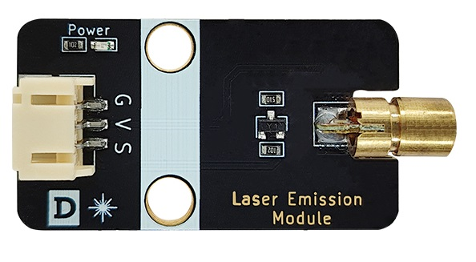
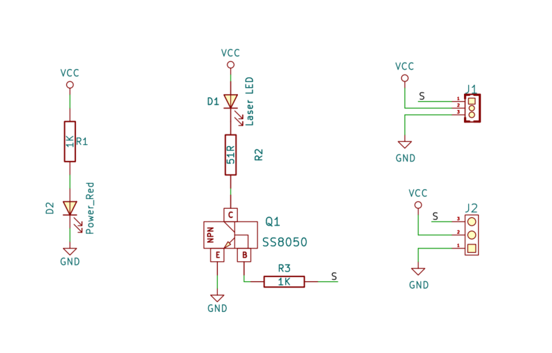
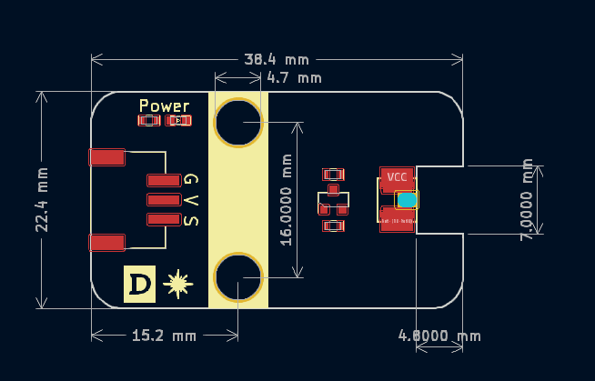

# 激光发射模块



## 概述

​	激光是20世纪以来继核能、电脑、半导体之后，人类的又一重大发明，被称为“最快的刀”、“最准的尺”、“最亮的光”。英文名Light Amplification by Stimulated Emission of Radiation，意思是“通过受激辐射光扩大”。激光的英文全名已经完全表达了制造激光的主要过程。激光的原理早在1916年已被著名的美国物理学家爱因斯坦发现。原子受激辐射的光，故名“激光”：原子中的电子吸收能量后从低能级跃迁到高能级，再从高能级回落到低能级的时候，所释放的能量以光子的形式放出。被引诱（激发）出来的光子束（激光），其中的光子光学特性高度一致。这使得激光比起普通光源，激光的单色性好，亮度高，方向性好。 激光发射模块上板载了一个6x13mm的激光头，当给信号脚一个高电平则触发激光发射头发出持续点状激光，可以旋转激光头调节激光头光斑大小。

## 原理图



## 模块参数

* 供电电压：3- 5V
* 功率：5mw
* 波长：650nm
* 激光头尺寸：6mmx13mm
* 连接方式：3Pin PH2.0防反接
* 模块尺寸：38.4*22.4mm
* 安装方式：M4螺钉兼容乐高插孔

| 引脚名称 | 描述                                     |
| -------- | ---------------------------------------- |
| V        | 3~5V电源输入                             |
| G        | GND 地线                                 |
| S        | 信号引脚，高电平发射激光，低电平关闭激光 |

## 机械尺寸



<a href="zh-cn/ph2.0_sensors/actuators/laser_emitter/laser_emitter_3d.zip" target="_blank">点击下载2D和3D文件</a>

## Arduino uno示例程序

```c
#define LASER_PIN A3  // Set the laser port to A3

void setup() {
  pinMode(LASER_PIN, OUTPUT);  // Set the laser port to output mode
}

void loop() {
  digitalWrite(LASER_PIN, HIGH);  // Set the laser port to high level
}
```


