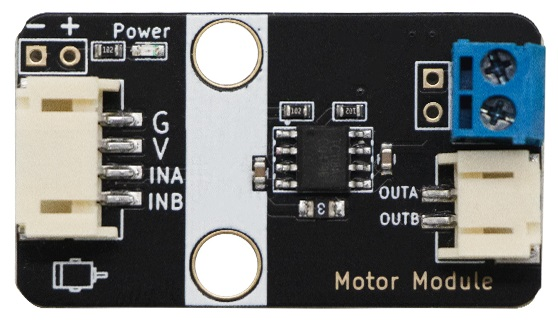
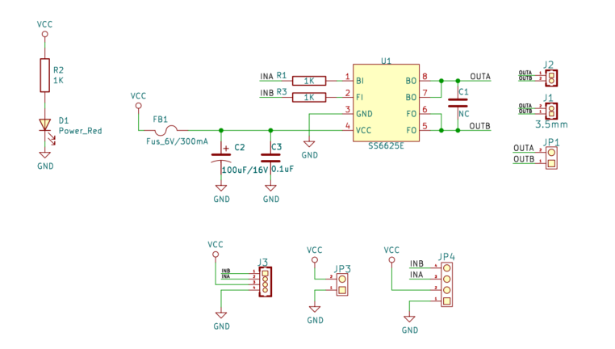
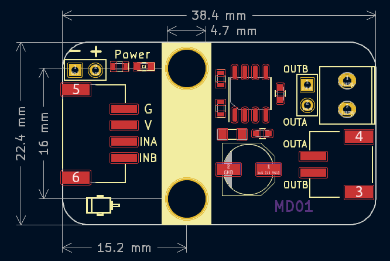

# MD01单路电机驱动模块



## 概述

​	MD01模块一款基于SS6625电机驱动芯片的单路驱动模块。该模块通过INA，INB两个TTL/CMOS电平输入控制信号，即可以控制电机转动。使得用户驱动电机时，不需要了解电机的工作原理，只需主控要通过PWM信号控制转速即可。本模块对驱动电流进行了300mA限流，只能用于小功率电机驱动，可以驱动M/L型乐高电机，TT电机，水泵，小型风扇，震动马达等。

​	需要大功率电机驱动请使用MD02模块。

## 原理图



## 模块参数

- 电压： 3 ~ 15V
- 接口：4Pin-PH2.0接口
- 电机类型： 启动电流在300mA以下的直流小电机
- 尺寸： 38.4 * 22.4 mm

接线方式： 将模块左侧接至单片机的PWM输出引脚，右侧接至电机的正负极即可。

## 模块尺寸



<a href="zh-cn/ph2.0_sensors/actuators/md01/md01_3d.zip" target="_blank">点击下载2D和3D文件</a>

## Arduino Uno代码示例

```c++
#define INA 5  // 定义电机A.B端口
#define INB 6  //

void setup() {
  pinMode(INB, OUTPUT);  // 设置电机端口为输出模式
  pinMode(INA, OUTPUT);  //
}

void loop() {
  analogWrite(INA, 255);  // 设置A端口为高电平
  analogWrite(INB, 0);    // 设置B端口为低电平
  delay(2000);            // 2s之后电机反转
  analogWrite(INA, 0);    // 设置A端口为低电平
  analogWrite(INB, 255);  // 设置B端口为高电平
  delay(2000);            // 电机反转2s然后正转
}
```
