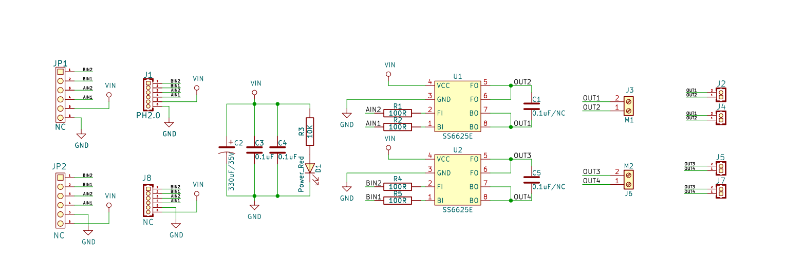
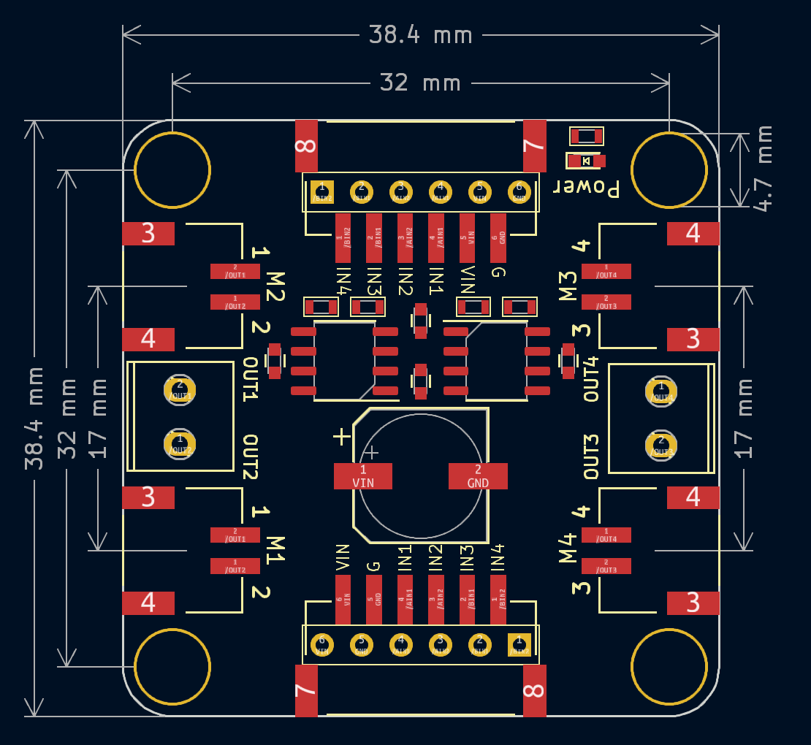
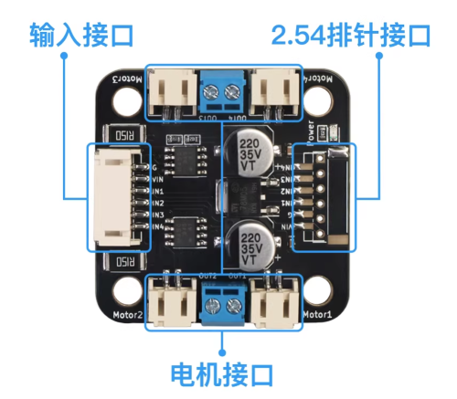

# MD02双路电机驱动模块


## 概述

​	MD02模块是集成两颗单路大电机驱动芯片<a href="zh-cn/ph2.0_sensors/actuators/doc/SS6625E_CN_V1.0.pdf" target="_blank">**SS6625E**</a>的双路电机驱动板。该模块工作电压范围比较广，可以支持3-20V输入电压，它的瞬间驱动电流可以达5.5A，持续工作电流可达3A。M1M2，M3M4分别共用一组驱动信号，所以它可以同时接4个电机接口，非常方便应用于DIY 4WD小车。

​	MD02模块功能可以替代L298N模块，使用方法也和L298N类似，但是尺寸大小、散热和驱动电流、功耗等性能方面远超L298N模块。

## 原理图



<a href="zh-cn/ph2.0_sensors/actuators/MD02_sch.pdf" target="_blank">原理图点击此处下载查看</a>

## 模块参数

- 供电电压：3~20V
- 最大电流：3A
- 连接方式：6pin PH2.0防反接线
- 尺寸：38.4*38.4mm
- 安装方式：M4螺钉兼容乐高插孔固定
- 驱动方式：四路PWM

| MD02引脚丝印 | 功能描述 |
| :----- | :-------: |
| G      | GND地线|
| Vin | 电机驱动输入电压3-20V |
| IN1   | M1/M2电机控制信号引脚1 |
| IN2   | M1/M2电机控制信号引脚2 |
| IN3   | M3/M4电机控制信号引脚3 |
| IN4   | M3/M4电机控制信号引脚4 |

### 模块尺寸



<a href="zh-cn/ph2.0_sensors/actuators/md02/md02_3d.zip" download>下载MD02模块3D文件</a>

## 注意事项

本模块电机接口M1、M2电机接口是共用驱动信号IN1，IN2，即给IN1，IN2驱动信号时M1M2会同步旋转；

本模块电机接口M3、M4电机接口是共用驱动信号IN3，IN4，即给IN3，IN4驱动信号时M3M4会同步旋转。



信号如图所示

| 直流电机 | 旋转方式 | IN1  | IN2  | IN3  | IN4  |
| -------- | -------- | ---- | ---- | ---- | ---- |
| M1/M2    | 正转     | 高   | 低   | /    | /    |
|          | 反转     | 低   | 高   | /    | /    |
|          | 停止     | 低   | 低   | /    | /    |
|          | 刹车     | 高   | 高   | /    | /    |
| M3/M4    | 正转     | /    | /    | 高   | 低   |
|          | 反转     | /    | /    | 低   | 高   |
|          | 停止     | /    | /    | 低   | 低   |
|          | 刹车     | /    | /    | 高   | 高   |

### VIN供电注意

- 如果被驱动电机启动电流低于100mA，比如兼容乐高的电机，塑料轴TT马达，Vin可以用5V供电
- 如果被驱动电机启动电流大于100mA，比如金属轴电机，370电机，520电机，Vin必须用7.4V电流大于2A以上的锂电池供电，否则无法驱动电机。

## Arduino Uno测试程序

如下示例程序为Arduino Uno主板使用双路电机驱动模块控制四路直流电机实现正转与反转，两个信号引脚控制两个电机，电机的正转与反转与两路PWM的高低电平有关，两者的电平一高一低就可以控制电机的转动方向。

```cpp
#define ININ1 5   // 定义电机IN1,IN2端口
#define ININ2 6   //
#define ININ3 9   // 定义电机IN3,IN4端口
#define ININ4 10  //

void setup() {
  pinMode(ININ2, OUTPUT);  // 设置电机端口为输出模式
  pinMode(ININ1, OUTPUT);  //
  pinMode(ININ3, OUTPUT);  //
  pinMode(ININ4, OUTPUT);  //
}

void loop() {
  analogWrite(ININ1, 255);  // 设置IN1端口为高电平
  analogWrite(ININ2, 0);    // 设置IN2端口为低电平
  analogWrite(ININ3, 255);  // 设置IN3端口为高电平
  analogWrite(ININ4, 0);    // 设置IN4端口为低电平
  delay(2000);              // 2s之后电机反转
  analogWrite(ININ1, 0);    // 设置IN1端口为低电平
  analogWrite(ININ2, 255);  // 设置IN2端口为高电平 
  analogWrite(ININ3, 0);    // 设置IN3端口为低电平
  analogWrite(ININ4, 255);  // 设置IN4端口为高电平
  delay(2000);              // 电机反转2s然后正转
}
```

<a href="zh-cn/ph2.0_sensors/actuators/md02/MD02_ArduinoDemo.zip" download>下载MD02 Arduino示例程序</a>