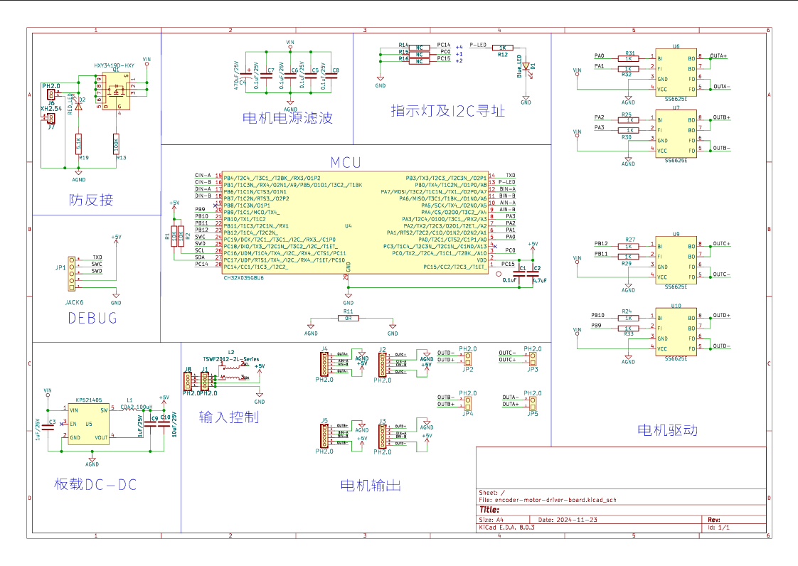
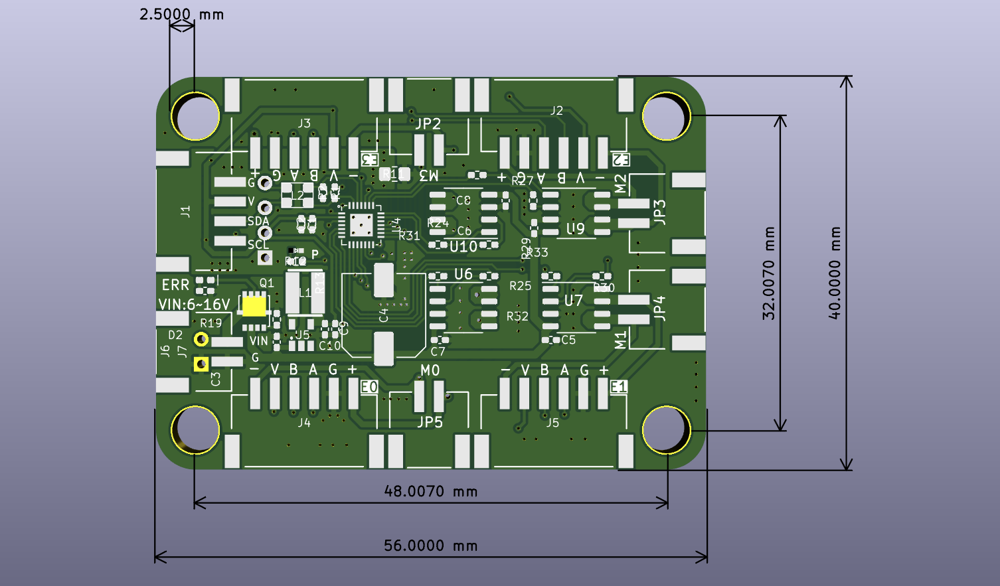

# MD40 四路编码驱动模块

## 模块实物图

## 概述

此模块是一款基于CH32X035单片机的四路编码驱动模块。该模块通过I2C协议接收指令，驱动四片SS6625E电机驱动芯片。模块有4个直流电机口和4个编码电机口，可驱动直流电机和编码电机，并支持信号反馈。适用于需要多电机协同运动及精确位置反馈的应用场景，如移动机器人、自动化小车和多轴联动平台等。

## 注意事项

- 此模块需要额外外接电源，大小为6-16v。

### 原理图

<a href="zh-cn/ph2.0_sensors/actuators/md40/encoder-motor-driver-board.pdf" target="_blank">点击此处查看原理图</a>

## 模块参数

- 与开发板连线电压：5V
- 外接电源：6-16V
- 接 口：I2C接口，外接电源接口，直流电机接口和编码电机接口
- 通信方式：I2C通信，地址0x16
- 尺 寸：40*56mm，兼容乐高积木和M4螺丝固定孔

| 引脚名称  | 描述         |
| -------- | ------------ |
| G        | GND地线       |
| V        | 3-5v电源引脚  |
| SDA      | I2C数据引脚   |
| SCL      | I2C时钟引脚   |

### 机械尺寸图

## Arduino示例程序

<a href="https://gh-proxy.com/https://github.com/emakefun-arduino-library/em_md40/archive/refs/tags/v1.0.0.zip" download>点击下载Arduino示例程序</a>

<a href="https://emakefun-arduino-library.github.io/em_md40/html/zh-CN/classem_1_1_md40.html" target="_blank">点击此处查看API说明文档</a>

## MicroPython 示例程序

### ESP32 MicroPython示例程序

<a href="https://gh-proxy.com/https://github.com/emakefun-micropython-lib/em_mpy_md40/archive/refs/tags/v1.0.2.zip" download>点击下载ESP32 MicroPython示例程序</a>

### micro:bit MicroPython示例程序

待补充

## micro:bit MakeCode示例程序

待补充
