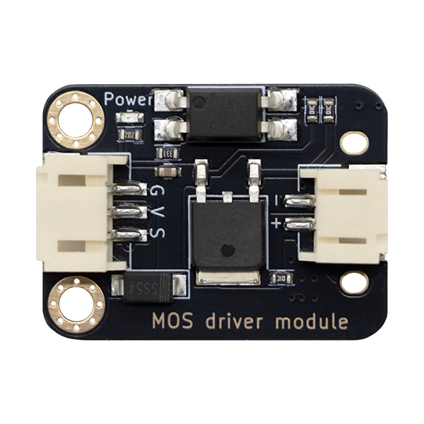
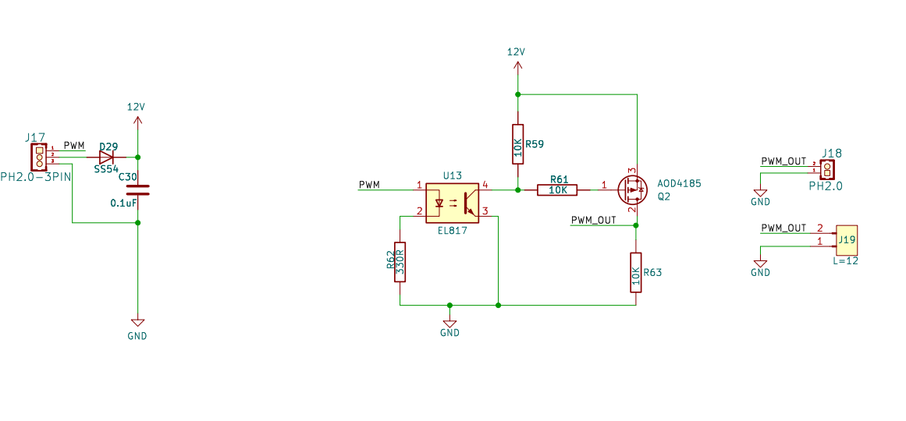

# MOS管驱动模块

## 模块实物图



## 概述

该模块主要用于实现电平转换和功率放大功能，以适配低电平信号（如单片机或微控制器的 PWM 输出）驱动高功率设备（如继电器或电机）。适用于工业控制、电机驱动、继电器控制等需要低电平信号驱动高功率设备的场景，特别适合对可靠性要求较高的应用。

### 原理图



[点击此处查看原理图](zh-cn/ph2.0_sensors/actuators/mos_driver_module/mos_driver_module.pdf ':ignore')

### 尺寸图

待补充

### 主要特点与作用

- 电气隔离：通过光耦 (U13) 实现输入与输出的电气隔离，提高系统抗干扰能力。
- 功率放大：由 MOSFET (Q2) 放大 PWM 信号，适用于驱动高功率负载。
- 可靠性高：D29 和 C30 的保护机制，以及合理的电阻限流网络，提高电路的稳定性。

## Arduino 驱动电机示例

### 硬件连接

下图为 水弹枪通过 MOS 驱动电机模块连接Arduino的接线图：


### 示例程序

```c
const int motor = A0;
void setup()
{
  Serial.begin(115200);
  pinMode(motor,OUTPUT);
}

void loop(){
//发射水弹枪
    digitalWrite(motor,HIGH);
    Serial.println("Fire the water cannon!");
    delay(3000);
    digitalWrite(motor,LOW);
    Serial.println("Turn off the water bomb gun!");
    delay(3000);
}
```

<a href="zh-cn/ph2.0_sensors/actuators/mos_driver_module/motor_driver.zip" download>点击此处下载 Arduino 驱动电机示例程序</a>
