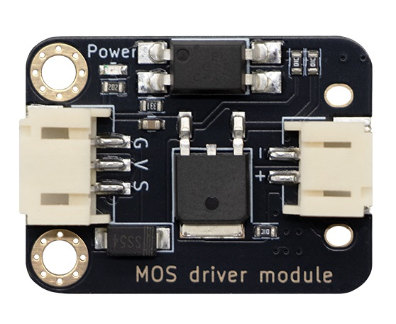
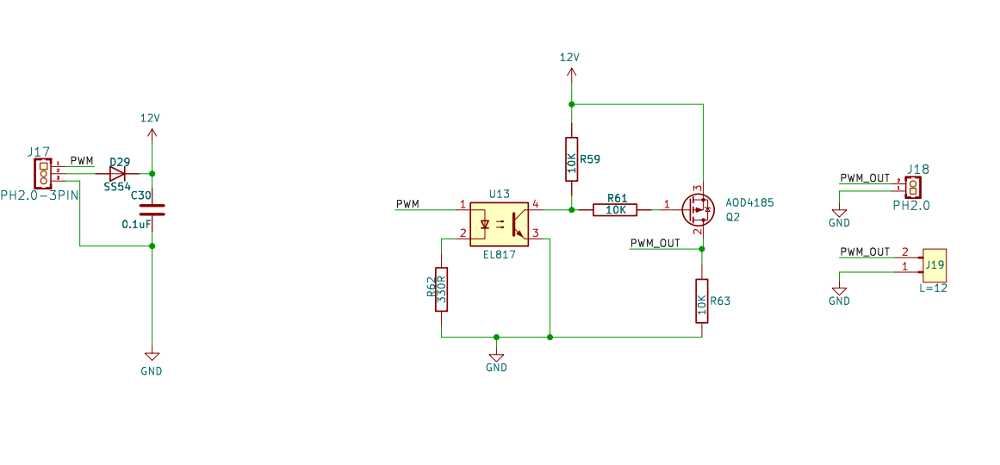
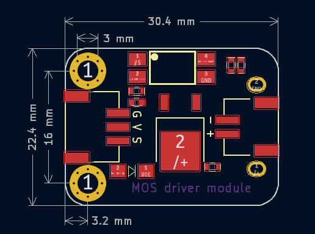
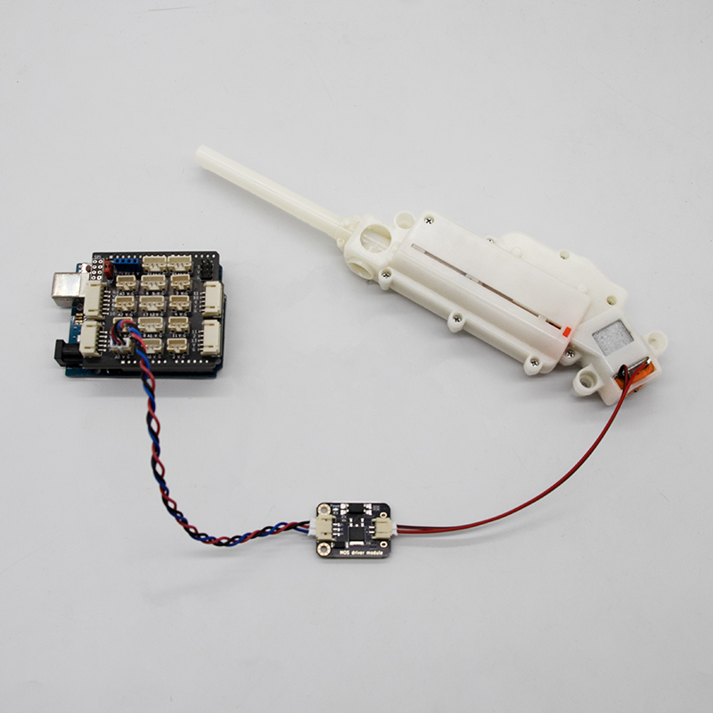

# MOS管驱动模块




## 概述

该模块主要用于实现电平转换和功率放大功能，以适配低电平信号（如单片机或微控制器的 PWM 输出）驱动高功率设备（如继电器或电机）。适用于工业控制、电机驱动、继电器控制等需要低电平信号驱动高功率设备的场景，特别适合对可靠性要求较高的应用。

可以用来驱动马达、风扇、水泵、电磁锁等

### 原理图



<a href="zh-cn/ph2.0_sensors/actuators/mos_driver_module/mos_driver_module.pdf" target="_blank">点击此处查看原理图</a>

### 主要特点与作用

- 电气隔离：通过光耦 (U13) 实现输入与输出的电气隔离，提高系统抗干扰能力。
- 功率放大：由 MOSFET (Q2) 放大 PWM 信号，适用于驱动高功率负载。
- 可靠性高：D29 和 C30 的保护机制，以及合理的电阻限流网络，提高电路的稳定性。

## 模块参数

* 供电电压：5 ~ 12V
* 连接方式：3Pin PH2.0防反接
* 模块尺寸：30.4*22.4mm
* 安装方式：M3螺钉兼容乐高插孔

| 引脚名称 | 描述                                       |
| -------- | ------------------------------------------ |
| V        | 5 ~ 12V电源输入                            |
| G        | GND 地线                                   |
| S        | 信号引脚，高电平MOS管导通，低电平MOS管截止 |

## 机械尺寸



<a href="zh-cn/ph2.0_sensors/actuators/mos_driver_module/mos_driver_module_3d.zip" target="_blank">点击下载2D和3D文件</a>

## Arduino 驱动波箱电机示例

### 硬件连接

下图为 水弹枪通过 MOS 驱动电机模块连接Arduino的接线图：



### 示例程序

```c
const int kMotor = A0;

void setup() {
  Serial.begin(115200);
  pinMode(kMotor, OUTPUT);
}

void loop() {
  // 发射水弹枪
  digitalWrite(kMotor, HIGH);
  Serial.println("Fire the water cannon!");
  delay(3000);
  digitalWrite(kMotor, LOW);
  Serial.println("Turn off the water bomb gun!");
  delay(3000);
}
```
