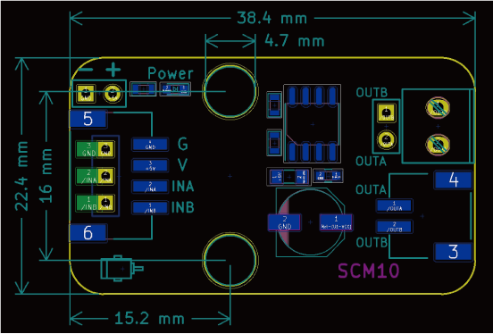

# 单路电机驱动模块

## 实物图


## 概述

该模块用于驱动一个直流电机，其工作原理是通过控制电机的转速来驱动电机转动。很大程度上方便了用户使用电机，不需要了解电机的工作原理，只需要通过PWM信号控制转速即可。

## 原理图

 模块参数

<a href="zh-cn/ph2.0_sensors/actuators/motor_module/SS6625E.pdf" target="_blank">点击此处查看原理图</a>

## 模块参数

* 1.供电电压:5V
* 2.连接方式:俩种接线方式，接线柱或者PH2.0接口
* 3.模块尺寸:38.4*30.4mm
* 4.安装方式:M4螺钉兼容乐高插孔固定

| 引脚名称 | 描述       |
| -------- | ---------- |
| G        | GND 地线 |
| V        | 5V电源引脚   |
| INA | PWM输入 |
| INB     | PWM输入 |
| OUTA | 直流电机接口 |
| OUTB     | 直流电机接口 |

## 机械尺寸



## 3D图纸
<a href="zh-cn/ph2.0_sensors/actuators/motor_module/Drawing/SS6625E.step" download>点击下载STEP文件</a>

<a href="zh-cn/ph2.0_sensors/actuators/motor_module/Drawing/SS6625E.wrl" download>点击下载WRL文件</a>

<a href="zh-cn/ph2.0_sensors/actuators/motor_module/Drawing/SS6625E.dxf" download>点击下载DXF文件</a>


## Arduino代码示例

```c++
#define INA 5  // 定义电机A.B端口
#define INB 6  //

void setup() {
  pinMode(INB, OUTPUT);  // 设置电机端口为输出模式
  pinMode(INA, OUTPUT);  //
}

void loop() {
  analogWrite(INA, 255);  // 设置A端口为高电平
  analogWrite(INB, 0);    // 设置B端口为低电平
  delay(2000);            // 2s之后电机反转
  analogWrite(INA, 0);    // 设置A端口为低电平
  analogWrite(INB, 255);  // 设置B端口为高电平
  delay(2000);            // 电机反转2s然后正转
}
```
