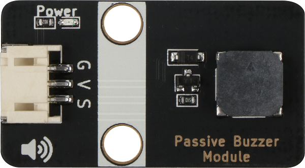
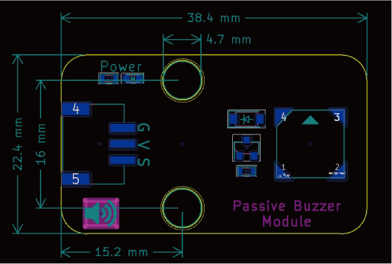

# 无源蜂鸣器规格书

## 模块图



## 概述

​        有些电器在电气状态下经常会发出嗡嗡声，这实际上来自蜂鸣器，学校里铃声只是一个更大的蜂鸣器。 蜂鸣器有两种，一种是主动蜂鸣器，另一种是被动蜂鸣器。 “主动”和“被动”并不是指是否需要提供电源，而是指有或没有内部振荡器的蜂鸣器。有源蜂鸣器只要给它通电，就会发出嗡嗡声，但频率是固定的。 主要用于一些报警装置上，如烟雾报警器。

## 原理图


<a href="zh-cn/ph2.0_sensors/actuators/passiveBuzzerModule/无源.pdf" target="_blank">点击此处查看原理图</a>

## 模块参数

* 1.供电电压:5V
* 2.连接方式:3PIN防反接杜邦线
* 3.模块尺寸38.4*22.4mm
* 4.安装方式:M4螺钉兼容乐高插孔固定

| 引脚名称 | 描述       |
| -------- | ---------- |
| V        | 5V电源引脚 |
| G        | GND 地线   |
| S        | 信号引脚   |

## 尺寸图




## 3D图纸
<a href="zh-cn/ph2.0_sensors/actuators/passiveBuzzerModule/Drawing/Passive_Buzzer_Module.step" download>点击下载STEP文件</a>

<a href="zh-cn/ph2.0_sensors/actuators/passiveBuzzerModule/Drawing/Passive_Buzzer_Module.wrl" download>点击下载WRL文件</a>

<a href="zh-cn/ph2.0_sensors/actuators/passiveBuzzerModule/Drawing/Passive_Buzzer_Module.dxf" download>点击下载DXF文件</a>

## Arduino IDE示例程序

```c
#define BUZZER_PIN A0

void setup() {
  pinMode(BUZZER_PIN, OUTPUT);
}

void loop() {
  for (int i = 200; i <= 800; i++) {  // 200HZ ~ 800HZ
    tone(BUZZER_PIN, i);
  }
  delay(1000);                      // Max Frequency hold 1s
  for (int i = 800; i >= 200; i--) {  // 800HZ ~ 200HZ
    tone(BUZZER_PIN, i);
    delay(10);
  }
}
```

## micro:bit示例程序

<a href="https://makecode.microbit.org/_JMyMfiebu8gz" target="_blank">动手试一试</a>