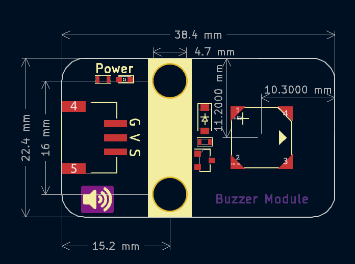

# 无源蜂鸣器


## 概述

​	无源蜂鸣器是一种利用电磁感应现象的发声装置，其核心原理为音圈接入交变电流后形成的电磁铁与永磁铁相互作用，通过吸合或排斥推动振膜振动发声。与有源蜂鸣器通电就响不同，它内部没有震荡驱动电路，需依赖外部2-5kHz的驱动信号（如PWM方波）控制发声频率和时长，且在接入直流电时仅能在电路通断瞬间发声。由于无源蜂鸣器可通过调节驱动信号实现多样化音调，声音表现更清脆纯净，主要应用于电子产品警报提示、设备状态通知及玩具等领域。


## 模块参数

* 供电电压：3 ~ 5V；
* 工作电流：80mA；
* 内阻：30R；
* 声压：85dB；
* 连接方式：3pin PH2.0接口；
* 尺寸大小：蜂鸣器：8.5x8.5x3mm 模块：38.4x22.4 mm；
* 安装方式：M4螺钉兼容乐高插孔固定

| 引脚名称 | 描述                                       |
| -------- | ------------------------------------------ |
| V        | 3~5V电源输入引脚                           |
| G        | GND地线                                    |
| S        | 信号引脚，高电平不会响，需要2-5kHz频率驱动 |

## 机械尺寸



<a href="zh-cn/ph2.0_sensors/actuators/passive_buzzer/passive_buzzer3D.zip" target="_blank">点击下载2D和3D文件</a>

## Arduino IDE示例程序

```c
#define BUZZER_PIN A0

void setup() {
  pinMode(BUZZER_PIN, OUTPUT);
}

void loop() {
  for (int i = 200; i <= 800; i++) {  // 200HZ ~ 800HZ
    tone(BUZZER_PIN, i);
  }
  delay(1000);                        // Max Frequency hold 1s
  for (int i = 800; i >= 200; i--) {  // 800HZ ~ 200HZ
    tone(BUZZER_PIN, i);
    delay(10);
  }
}
```

## micro:bit示例程序

<a href="https://makecode.microbit.org/_JMyMfiebu8gz" target="_blank">动手试一试</a>
