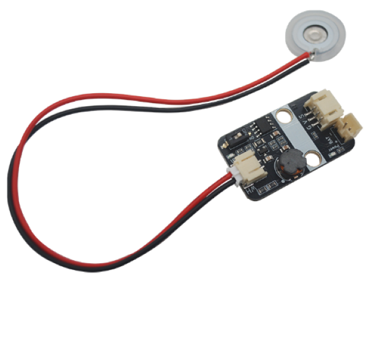

# Atomizer_5V_module雾化器模块

## 模块实物图

## 概述

Atomizer_5V_module是一款超声波雾化器模块，其利用高频振动将液体分解成细小颗粒。板载两颗高亮LED，红色LED用以指示LED供电是否正常，蓝色LED则指示雾化模块是否有在工作。

Atomizer_5V_module可通过单片机I/O口控制，也可通过板上自带的拨码开关控制，即便在没有单片机的情况下也能轻松使用雾化器模块，使用非常便利。除此之外，雾化器适应频率范围为100KHz~160KHz(中心频率108KHz或 150KHz)微孔雾化片，其内部集成微孔雾化片频率适应电路，可以检测微孔雾化片需要频率进行驱动，自适应频率快。拥有PH2.0防反插接口。

此设备可以应用于医疗、美容、工业和家庭等多个领域等。

### 原理图

[点击下载原理图](zh-cn/ph2.0_sensors/actuators/small_atomizer.pdf ':ignore')

### 芯片规格书

[点击下载Atomizer_chip规格书](zh-cn/ph2.0_sensors/smart_module/Atomizer_5V_Module/Atomizer_chip.pdf ':ignore')

### 尺寸图

待补充

## 模块参数

- 工作电压：4-5V
- 工作电流：120mA
- 震动频率频率：108KHZ
- 接 口：PH2.0间距接口，3pin的是供电及控制接口，2pin为雾化片接口及电池供电接口。
- 工作稳定温度范围：0℃ ~ +70℃
- 通信方式:  I/O口直接控制
- 尺 寸：22.4*38.4mm，兼容乐高积木和M4螺丝固定孔

## 引脚定义

| 引脚名称 | 描述        |
| -------- | :---------- |
| G        | GND     |
| V        | VCC  |
| S      | 雾化启动控制，低有效 |
| WH     | 雾化片接口 |
| + | 电池供电正极 |
| - | 电池供电负极 |

## Arduino示例程序（C/C++）

待补充

## Micropython示例程序

待补充

## Mixly图形化示例

待补充

## Mind+图形化示例

待补充
