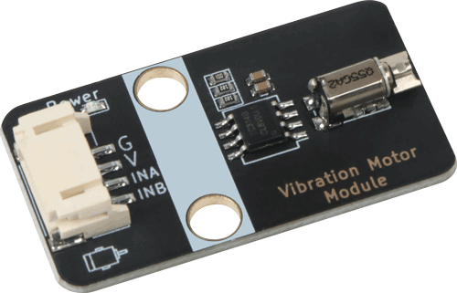
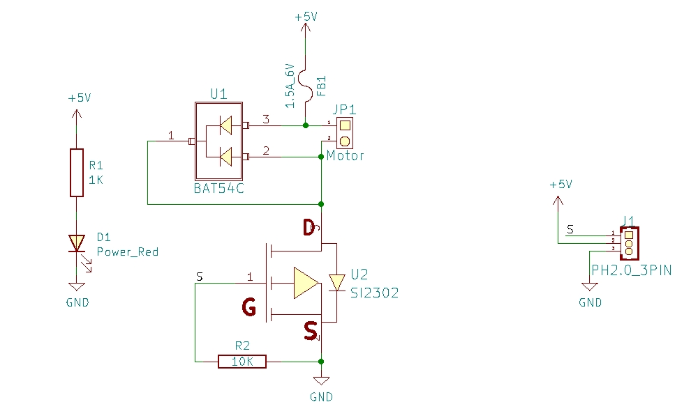
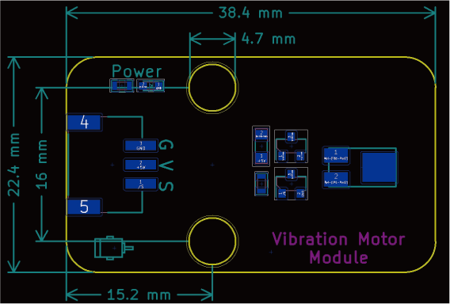

# 振动马达模块



## 概述

振动马达模块，内含一个转子马达，通过马达转动带动转子产生离心引起振动。

许多产品均需要使用振动马达，如智能手机，手表等。

## 原理图



<a href="zh-cn/ph2.0_sensors/actuators/8002a_amp_speaker/Vibration_Motor_Module.pdf" target="_blank">点击此处查看原理图</a>

## 模块参数

* 1.供电电压:5V
* 2.连接方式:3PIN防反接杜邦线
* 3.模块尺寸:38.4*2.2.4mm
* 4.安装方式:M4螺钉兼容乐高插孔固定

| 引脚名称 | 描述       |
| -------- | ---------- |
| V        | 5V电源引脚 |
| G        | GND 地线   |
| S        | 信号引脚   |

## 机械尺寸




## 3D图纸
<a href="zh-cn/ph2.0_sensors/actuators/vibrationMotorModule/Drawing/Vibration_Motor_Module.step" download>点击下载STEP文件</a>

<a href="zh-cn/ph2.0_sensors/actuators/vibrationMotorModule/Drawing/Vibration_Motor_Module.wrl" download>点击下载WRL文件</a>

<a href="zh-cn/ph2.0_sensors/actuators/vibrationMotorModule/Drawing/Vibration_Motor_Module.dxf" download>点击下载DXF文件</a>


## 示例程序

```c
#define INB 6  // 定义振动电机B端口
#define INA 5  // 定义振动电机A端口

void setup() {
  pinMode(INB, OUTPUT);  // 设置振动电机B端口为输出模式
  pinMode(INA, OUTPUT);  // 设置振动电机A端口为输出模式
}

void loop() {
  analogWrite(INA, 255);  // 设置振动电机A端口为高电平
  analogWrite(INB, 0);    // 设置振动电机B端口为低电平
  delay(2000);            // 2s之后电机反转
  analogWrite(INA, 0);    // 设置振动电机A端口为低电平
  analogWrite(INB, 255);  // 设置振动电机B端口为高电平
  delay(2000);            // 振动电机反转2s然后正转
}
```
