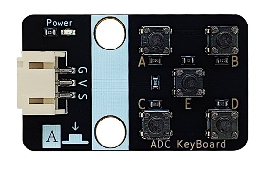
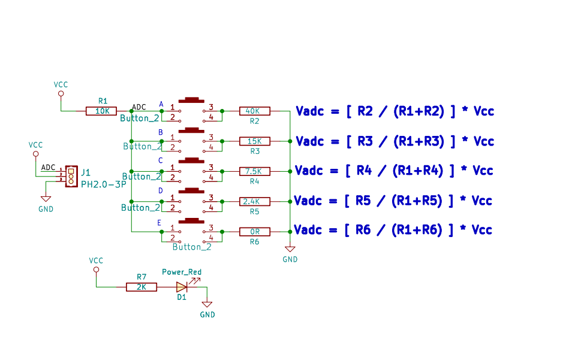
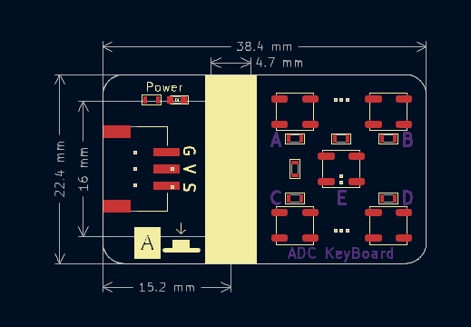

# ADC按键模块

## 概述

​ADC按键模块是一种利用模数转换技术（ADC）实现按键检测的电子组件。其核心原理是通过电阻分压区分不同按键：每个按键连接特定电阻，按下时产生独特电压值，ADC芯片将模拟电压转换为数字信号，由微控制器识别对应按键。相比传统矩阵键盘，它显著节省IO口资源，仅需单个ADC通道即可支持5个按键，且电路结构简单、成本较低。主要优势包括布线简化、抗干扰能力强（可通过软件滤波消抖）和扩展灵活，但需注意电阻精度和供电稳定性以避免误判。典型应用于智能家居面板、工业控制器及便携设备等IO资源有限的场景。

## 原理图

<a href="zh-cn/ph2.0_sensors/base_input_module/adc_button_module/adc_button_sch.pdf" target="_blank">点击此处查看原理图</a>

## 模块参数

- 供电电压：3~5V

- 连接方式：PH2.0-3pin线

- 模块按键数量：5个

- 尺寸大小：38.4x22.4mm

- 安装方式：M4螺钉兼容乐高插孔固定

## 尺寸图

<a href="zh-cn/ph2.0_sensors/base_input_module/adc_button_module/adc_button_module_3d.zip" download>下载ADC按键模块3D文件</a>

## 模块使用方法

### Arduino IDE 使用方法

<a href="https://gh-proxy.com/https://github.com/emakefun-arduino-library/em_adc_button/archive/refs/tags/v1.0.0.zip" download>点击此处下载Arduino库</a>

<a href="https://emakefun-arduino-library.github.io/em_adc_button/html/zh-CN/functions_func.html" target="_blank">点击此处查看API说明文档</a>

<a href="https://emakefun-arduino-library.github.io/em_adc_button/html/zh-CN/get_button_status_8ino-example.html" target="_blank">点击查看示例函数说明</a>

将上述Arduino库下载之后，打开示例文件，将按键模块连接到Arduino板子的PH2.0接口，并将程序下载至Arduino板子。

打开串口监视器，可以看到按键状态的实时反馈。

### ESP32 MicroPython 示例程序

<a href="zh-cn/ph2.0_sensors/base_input_module/adc_button_module/adc_button_esp32_micropython.zip" download>点击此处下载ESP32 MicroPython示例程序</a>
