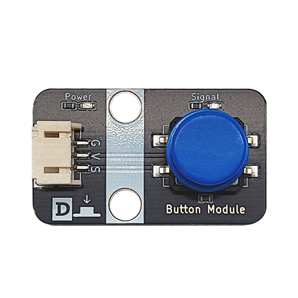

# 按键模块

## 实物图



## 概述

按键也称之为轻触开关，使用时以满足操作力的条件向开关操作方向施压，开关闭合接通；当撤销压力时开关即断开，其内部结构是靠金属弹片受力变化来实现通断的。如图，正常情况下，按键的 1和2、3和4 脚是相连的；当我们按下按键时，四个脚相互接通；松开按键时，恢复正常状态。

​我们的模块正常连接上后，模块的红色power灯亮起，当按键按下时，模块输出低电平，并且信号蓝色灯亮起，松开后蓝色灯熄灭，输出高电平。

## 原理图


[点击查看原理图](zh-cn/ph2.0_sensors/base_input_module/button_module/button_module_schematic.pdf ':ignore')

## 机械尺寸图


## 模块参数

| 引脚名称 |                   描述                   |
| :------: | :--------------------------------------: |
|    G     |                   GND                    |
|    V     |                   VCC                    |
|    S     | 信号数字输出，按下时低电平，松开时高电平 |

- 供电电压：3V3/5V

- 连接方式：PH2.0 3PIN防反接线

- 模块尺寸：40x22.5mm

- 安装方式：M4螺钉兼容乐高插孔固定

## 示例

### Arduino UNO使用教程

#### 接线

按键模块接P1（A3口），LED模块接P9（3口）；

**接线端口可自行更改，只需注意编程时调节端口，本教程全按照示例接口进行。**


#### Arduino示例程序

<a href="zh-cn/ph2.0_sensors/base_input_module/button_module/button_module.zip" download>下载示例程序</a>

```c
int led_out = 3;//定义LED引脚
int keypad_pin = A3; //定义按键引脚
int Button_value;
void setup()
{
  pinMode(led_out,OUTPUT); //初始化LED连接的引脚为输出引脚
  pinMode(keypad_pin,INPUT); //初始化按键连接的引脚为输入
}
void loop()
{
  Button_value = digitalRead(keypad_pin); //读取按键输入引脚的值
  if (Button_value == LOW) 
  {
      digitalWrite(led_out,HIGH); //如果读取值为低即按键按下去了，LED亮
  }
  else
  {
      digitalWrite(led_out,LOW); //如果读取值为低即按键没有按下，LED灭
  }
}
```

#### Mixly示例程序


<a href="zh-cn/ph2.0_sensors/base_input_module/button_module/Button_Mixly_demo.zip" download>下载示例程序</a>

### micro:bit示例程序

<a href="https://makecode.microbit.org/_bHkRLAeXDeMo" target="_blank">动手试一试</a>

### 6.3 ESP32-MicroPython示例程序

按钮模块通过3Pin线接在主板P1（5号）口；

LED模块通过3Pin线接在主板P2（2号）口；

**接线端口可自行更改，只需注意编程时调节端口，本教程全按照示例接口进行。**


<a href="zh-cn/ph2.0_sensors/base_input_module/button_module/MicroPython.zip" download>示例程序下载</a>

```
from machine import Pin
button = Pin(5, Pin.IN)  #按键端口
led = Pin(2, Pin.OUT)  #LED端口
while True:
    if button.value() == 0:
        led.value(1)  
    else:
        led.value(0)
```

## 实验结果

器件连接好线之后，将上述程序烧录到主板之后，给主板通电，按下按键将使得LED点亮，松开则灯灭。通过按键的按下与松开，触发按键的信号口输出高低电平,通过判断信号口的高低电平状态，控制LED灯的亮与灭的状态。我们的按键模块按下时，输出低电平，否则输出高电平，达到目的。
