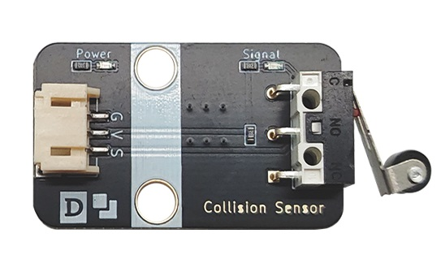
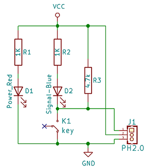
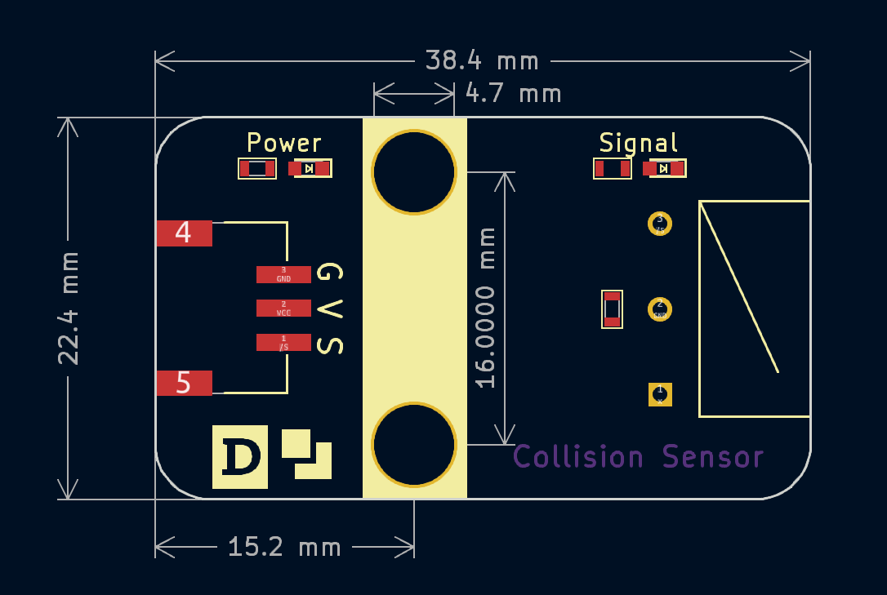

# 碰撞开关



## 概述

​碰撞开关模块实质为一个微型快动开关，即广为人知的微型开关，是一种由很小的物理力启动的电子开关。它能够直接连在单片机上。它将负载电阻同LED指示灯整合在一起。这使得对他进行测试更为简单。当有物理压力触发开关闭合时，板上的LED指示灯会亮起。碰撞开关的原理比较简单，当被外力触发闭合时，开关闭合，模块输出低电平；当撤销外力时，开关被打开，模块输出高电平。广泛应用在限位检测，电梯开关和水平检测、微波炉门联锁装置、自动贩卖机、打印机纸堵塞或者故障定位检测等。

## 原理图



## 模块参数

- 供电电压：3~5V

- 连接方式：PH2.0-3pin接口

- 模块尺寸：38.4x22.4mms

- 安装方式：M4螺钉兼容乐高插孔

| 引脚名称 | 描述                            |
| :------- | :------------------------------ |
| G        | GND                             |
| V        | 3~5V电源输入                   |
| S        | 信号数字输出，开关触发被按下时输出低电平，松开时输出高电平 |

## 机械尺寸图



<a href="zh-cn/ph2.0_sensors/base_input_module/collision_module/collision_module_3d.zip" download>下载碰撞模块3D文件</a>

## Arduino示例程序

```c
namespace {
constexpr uint8_t kTouchPin = 3;   // 定义碰触开关引脚
constexpr uint8_t kLedOut = 4;     // 定义LED引脚

int8_t g_collision_value = 0;      // 存储碰撞检测值
}  // namespace

void setup() {
  pinMode(kTouchPin, INPUT);
  pinMode(kLedOut, OUTPUT);
}

void loop() {
  g_collision_value = digitalRead(kTouchPin);
  if (g_collision_value == LOW) {
    digitalWrite(kLedOut, HIGH);
  } else {
    digitalWrite(kLedOut, LOW);
  }
}
```
