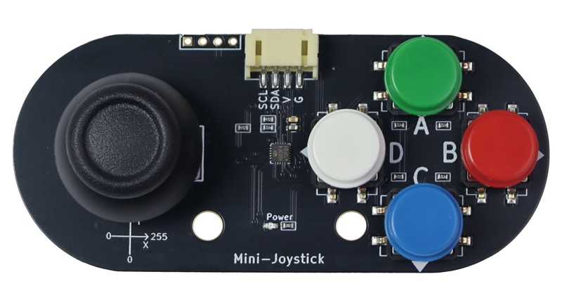
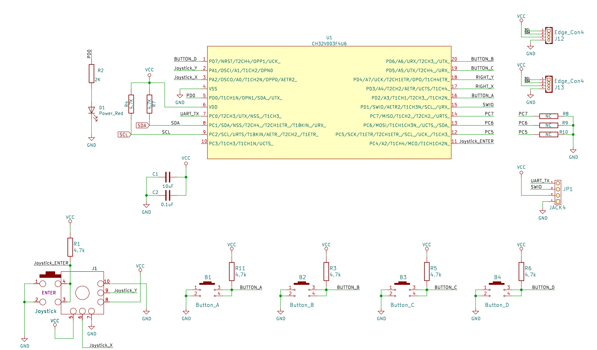
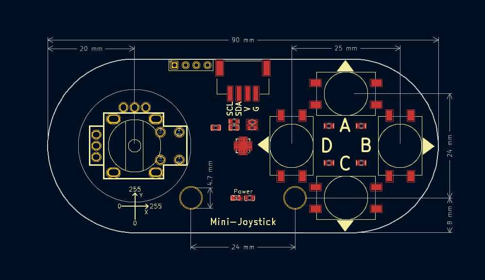
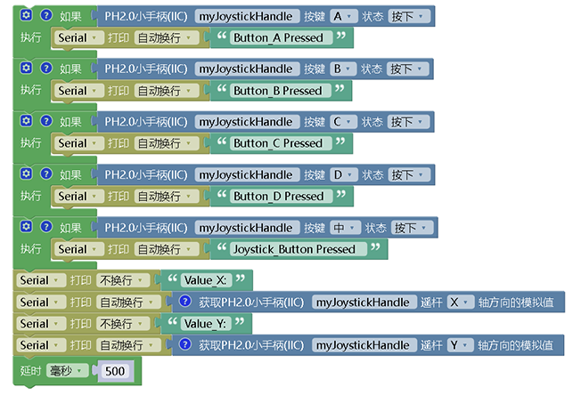

# mini-joystick手柄




## 概述

​	mini-joystick手柄手柄包含一个操纵杆（X轴和Y轴）和五个按键（A、B、C、D、摇杆中心OK按键）。操纵杆根据两个触点控制运动，其中一个触点向左和向右，另一个向上和向下。手柄内置一个MCU单片机通过ADC读取操纵杆X，Y轴上两个电位器的不同的电压值，从而识别特定的位置。X轴和Y轴的模拟值都是从0到255，分别表示从左到右的位置和从上到下的位置。当没有操作时，X和Y轴方向读取的模拟值都为128。A、B、C、D和摇杆OK按键五个按键都有5种状态（按下、释放、单击、双击、长按）。主控通过I2C接口连接手柄的PH2.0接口来去读取摇杆的操作状态。

## 原理图



<a href="zh-cn/ph2.0_sensors/base_input_module/mini-joystick/mini-joystick_schematic.pdf" target="_blank">点击此处查看原理图</a>

## 模块参数

| 引脚名称 |      描述       |
| :------: | :-------------: |
|    G     |       GND       |
|    V     |       5V        |
|   SCL    | I2C通信时钟引脚 |
|   SDA    | I2C通信数据引脚 |

- 供电电压：3 ~ 5V
- 通信方式：IIC，默认地址0x5A
- 连接方式：PH2.0-4PIN防反接线
- 外形尺寸：90*40mm

## 机械尺寸图



<a href="zh-cn/ph2.0_sensors/base_input_module/mini-joystick/mini-joystick_3d.zip" download>下载mini-joystick模块3D文件</a>

### Arduino示例程序

| Mini-Joystick按键名字 | joystick_handle库对应名字 |
| --------------------- | ------------------------- |
| A                     | BUTOON_A                  |
| B                     | BUTOON_B                  |
| C                     | BUTOON_C                  |
| D                     | BUTOON_D                  |
| 左摇杆按下            | BUTOON_OK                 |
| 左摇杆X               | AnalogRead_X              |
| 左摇杆Y               | AnalogRead_Y              |

<a href="zh-cn/ph2.0_sensors/base_input_module/mini-joystick/joystick_handle.zip" download>下载示例程序</a>

```c
#include "JoystickHandle.h"

JoystickHandle myJoystickHandle(JOYSTICK_I2C_ADDR);

void setup(){
  Serial.begin(9600);
}

void loop(){
  if (myJoystickHandle.Get_Button_Status(BUTOON_A)==PRESS_DOWN) {  // 判断按键A是否按下
    Serial.println("Button_A Pressed");
  }
  if (myJoystickHandle.Get_Button_Status(BUTOON_B)==PRESS_DOWN) {  // 判断按键B是否按下
    Serial.println("Button_B Pressed");
  }
  if (myJoystickHandle.Get_Button_Status(BUTOON_C)==PRESS_DOWN) {  // 判断按键C是否按下
    Serial.println("Button_C Pressed");
  }
  if (myJoystickHandle.Get_Button_Status(BUTOON_D)==PRESS_DOWN) {  // 判断按键D是否按下
    Serial.println("Button_D Pressed");
  }
  if (myJoystickHandle.Get_Button_Status(BUTOON_OK)==PRESS_DOWN) {  // 判断摇杆按键是否按下
    Serial.println("Button OK Pressed");
  }
  Serial.print("Value_X:");
  Serial.println(myJoystickHandle.AnalogRead_X()); // 读取摇杆X轴的模拟值打印出来
  Serial.print("Value_Y:");
  Serial.println(myJoystickHandle.AnalogRead_Y()); // 读取摇杆Y轴的模拟值打印出来
  // Serial.println(myJoystickHandle.Get_Button_Status(BUTOON_A));
  delay(50);
}
```

## Mixly示例程序

<a href="zh-cn/ph2.0_sensors/base_input_module/mini-joystick/joystick_handle_Mixly_demo.zip" download>下载示例程序</a>



## micro:bit示例程序

<a href="https://makecode.microbit.org/_MU6Yt1gLoiFF" target="_blank">动手试一试</a>