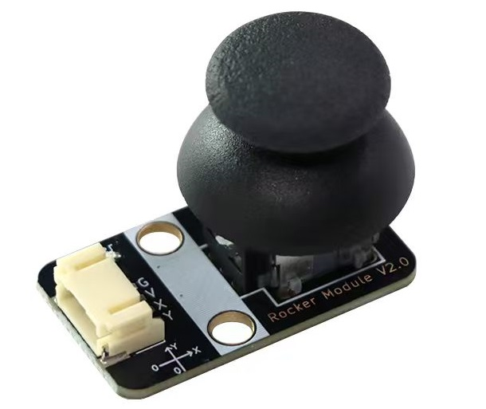
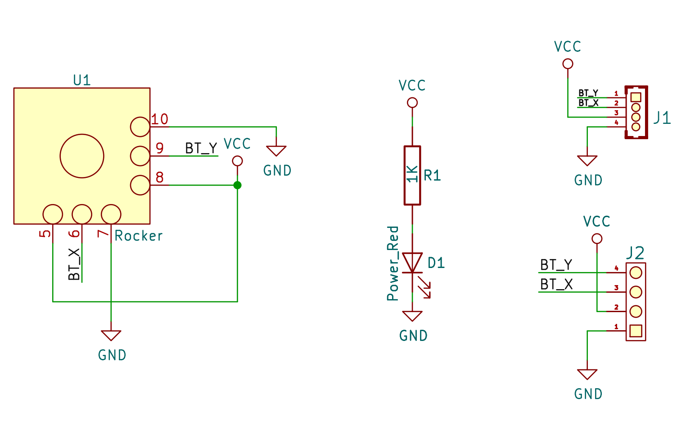
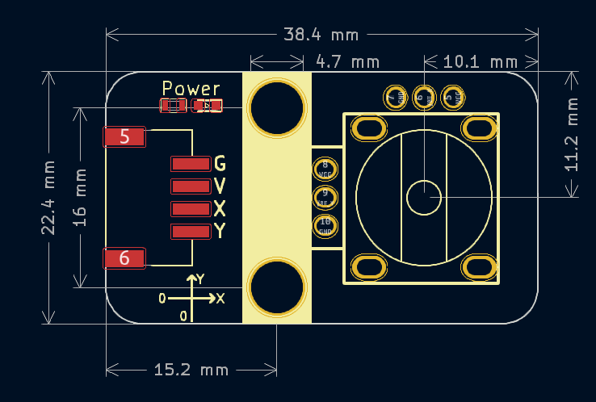

# 摇杆模块




## 概述

   rocker摇杆模块是一款不带中间按键，只有两个电位器（X轴和Y轴）。 操纵杆根据两个触点控制运动，其中一个触点向左和向右，另一个向上和向下。 操纵杆移动决定了触点的位置，就像地球的纬度和经度一样，不同的位置对应不同的电压，然后主控可以通过ADC读取摇杆X、Y轴方向的电压值。当没有操作时，X 和 Y 轴方向输出的模拟值为中间值，即最大值的一半，电位器的精度5%。

## 原理图



<a href="zh-cn/ph2.0_sensors/base_input_module/rocker_module/rocker_module_schematic.pdf" target="_blank">点击此处查看原理图</a>

## 模块参数

| 引脚名称 |         描述         |
| :------: | :------------------: |
|    G     |         GND          |
|    V     |        3 ~ 5V        |
|    X     | 获取摇杆上下动的数据 |
|    Y     | 获取摇杆左右动的数据 |

- 供电电压：3 ~ 5V

- 连接方式：PH2.0 4pin接口

- 模块尺寸：38.4x22.4mm

- 安装方式：M4螺钉兼容乐高插孔

## 机械尺寸图



<a href="zh-cn/ph2.0_sensors/base_input_module/rocker_module/rocker_module_3d.zip" download>下载3D文件</a>

## Arduino示例程序

```c
#define JOYSTICK_X A5  // 定义X输入引脚
#define JOYSTICK_Y A4  // 定义Y输入引脚

int value_x = 0;
int value_y = 0;

void setup() {
  pinMode(JOYSTICK_X, INPUT);         // 初始化X引脚
  pinMode(JOYSTICK_Y, INPUT);         // 初始化Y引脚
  Serial.begin(9600);                 // 设置波特率
}

void loop() {
  Serial.print("X Value:");
  Serial.println(analogRead(JOYSTICK_X));  // 读取摇杆X轴值并打印出来
  Serial.print("Y Value:");
  Serial.println(analogRead(JOYSTICK_Y));  // 读取摇杆Y轴值并打印出来
  delay(50);
}
```

## Mixly示例程序

<a href="zh-cn/ph2.0_sensors/base_input_module/rocker_module/rocker_Mixly_demo.zip" download>下载示例程序</a>

## micro:bit示例程序

<a href="https://makecode.microbit.org/_ahq11cX1E6JT" target="_blank">动手试一试</a>