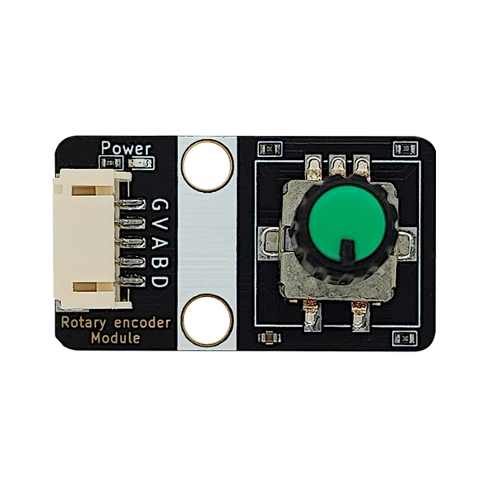
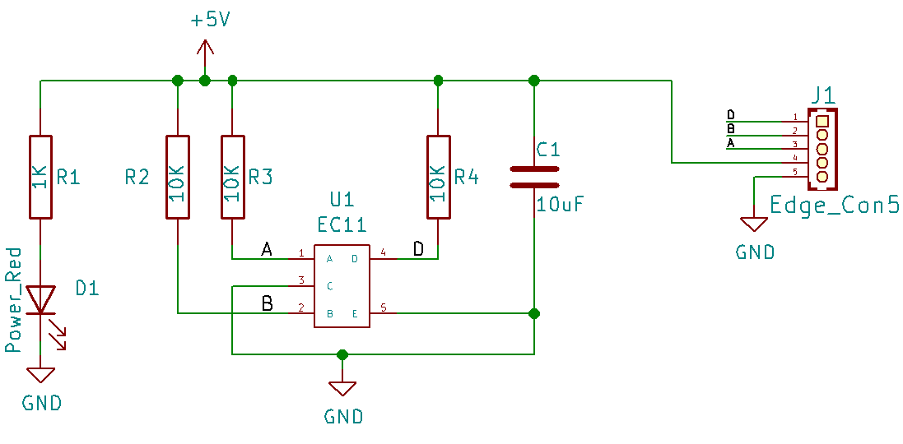

# 旋转编码器

## 实物图

## 概述

  编码器是一种将旋转位移转换为一连串数字脉冲信号的旋转式传感器，旋转编码器可通过旋转可以计数正方向和反方向转动过程中输出脉冲的次数，旋转计数不像电位计，这种转动计数是没有限制的。配合旋转编码器上的按键，可以实现某些特定功能。读数系统通常采用差分方式，即将两个波形一样但相位差为180°的不同信号进行比较，以便提高输出信号的质量和稳定性。编码器广泛用于汽车音量、空调调节等应用场景。

## 原理图

[点击查看原理图](zh-cn/ph2.0_sensors/base_input_module/rotary_encoder_module/rotary_encoder_module_schematic.pdf ':ignore')

## 模块参数

| 引脚名称 |              描述              |
| :------: | :----------------------------: |
|    G     |              GND               |
|    V     |               5V               |
|    A     |   A端口输出引脚，对应A相输出   |
|    B     |   B端口输出引脚，对应B相输出   |
|    D     | D端口输出引脚,对应带的按键输出 |

- 供电电压：5V

- 连接方式：PH2.0 5PIN防反接线

- 模块尺寸：40x22.5mm

- 安装方式：M4螺钉兼容乐高插孔固定

## Arduino示例程序

硬件接线如下表格所示

| Arduino | 旋转编码器 |
| ------- | ---------- |
| VCC     | V          |
| GND     | G          |
| IO 2    | A          |
| IO 3    | B          |
| IO 4    | D          |

[点击此处下载zip库](zh-cn/ph2.0_sensors/base_input_module/rotary_encoder_module/a21-master.zip ':ignore')

下载好上述zip库后，打开Arduino IDE，选择项目->导入库->添加.ZIP库，选择刚下载的zip库，等待安装完成。

导入库完成后，点击文件->示例->a21->a21-ec11-example，将示例程序烧录到Arduino上。

烧录完成后，打开串口助手，设置波特率为115200，点击“打开串口”按钮，等待程序运行。

## Mixly示例程序

[下载示例程序](zh-cn/ph2.0_sensors/base_input_module/rotary_encoder_module/rotary_encoder_Mixly_demo.zip ':ignore')

## micro:bit示例程序

<a href="https://makecode.microbit.org/_Aspg3ah3sXL0" target="_blank">动手试一试</a>

将旋转编码器A引脚接MicrobitP1引脚，B引脚接P2引脚，D引脚接P8引脚,通过往一个方向旋转旋转编码器时，Microbit显示屏显示1，当按下按钮往一个方向旋转Microbit显示屏显示2；往逆方向旋转Microbit显示屏显示-1，按下按钮往逆方向旋转Microbit显示屏显示-2，按下松开不旋转Microbit显示屏显示3
