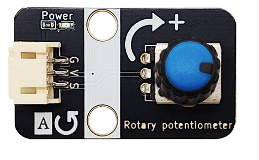
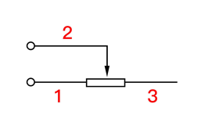
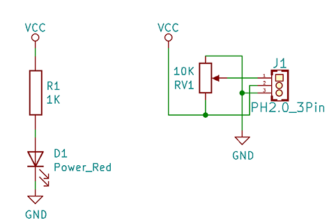
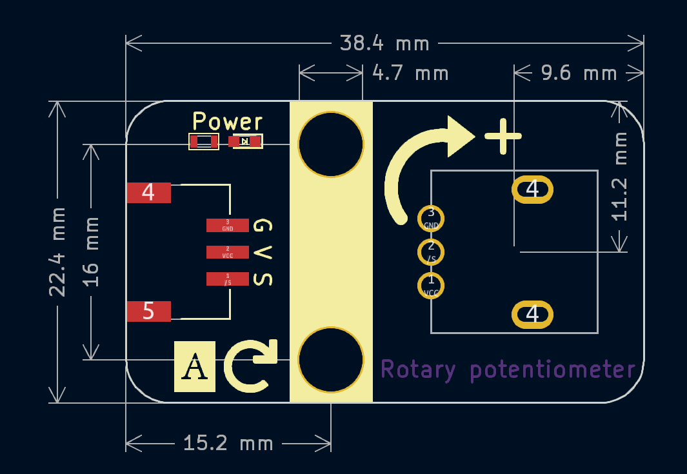

# 旋转电位器



旋转电位器符号图如下，1接电源GND，3接地VCC，2号信号输出



## 概述

旋转电位计实际上就是可变电阻器，由于它在电路中的作用是获得与输入电压（外加电压）成一定 关系得输出电压，因此称之为电位计。如下原理图所示，电位器（或微调电阻等等）常规引脚（仅 举例说有3个引脚的电位器），两头的电阻值是固定的，中间引脚对任何一端引脚的电阻值是可变 的。通常被制造成不管使用多久均能维持原有的特性，若当位置传感器使用，电位计可以是直线或 旋转式位置传感器。电位计输出一个电压值，其正比于沿着可变电阻器之滑动器的位置。因为温度 变化、磨耗及滑动器与可变电阻器之间的污垢均会造成电阻变化，影响电位计的精度。

## 原理图



## 模块参数

| 引脚名称 | 描述                                  |
| :------- | ------------------------------------ |
| G        | GND                                  |
| V        | 3~5V电源                              |
| S        | 信号输出引脚，输出电位器中间引脚的电压值 |

- 供电电压：3~5V

- 模块阻值：10K，顺时针旋转电压值越大

- 连接方式：PH2.0-3PIN防反接线

- 模块尺寸：38.4x22.4mm

- 安装方式：M4螺钉兼容乐高插孔固定

## 机械尺寸图



<a href="zh-cn/ph2.0_sensors/base_input_module/rotary_potentiometer/rotary_potentiometer_3d.zip" download>下载旋转电位器平面和3D文件</a>

## Arduino示例程序

```c
namespace {
constexpr uint8_t kAnalogPin = A3;  // 定义电a位器模拟输入引脚

constexpr float kReferenceVoltage = 5.0f;   // 参考电压 5V
constexpr uint16_t kMaxAnalogValue = 1023;  // 模拟值最大值

int16_t g_analog_data = 0;  // 存储原始模拟值
float g_voltage = 0.0f;     // 存储计算得到的电压值
}  // namespace

void setup() {
  Serial.begin(115000);  // 初始化串口通信

  pinMode(kAnalogPin, INPUT);  // 设置引脚为输入模式
}

void loop() {
  g_analog_data = analogRead(kAnalogPin);                                          // 读取模拟值
  g_voltage = (g_analog_data / static_cast(kMaxAnalogValue)) * kReferenceVoltage;  // 转换为电压

  Serial.print("voltage is: ");
  Serial.print(g_voltage);
  Serial.println("V");

  delay(200);
}
```

## micro:bit示例程序

<a href="https://makecode.microbit.org/_70ahCtDUCPtq" target="_blank">动手试一试</a>
