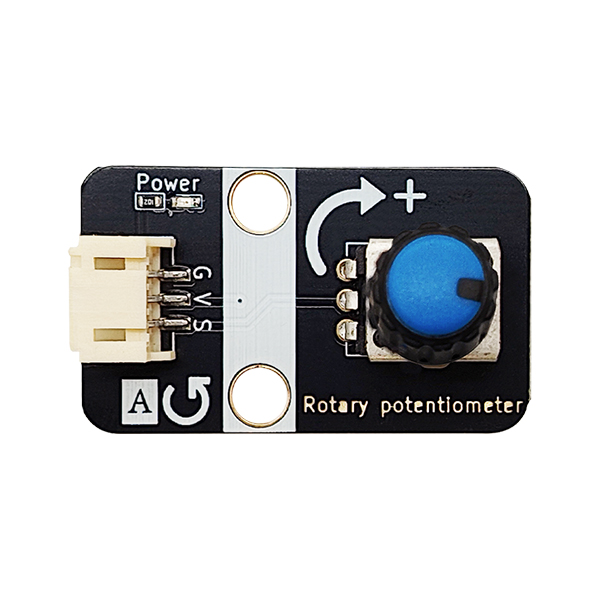
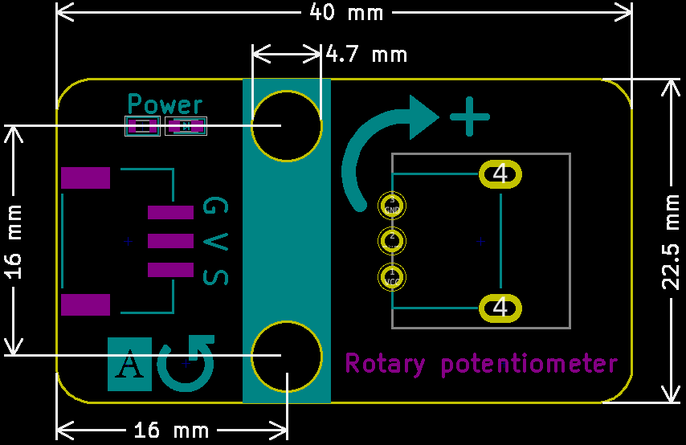

# 旋转电位器




旋转电位器符号图如下，1接电源GND，3接地VCC，2号信号输出


## 概述

​	旋转电位计实际上就是可变电阻器，由于它在电路中的作用是获得与输入电压（外加电压）成一定 关系得输出电压，因此称之为电位计。如下原理图所示，电位器（或微调电阻等等）常规引脚（仅 举例说有3个引脚的电位器），两头的电阻值是固定的，中间引脚对任何一端引脚的电阻值是可变 的。通常被制造成不管使用多久均能维持原有的特性，若当位置传感器使用，电位计可以是直线或 旋转式位置传感器。电位计输出一个电压值，其正比于沿着可变电阻器之滑动器的位置。因为温度 变化、磨耗及滑动器与可变电阻器之间的污垢均会造成电阻变化，影响电位计的精度。

## 原理图


## 模块参数

| 引脚名称 |                   描述                   |
| :------: | :--------------------------------------: |
|    G     |                   GND                    |
|    V     |                 3~5V电源                 |
|    S     | 信号输出引脚，输出电位器中间引脚的电压值 |

- 供电电压：3~5V
- 模块阻值：10K，顺时针旋转电压值越大
- 连接方式：PH2.0-3PIN防反接线
- 模块尺寸：38.4x22.4mm
- 安装方式：M4螺钉兼容乐高插孔固定

## 机械尺寸图



<a href="zh-cn/ph2.0_sensors/base_input_module/rotary_potentiometer/rotary_potentiometer3D.zip" download>下载旋转电位器平面和3D文件</a>

## Arduino示例程序

```c
float voltage = 0,;
int data = 0;  // 定义电压和模拟值变量
int analog_pin = A3;       // 定义电位器接口接收电压模拟值

void setup() {
  pinMode(analog_pin, INPUT);  // 电压输出接口
  Serial.begin(9600);         // 设置串口波特率
}

void loop() {
  data = analogRead(analog_pin);  // 获取电压模拟值
  voltage = (data / 1023) * 5;   // 模拟值和数字值转换 * 电压 得到当前电压
  Serial.print("voltage is: ");
  Serial.print(voltage);  // 打印获取到的电压
  Serial.println("V");
  delay(200);
}
```

## micro:bit示例程序

<a href="https://makecode.microbit.org/_70ahCtDUCPtq" target="_blank">动手试一试</a>
