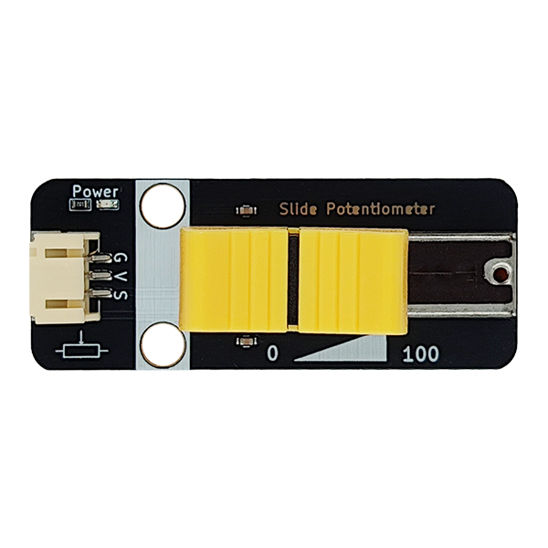
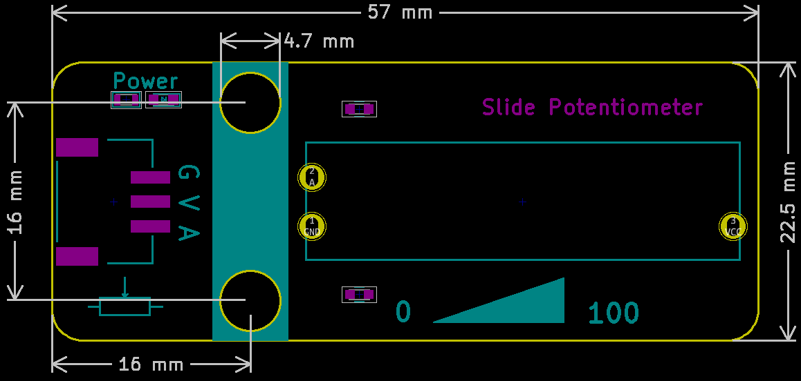

# 滑动变阻器

## 实物图



## 概述

​  滑动变阻器是电路中的一个重要元件，它可以通过移动滑片的位置来改变自身的电阻，从而起到控制电路的作用。在电路分析中，滑动变阻器既可以作为一个定值电阻，也可以作为一个变值电阻。

## 原理图


<a href="zh-cn/ph2.0_sensors/base_input_module/slide_potentiometer/slide_potentiometer_schematic.pdf" target="_blank">点击查看原理图</a>

## 模块参数

| 引脚名称 |                   描述                   |
| :------: | :--------------------------------------: |
|    G     |                   GND                    |
|    V     |                   VCC                    |
|    A     | 信号输出引脚，输出电位器中间引脚的电压值 |

- 供电电压：3V3/5V

- 连接方式：PH2.0 3PIN防反接线

- 模块尺寸：57*22.5cm

- 安装方式：M4螺钉兼容乐高插孔固定

## 机械尺寸图



## Arduino示例程序

<a href="zh-cn/ph2.0_sensors/base_input_module/slide_potentiometer/slide_potentiometer.zip" download>下载示例程序</a>

``` c
float voltage = 0;
int data = 0;  // 定义刚获取的模拟值 data 模数转化后的数值 i 实际的电阻大小 j
int position = 0;
int analog_pin = A3;  // 定义滑动变阻器接口

void setup() {
  pinMode(analog_pin, INPUT);  // 设置端口输入
  Serial.begin(9600);         // 设置串口波特率
}

void loop() {
  data = analogRead(analog_pin);    // 获取端口的模拟值
  voltage = (data / 1023) * 5;     // 模拟值和数字值转换 * 电压 得到当前电压
  position = (data / 1023) * 100;  // 模拟值和数字值转换 * 100 得到滑杆位置
  Serial.print("voltage is:");
  Serial.println(voltage);  // 打印获取到的电压值
  Serial.print("V");
  Serial.print("Slider position(0~100): ");
  Serial.println(position);  // 打印获取到的滑杆位置
  delay(200);
}
```

## Mixly示例程序

<a href="zh-cn/ph2.0_sensors/base_input_module/slide_potentiometer/slide_potentiometer_Mixly_demo.zip" download>下载示例程序</a>

## micro:bit示例程序

<a href="https://makecode.microbit.org/_HaWXTmVJD6jf" target="_blank">动手试一试</a>
