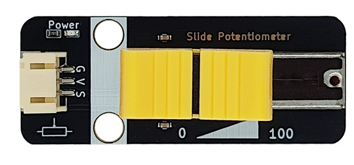
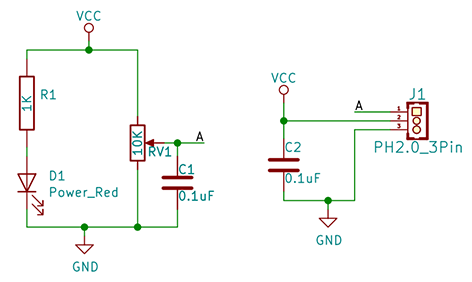
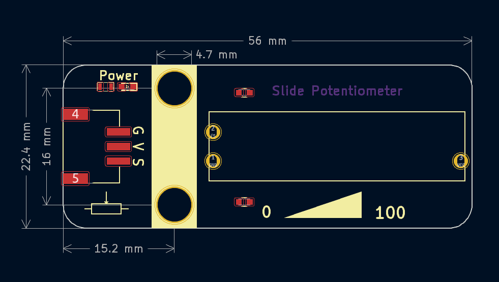

# 滑动变阻器



## 概述

滑动变阻器是电路中的一个重要元件，它可以通过移动滑片的位置来改变自身的电阻，从而起到控制电路的作用。在电路分析中，滑动变阻器既可以作为一个定值电阻，也可以作为一个变值电阻。

它的构成：一般包括接线柱、滑片、电阻丝、金属杆和瓷筒等五部分。滑动电位器的电阻丝绕在绝缘瓷筒上，电阻丝外面涂有绝缘漆。

下图为滑动电位器符号图 1接电源GND，3接地VCC，2号信号输出。


## 原理图



## 模块参数

- 供电电压：3~5V

- 连接方式：PH2.0-3pin线

- 模块尺寸：56x22.4mm

- 安装方式：M4螺钉兼容乐高插孔固定

- 电阻值：最左边为0R，最右边为10K， 输出电压和摇杆在电位器位置呈线性关系

| 引脚名称 | 描述                                      |
| :------- | :--------------------------------------- |
| G        | GND                                      |
| V        | 3~5V输入                               |
| A        | 信号输出引脚，输出电位器中间引脚的电压值     |

## 机械尺寸图



<a href="zh-cn/ph2.0_sensors/base_input_module/slide_potentiometer/slide_potentiometer_3d.zip" download>下载滑动电阻器3D文件</a>

## Arduino Uno示例程序

``` c
namespace {
constexpr uint8_t kAnalogPin = A3;          // 定义滑动变阻器模拟输入引脚

constexpr float kReferenceVoltage = 5.0f;   // 参考电压 5V
constexpr uint16_t kMaxAnalogValue = 1023;  // ADC 最大值
constexpr uint8_t kMaxPosition = 100;       // 滑杆位置最大值（百分比）

int16_t g_analog_data = 0;  // 存储原始模拟值
float g_voltage = 0.0f;     // 存储计算得到的电压值
uint8_t g_position = 0;     // 存储滑杆位置（0~100）
}  // namespace

void setup() {
  Serial.begin(115200);  // 初始化串口通信

  pinMode(kAnalogPin, INPUT);  // 设置引脚为输入模式
}

void loop() {
  g_analog_data = analogRead(kAnalogPin);                                                 // 读取模拟值
  g_voltage = (g_analog_data / static_cast<float>(kMaxAnalogValue)) * kReferenceVoltage;  // 计算电压
  g_position = (g_analog_data / static_cast<float>(kMaxAnalogValue)) * kMaxPosition;      // 计算滑杆位置

  Serial.print("voltage is: ");
  Serial.print(g_voltage);
  Serial.println(" V");
  Serial.print("Slider position (0~100): ");
  Serial.println(g_position);

  delay(200);
}
```
