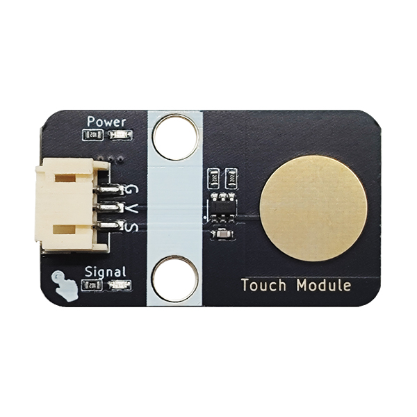
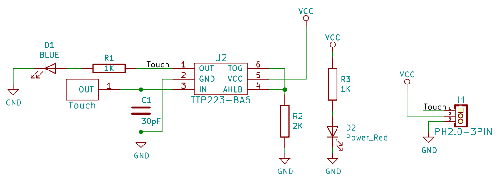
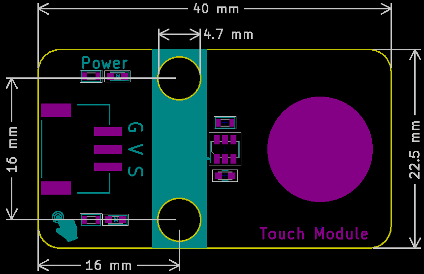

# 触摸模块




## 概述

​        触摸传感器模块是一个基于触摸检测IC（<a href="zh-cn/ph2.0_sensors/base_input_module/touch_module/ttp223_datasheet.pdf" target="_blank">ttp223</a>）的电容式点动型触摸开关模块，当模块的金属触片被触摸，相当于按键被按下。我们可以将模块安装在非金属材料如塑料、玻璃的表面，另外将薄薄的纸片（非金属）覆盖在模块的表面，只要触摸的位置正确，即可做成隐藏在墙壁、桌面等地方的按键。模块当被触摸时，蓝色灯亮，输出低电平，否则蓝色灯熄灭，输出高电平，它的使用方法和功能和机械按键没有区别。

## 原理图



<a href="zh-cn/ph2.0_sensors/base_input_module/touch_module/touch_module_sch.pdf" target="_blank">点击查看原理图</a>

## 模块参数

| 引脚名称 |                          描述                          |
| :------: | :----------------------------------------------------: |
|    G     |                          GND                           |
|    V     |                        3~5V电压                        |
|    S     | 信号输出引脚，当被触摸时，输出低电平，松开时输出高电平 |

- 供电电压：3~5V
- 连接方式：PH2.0-3PIN防反接线
- 模块尺寸：38.4x22.4mm
- 安装方式：M4螺钉兼容乐高插孔固定

## 机械尺寸图



<a href="zh-cn/ph2.0_sensors/base_input_module/touch_module/touch_module_3D.zip" download>下载触摸模块3D文件</a>

## 示例

### Arduino UNO R3使用教程

触摸模块接P1（A3口），LED模块接P9（3口）；

**接线端口可自行更改，只需注意编程时调节端口，本教程按照下图接口进行。**


#### Arduino IDE示例程序

<a href="zh-cn/ph2.0_sensors/base_input_module/touch_module/touch_module.zip" download>下载ArduinoIDE示例程序</a>

```c
int touch_pin = A3;  // 定义触摸按键引脚
int led_out = 3;     // 定义Arduino LED引脚
int value = 0;

void setup() {
  pinMode(touch_pin, INPUT);  // 初始化触摸按键连接的引脚为输入
  pinMode(led_out, OUTPUT);   // 初始化LED连接的引脚为输出引脚
}

void loop() {
  value = digitalRead(touch_pin);  // 读取触摸按键输入引脚的值
  if (value == LOW) {
    digitalWrite(led_out, HIGH);  // 如果读取值为低即被触摸到了，LED亮
  } else {
    digitalWrite(led_out, LOW);  // 如果读取值为高即没有触摸按键，LED灭
  }
}
```

#### esp32 micropython示例

```python
from machine import Pin
button = Pin(5, Pin.IN)  #按键端口
led = Pin(2, Pin.OUT)    #LED端口
while True:
    if button.value() == 0:
        led.value(1)  
    else:
        led.value(0)
```

## 实验结果

​	器件连接好线之后，将上述程序烧录到主板之后，给主板通电，按下触摸将使得LED点亮，松开则灯灭。通过触摸的按下与松开，触发触摸的信号口输出高低电平,通过判断信号口的高低电平状态，控制LED灯的亮与灭的状态。我们的触摸模块按下时，输出低电平，否则输出高电平，达到目的。
