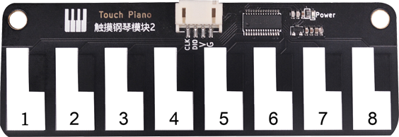
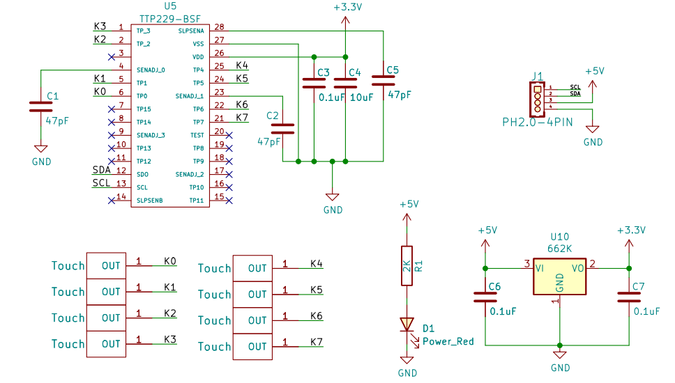
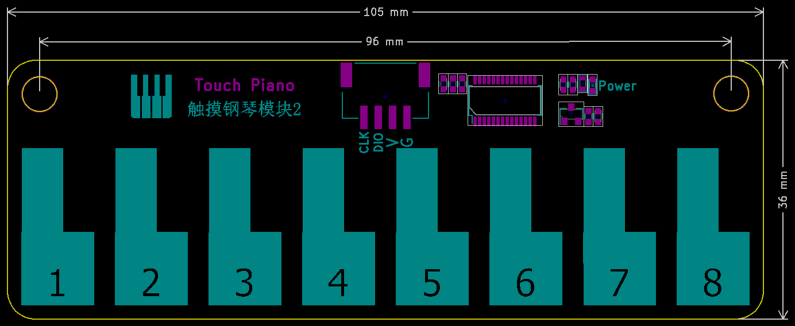
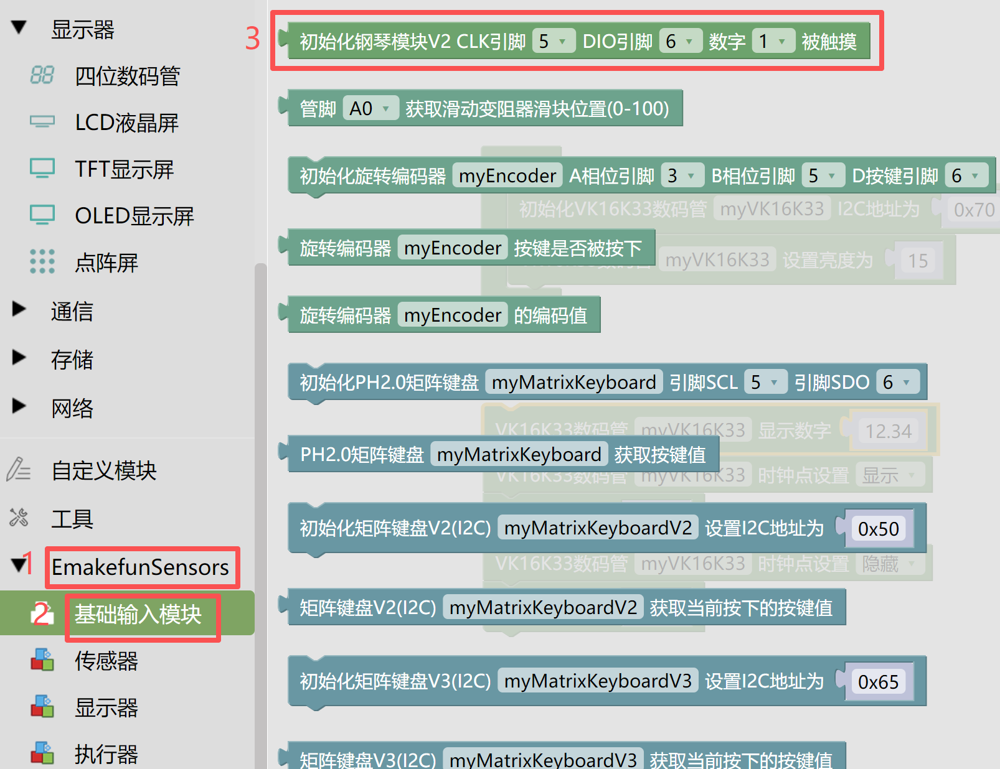
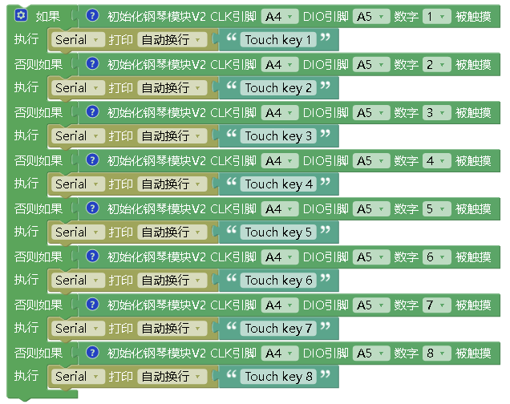

# TTP229触摸钢琴



## 概述

​触摸钢琴模块原理是通过分布在触摸芯片<a href="zh-cn/ph2.0_sensors/base_input_module/touch_piano/ttp229_datasheet.pdf" target="_blank">TTP229</a>端口的电容因为手指的接触，使电容发生了改变，经芯片处理后能将微小的电容变化转化成电压信号的变化，再通过软件AD采集端口电压，根据电压的变化实现触摸的识别。实际上MCU通过单线串行协议去获取的只是具体的键值，而要真正的模拟钢琴的声音，需要MCU在做进一步的处理，例如驱动蜂鸣器以不同的频率响。

当钢琴的按键被触碰时，按照钢琴按键键值对应表输出对应的十六进制值：

| 按键值 | 十六进制值 |
| :----- | :--------- |
| 1      | 0x01       |
| 2      | 0x02       |
| 3      | 0x04       |
| 4      | 0x08       |
| 5      | 0x10       |
| 6      | 0x20       |
| 7      | 0x40       |
| 8      | 0x80       |

## 原理图



<a href="zh-cn/ph2.0_sensors/base_input_module/touch_piano/touch_piano_schematic.pdf" target="_blank">点击此处查看原理图</a>

## 模块参数

| 引脚名称 |     描述     |
| :------- | :----------- |
| G        | GND          |
| V        | 5V电源        |
| CLK      | 时钟信号      |
| DIO      | 数据输入引脚  |

- 供电电压：5V

- 通信协议： 两线串行协议

- 连接方式：PH2.0 4PIN防反接线

- 模块尺寸：105 x 36mm

- 安装方式：M4螺钉兼容乐高插孔固定

## 机械尺寸图



<a href="zh-cn/ph2.0_sensors/base_input_module/touch_piano/piano_module_3d.zip" download>**下载触摸钢琴模块平面和3D文件**</a>

## Arduino IDE示例程序

<a href="zh-cn/ph2.0_sensors/base_input_module/touch_piano/em_piano_test.zip" download>下载arduino IDE示例程序</a>

```c
#include "em_piano.h"

namespace {
constexpr uint8_t kClkPin = 7;   // 时钟引脚 (Arduino UNO)
constexpr uint8_t kDioPin = A0;  // 数据引脚 (Arduino UNO)
// 若使用 ESP32，可改为 kClkPin = 22, kDioPin = 21

Piano g_piano;  // 钢琴模块全局对象
}  // namespace

void setup() {
  Serial.begin(115200);  // 设置波特率

  g_piano.initPiano(kClkPin, kDioPin);  // 初始化触摸钢琴模块
}

void loop() {
  if (g_piano.PressBsButton(EM_PIANO_KEYCODE_1)) {
    Serial.println("Touch key 1");
  } else if (g_piano.PressBsButton(EM_PIANO_KEYCODE_2)) {
    Serial.println("Touch key 2");
  } else if (g_piano.PressBsButton(EM_PIANO_KEYCODE_3)) {
    Serial.println("Touch key 3");
  } else if (g_piano.PressBsButton(EM_PIANO_KEYCODE_4)) {
    Serial.println("Touch key 4");
  } else if (g_piano.PressBsButton(EM_PIANO_KEYCODE_5)) {
    Serial.println("Touch key 5");
  } else if (g_piano.PressBsButton(EM_PIANO_KEYCODE_6)) {
    Serial.println("Touch key 6");
  } else if (g_piano.PressBsButton(EM_PIANO_KEYCODE_7)) {
    Serial.println("Touch key 7");
  } else if (g_piano.PressBsButton(EM_PIANO_KEYCODE_8)) {
    Serial.println("Touch key 8");
  }

  delay(100);
}
```

## Mixly示例程序

[Mixly2.0云端导入PH2.0 Sensors库](/zh-cn/software/mixly/mixly)，通过下图找到触摸钢琴模块的mixly块



<a href="zh-cn/ph2.0_sensors/base_input_module/touch_piano/touch_piano_mixly_demo.zip" download>下载mixly示例程序</a>



### Mind+示例程序

支持arduino uno、esp32主板  <a href="zh-cn/ph2.0_sensors/base_input_module/touch_piano/piano_module_mind_plus.zip" download>下载mind+示例程序</a>

## MicroPython示例程序

<a href="zh-cn/ph2.0_sensors/base_input_module/touch_piano/touch_piano_py.zip" download>点击下载MicroPython示例程序</a>

## Micro:bit示例程序

钢琴模块 V2：<a href="https://makecode.microbit.org/_c0cAijCb05w1" target="_blank">动手试一试</a>
