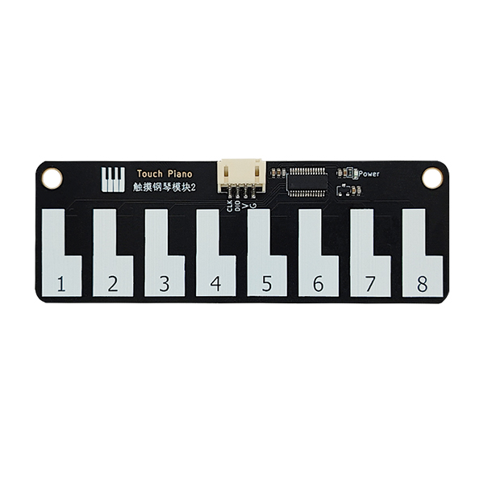

# TTP229触摸钢琴




## 概述

​	触摸钢琴模块原理是通过分布在触摸芯片<a href="zh-cn/ph2.0_sensors/base_input_module/touch_piano/ttp223_datasheet.pdf" target="_blank">TTP229</a>端口的电容因为手指的接触，使电容发生了改变，经芯片处理后能将微小的电容变化转化成电压信号的变化，再通过软件AD采集端口电压，根据电压的变化实现触摸的识别。实际上MCU通过单线串行协议去获取的只是具体的键值，而要真正的模拟钢琴的声音，需要MCU在做进一步的处理，例如驱动蜂鸣器以不同的频率响。

当钢琴的按键被触碰时，按照钢琴按键键值对应表输出对应的十六进制值：

| 按键值 | 十六进制值 |
| :----: | :--------: |
|   1    |    0x01    |
|   2    |    0x02    |
|   3    |    0x04    |
|   4    |    0x08    |
|   5    |    0x10    |
|   6    |    0x20    |
|   7    |    0x40    |
|   8    |    0x80    |

## 原理图

<a href="zh-cn/ph2.0_sensors/base_input_module/touch_piano/touch_piano_schematic.pdf" target="_blank">下载原理图</a>


## 模块参数

| 引脚名称 |     描述     |
| :------: | :----------: |
|    G     |     GND      |
|    V     |    5V电源    |
|   CLK    |   时钟信号   |
|   DIO    | 数据输入引脚 |

- 供电电压：5V
- 通信协议： 两线串行协议
- 连接方式：PH2.0 4PIN防反接线
- 模块尺寸：105 x 36mm
- 安装方式：M4螺钉兼容乐高插孔固定

## 机械尺寸图


<a href="zh-cn/ph2.0_sensors/base_input_module/touch_piano/piano_module_3D.zip" download>**下载触摸钢琴模块平面和3D文件**</a>

## Arduino IDE示例程序

<a href="zh-cn/ph2.0_sensors/base_input_module/touch_piano/em_piano_arduino_demo.zip" download>下载arduino IDE示例程序</a>

```c
#include "EM_Piano.h"

Piano m_piano;

void setup() {
  m_piano.initPiano(7, A0);  // arduino uno 初始化触摸钢琴模块  CLK 7,DIO A0
  //m_piano.initPiano(22, 21);  // esp32主板 初始化触摸钢琴模块  CLK 22,DIO 21
  Serial.begin(9600);
}

void loop() {
  if (m_piano.PressBsButton(EM_PIANO_KEYCODE_1)) {  // 判断钢琴模块按键1是被触摸，如果被触摸则打印Touch key 1
    Serial.println("Touch key 1");
  } else if (m_piano.PressBsButton(EM_PIANO_KEYCODE_2)) {  // 判断钢琴模块按键2是被触摸，如果被触摸则打印Touch key 2
    Serial.println("Touch key 2");
  } else if (m_piano.PressBsButton(EM_PIANO_KEYCODE_3)) {  // 判断钢琴模块按键3是被触摸，如果被触摸则打印Touch key 3
    Serial.println("Touch key 3");
  } else if (m_piano.PressBsButton(EM_PIANO_KEYCODE_4)) {  // 判断钢琴模块按键4是被触摸，如果被触摸则打印Touch key 4
    Serial.println("Touch key 4");
  } else if (m_piano.PressBsButton(EM_PIANO_KEYCODE_5)) {  // 判断钢琴模块按键5是被触摸，如果被触摸则打印Touch key 5
    Serial.println("Touch key 5");
  } else if (m_piano.PressBsButton(EM_PIANO_KEYCODE_6)) {  // 判断钢琴模块按键6是被触摸，如果被触摸则打印Touch key 6
    Serial.println("Touch key 6");
  } else if (m_piano.PressBsButton(EM_PIANO_KEYCODE_7)) {  // 判断钢琴模块按键7是被触摸，如果被触摸则打印Touch key 7
    Serial.println("Touch key 7");
  } else if (m_piano.PressBsButton(EM_PIANO_KEYCODE_8)) {  // 判断钢琴模块按键8是被触摸，如果被触摸则打印Touch key 8
    Serial.println("Touch key 8");
  }
  delay(100);
}
```

## Mixly示例程序

 [Mixly2.0云端导入PH2.0 Sensors库](/zh-cn/software/mixly/mixly)，通过下图找到触摸钢琴模块的mixly块


<a href="zh-cn/ph2.0_sensors/base_input_module/touch_piano/touch_piano_mixly_demo.zip" download>下载mixly示例程序</a>


### Mind+示例程序

支持arduino uno 、esp32主板  <a href="zh-cn/ph2.0_sensors/base_input_module/touch_piano/piano_module_mind_plus.zip" download>下载mind+示例程序</a>

## MicroPython示例程序

<a href="zh-cn/ph2.0_sensors/base_input_module/touch_piano/touch_piano_py.zip" download>点击下载MicroPython示例程序</a>

## Micro:bit示例程序

钢琴模块 V2：<a href="https://makecode.microbit.org/_c0cAijCb05w1" target="_blank">动手试一试</a>