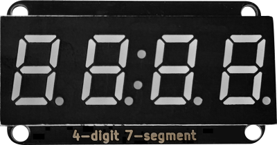
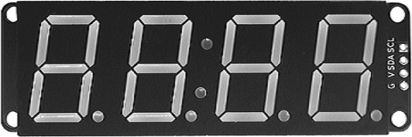

# VK16K33时钟数码管显示模块V2.0

## 概述

4位7段数码管由一个12管脚的4位7段共阳极数码管和一个控制芯片VK16K33构成,VK16K33是一种带按键扫描接口的数码管或点阵LED驱动控制专用芯片,内置上电复位电路，整体闪烁频率可设置。该模块采用沉金工艺，外观更加美观，同时采用防插反接口，操作更加安全，该模块采用IIC协议通信。此产品可以应用在时间显示，跑表显示以及其他需要显示数字的设备上。

## 模块图

0.4寸：

0.8寸：

## 原理图

TODO

## 芯片规格书

[点击查看芯片规格书](zh-cn/ph2.0_sensors/displayers/4_digit_7_segment_v2.0/VK16K33.pdf ':ignore')

## 模块参数

- 供电电压:5V
- 连接方式:4PIN防反接杜邦线
- 模块尺寸:4*2.1cm
- 安装方式:M3螺钉兼容乐高插孔固定

| G      | GND地线|
| :----- | :-------: |
| V    | 5V电源引脚|
| SDA   | 数据引脚|
| CLK   | 时钟引脚|

## 模块尺寸

TODO

## Arduino应用场景

[Arduino库和示例程序下载链接](https://github.com/emakefun-arduino-library/emakefun_digit_display/archive/refs/tags/release.zip)

### Arduino 库使用文档

[说明文档](https://github.com/emakefun-arduino-library/emakefun_digit_display)

### Arduino 库示例程序

[显示整数](https://emakefun-arduino-library.github.io/emakefun_digit_display/show_integer_number_8ino-example.html)

[显示小数](https://emakefun-arduino-library.github.io/emakefun_digit_display/show_decimal_number_8ino-example.html)

[按位置显示数字](https://emakefun-arduino-library.github.io/emakefun_digit_display/show_digit_number_8ino-example.html)

[显示/隐藏冒号](https://emakefun-arduino-library.github.io/emakefun_digit_display/show_colon_8ino-example.html)

[设置闪烁频率](https://emakefun-arduino-library.github.io/emakefun_digit_display/set_blink_rate_8ino-example.html)

## MicroPython示例程序

### ESP32 MicroPython示例程序

<a href="zh-cn/ph2.0_sensors/displayers/4_digit_7_segment_v2.0/vk16k33_esp32_micropython.zip" download>点击下载ESP32 MicroPython示例程序</a>

### micro:bit MicroPython示例程序

<a href="zh-cn/ph2.0_sensors/displayers/4_digit_7_segment_v2.0/vk16k33_microbit_micropython.zip" download>点击下载micro:bit MicroPython示例程序</a>

## micro:bit MakeCode 示例程序

[点击查看micro:bit MakeCode示例程序](https://makecode.microbit.org/S02939-66350-35638-80078)

[点击查看用户库链接](https://github.com/emakefun-makecode-extensions/emakefun_vk16k33)
