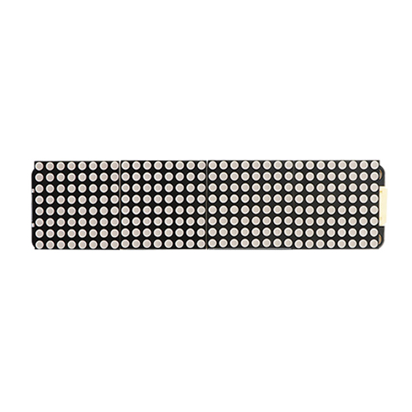

# 8X8点阵模块显示模块

## 实物图

## 概述

MAX7219驱动的8x32点阵屏由4个8x8 LED模块级联组成，通过SPI接口控制，可显示文字、图案及简单动画。其核心优势在于集成化驱动，支持多屏扩展、16级亮度调节及低功耗设计，无需外部元件即可稳定工作。适用于信息展示、电子时钟、传感器数据可视化等场景，编程简便，适合嵌入式开发及DIY项目。

[更多信息可以参考max7219 8x8点阵屏模块](zh-cn/ph2.0_sensors/displayers/8x8_dot_matrix/8x8LedDisplay.md)

## Arduino IDE示例程序

<a href="zh-cn/ph2.0_sensors/displayers/8x32_dot_matrix/8x32_dot_matrix.zip" download>点击下载Arduino IDE示例程序</a>

## MicroPython 示例程序

### ESP32 MicroPython示例程序

<a href="zh-cn/ph2.0_sensors/displayers/8x32_dot_matrix/8x32_dot_matrix_esp32_micropython.zip" download>点击下载ESP32 MicroPython示例程序</a>

### micro:bit MicroPython示例程序

<a href="zh-cn/ph2.0_sensors/displayers/8x32_dot_matrix/microbit_max7219_micropython.zip" download>点击下载micro:bit MicroPython示例程序</a>

## Mixly 示例程序

<a href="zh-cn/ph2.0_sensors/displayers/8x32_dot_matrix/max7219_mixly.zip" download>点击下载Mixly示例程序</a>

## micro:bit 示例程序

[动手试一试](https://makecode.microbit.org/S47114-53129-37900-76795)
