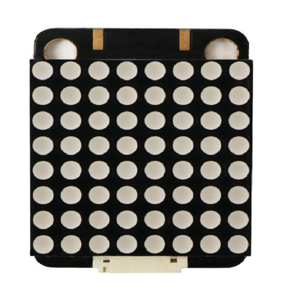
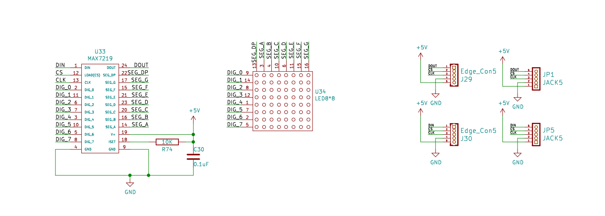
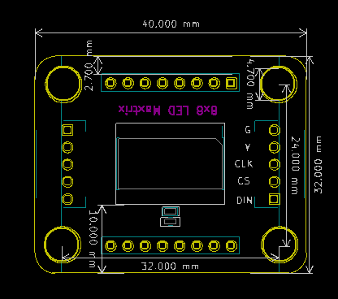

# 8X8点阵模块显示模块规格书

## 模块图

## 概述

8X8点阵模块由MAX7219驱动，MAX7219是一种集成化的串行输入/输出显示驱动器,它连接微处理器与8位数字的7段数字LED显示，也可以连接条线图显示器或者64个独立的LED。其上包括一个片上的B型BCD编码器、多路扫描回路，段字驱动器，而且还有一个8X8的静态RAM用来存储每一个数据。只有一个外部寄存器用来设置各个LED的段电流。一个方便的五线串行接口可以联接通用的微处理器。每个数据可以寻址在更新时不需要改写所有的显示。MAX7219同样允许用户对每一个数据选择编码或者不编码。整个设备包含一个150μA的低功耗关闭模式，模拟和数字亮度控制，一个扫描限制寄存器允许用户显示1-8位数据，还有一个让所有LED发光的检测模式。如果用普通的方法来驱动一个8*8的点阵，需要用到8个单片机IO,2个就是16个IO ，如果驱动几个点阵，单片机的IO就不够了，如果用MAX7219帮忙的话，用单片机的3个IO口就可以驱动1个/10个/20个点阵。

## 原理图

<a href="zh-cn/ph2.0_sensors/displayers/8x8_dot_matrix/8×8点阵.pdf" target="_blank">点击此处查看原理图</a>

## 模块参数

| 引脚名称 | 描述     |
|------|--------|
| G    | GND 地线 |
| V    | 5V电源引脚 |
| CLK  | 信号引脚   |
| CS   | 片选引脚   |
| DIN  | 数据输入引脚 |

* 1.供电电压:5V
* 2.连接方式:5PIN防反接杜邦线
* 3.模块尺寸:4*3.2cm
* 4.安装方式:M4螺钉兼容乐高插孔固定

## 机械尺寸

## Arduino IDE示例程序

<a href="zh-cn/ph2.0_sensors/displayers/8x8_dot_matrix/dot_matrix_module.zip" download>点击下载Arduino IDE示例程序</a>

## MicroPython示例程序

<a href="zh-cn/ph2.0_sensors/displayers/8x8_dot_matrix/microbit_max7219_micropython.zip" download>点击下载micro:bit MicroPython示例程序</a>

<a href="zh-cn/ph2.0_sensors/displayers/8x8_dot_matrix/esp32_max7219_micropython.zip" download>点击下载esp32 MicroPython示例程序</a>

## Mixly示例程序

<a href="zh-cn/ph2.0_sensors/displayers/8x8_dot_matrix/max7219_mixly.zip" download>点击下载Mixly示例程序</a>

## micro:bit MakeCode示例程序

<a href="https://makecode.microbit.org/_Yrt4JwWuKV8b" target="_blank">动手试一试</a>
