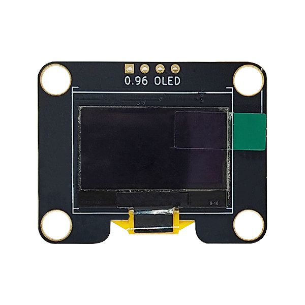
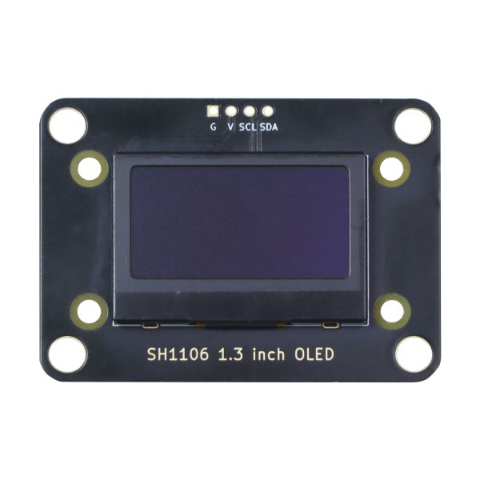
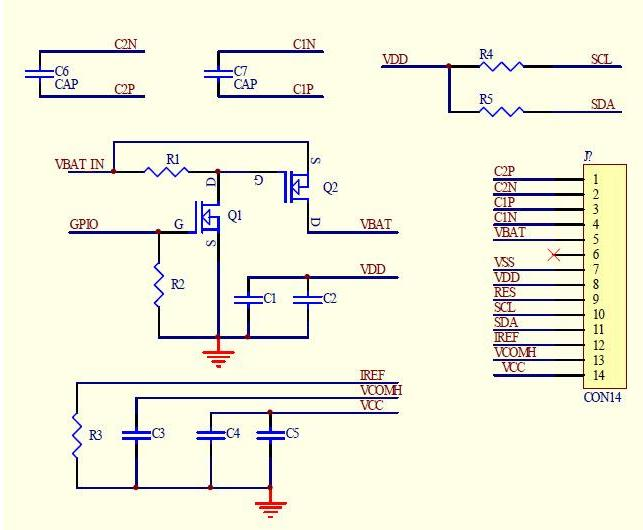
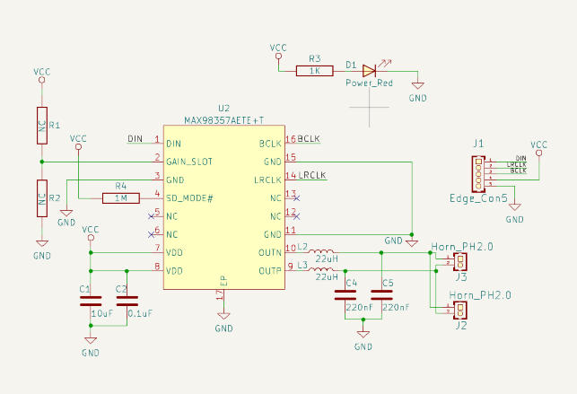
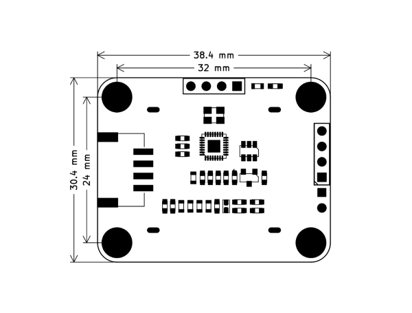
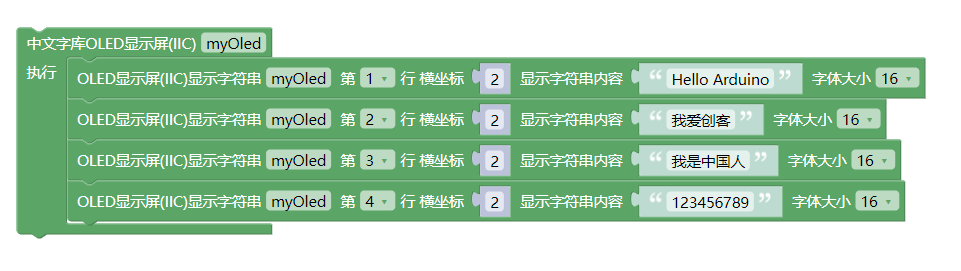

# 带中文字库OLED模块

## 0.96寸OLED实物图



## 1.3寸OLED实物图



## 概述

0.96oled使用SSD1306，SSD1306是一款用于有机/聚合物发光二极管点阵图形显示系统的带控制器的单片CMOS OLED/PLED驱动器。它由128个段和64个公共区组成。这种集成电路是为普通阴极型OLED面板设计的。作为一款常用的显示器，深受电子爱好者的青睐，但使用 时总少不了一些辅助软件去显示自己想要显示的信息，且有时会因为数据太多太占内存，本产品集成了一块GT20L16S1Y字库芯片和一款MCU，从根本上解决了这两方面的问题，使用更加方便。

1.3寸oled使用SH1106，SH1106是一款单芯片CMOSOLED/PLED驱动器,带有控制器,用于有机/聚合物发光二极管点阵图形显示系统。SH1106由132个段组成,64个公共端可支持132×64的最大显示分辨率。它专为共阴极型OLED面板而设计。SH1106嵌入了对比度控制,显示RAM振荡器和高效的DC-DC转换器,减少了外部元件的数量和功耗。

## 硬件参数

- 工作电压：5V/3.3v

- 接口支持最大速率：400k

- 通信方式：IIC (SSD1306 地址0x3C，MCU地址0x51)

- 接口类型：PH2.0-4Pin (G V SDA SCL)

- [点击下载SSD1306数据手册](./SSD1306.pdf)

- [点击下载SH1106数据手册](./SH1106.pdf)

- [点击下载字库芯片GT20L16S1Y数据手册](./GT20L16S1Ydatasheet.pdf)

## 模块特点

- 内置低功率 32 位 MCU：可以兼作应用处理器
- 内置字库：GT20L16S1Y字库芯片
- 显示器类型：SSD1306、SH1106

## 引脚定义

| 引脚名称 | 描述      |
| ---- | ------- |
| SCL  | IIC时钟引脚 |
| SDA  | IIC数据引脚 |
| V    | 5V电源引脚  |
| G    | GND 地线  |

## 原理图

### 0.96寸OLED



### 1.3寸OLED



## 模块尺寸



## 接线示例

| 显示屏模块 | Arduino |
| ----- | ------- |
| SDA   | A4/18   |
| SCL   | A5/19   |
| GND   | GND     |
| VCC   | 5V      |

## Arduino 应用场景

显示中文、英文、数字、标点字符

```c++
#include "em_oled.h"

EM_OLED u8g2(U8G2_R0, U8X8_PIN_NONE);

void setup() {
  Serial.begin(115200);
  u8g2.begin();
}

void loop() {
  u8g2.firstPage();
  do {
    u8g2.ShowFont(0, 0, "EMAKEFUN易创空间www.emakefun.com");
  } while (u8g2.nextPage());
}
```

### Arduino函数介绍

```c++
/*
显示字体
输入参数：
（x,y）起始坐标，显示字符的左上角坐标 
*str：要显示的UTF8字符数据可直接写汉字和字符
*/
uint8_t ShowFont(uint8_t x, uint8_t y, uint8_t *str);
```

### Arduino示例程序

<a href="zh-cn/ph2.0_sensors/displayers/GT20L16S1Y_OLED/GT20L16S1Y_OLED.zip" download>下载最新库程序</a>

### Mixly图形化块



<a href="zh-cn/ph2.0_sensors/displayers/GT20L16S1Y_OLED/oled_mixly.zip" download>点击下载Mixly示例程序</a>

### micro:bit MakeCode块

<a href="https://makecode.microbit.org/_1xP2br2C10zX" target="_blank">点击查看micro:bit示例程序</a>
