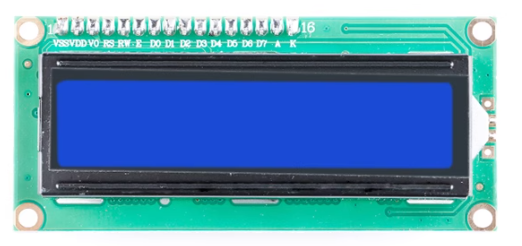
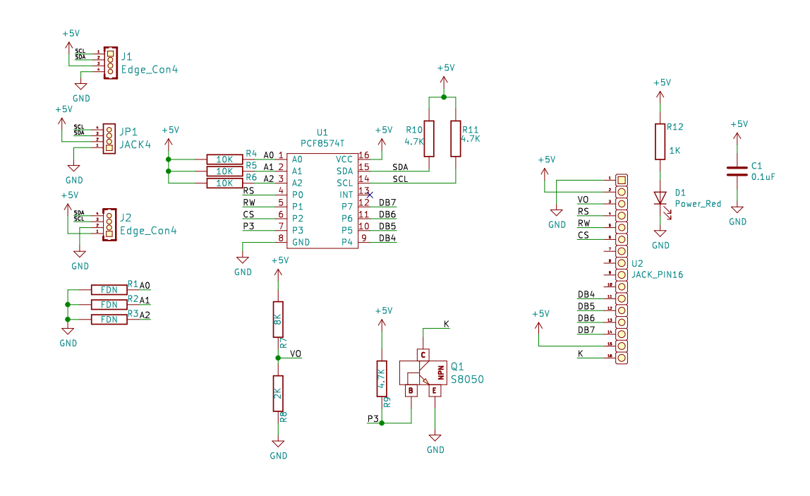
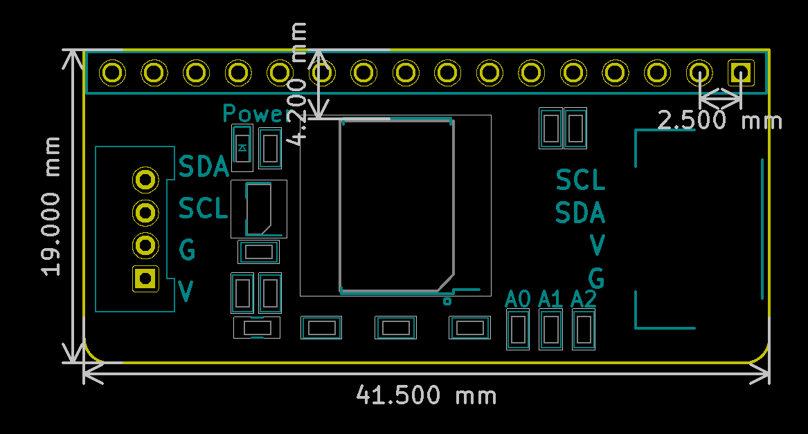

# LCD1602规格书

## 模块图

## 概述

​  LCD1602是一种专门用于显示字母，数字和符号的字符LCD模块。 它广泛应用于工业，比如电子钟，温度显示器。市场上的字符液晶显示器大多是基于HD44780字符的LCD芯片，控制原理完全相同。 “1602”表示2行和每行16个字符。带了转接板的LCD1602显示屏,使用了IIC接口,节省了许多的I/O口. 1602液晶显示器（1602Liquid Crystal Display，此后简称1602 LCD）是一种常见的字符液晶显示器，因其能显示16*2个字符而得名。通常我们使用的1602 LCD中集成了字库芯片，通过LiquidCrystal类库提供的API，我们可以很方便的使用1602LCD显示英文字母与一些符号。  

## 原理图

<a href="zh-cn/ph2.0_sensors/displayers/lcd1602/1602.pdf" target="_blank">点击查看原理图</a>

## 模块参数

| 引脚名称 | 描述     |
|------|--------|
| GND  | GND 地线 |
| VCC  | 5V电源引脚 |
| SDA  | 数据引脚   |
| SCL  | 时钟引脚   |

## 机械尺寸

## Arduino IDE示例程序

<a href="zh-cn/ph2.0_sensors/displayers/lcd1602/Serial_LCD1602_Display.zip" download>点击下载Arduino IDE示例程序</a>

## Mixly示例程序

<a href="zh-cn/ph2.0_sensors/displayers/lcd1602/LCD1602_Mixly.zip" download>点击下载Mixly示例程序</a>

## Mind+示例程序

<a href="zh-cn/ph2.0_sensors/displayers/lcd1602/LCD1602_mind_plus.zip" download>点击下载Mind+示例程序</a>

## MicroPython示例程序

<a href="zh-cn/ph2.0_sensors/displayers/lcd1602/lcd1602_microbit_micropython.zip" download>点击下载micro:bit MicroPython示例程序</a>

## micro:bit示例程序

<a href="https://makecode.microbit.org/_f4Mccy84xdcC" target="_blank">动手试一试</a>
