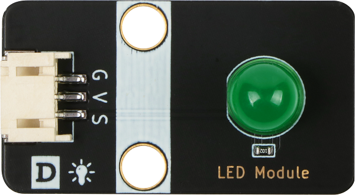
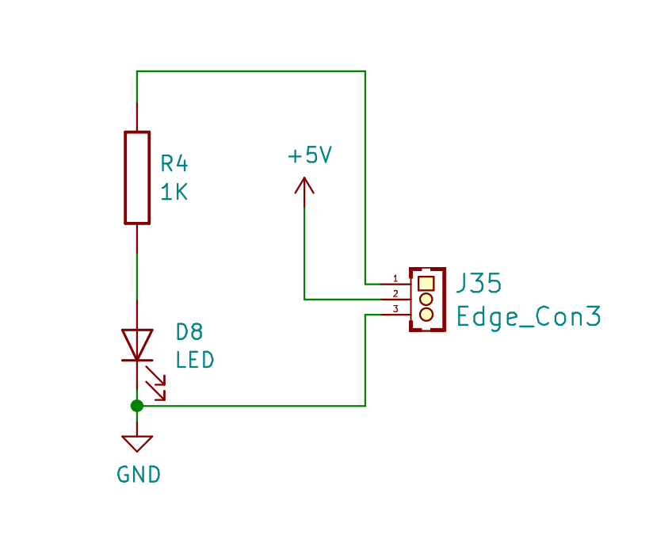
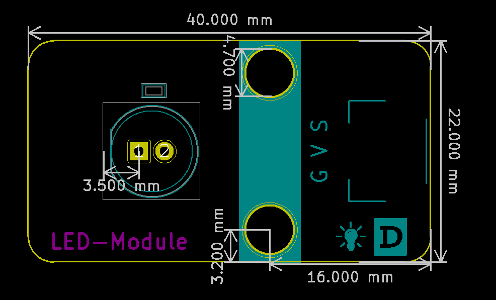

# LED灯规格书

## 模块图

## 概述

​  LED是发光二极管的缩写，由混合化合物制成，即镓（Ga），砷（AS），磷（P）。 砷化镓二极管发红光，磷化镓二极管发绿光，氮化镓二极管发蓝光，碳化硅二极管发黄光。发光二极管的反向击穿电压为5V。 其正伏安特性曲线太陡，模块上板载了限流电阻，以便在使用时控制流过管道的电流。

## 原理图

[点击查看led灯模块原理图](zh-cn/ph2.0_sensors/displayers/led_module/LED灯.pdf ':ignore')

## 模块参数

| 引脚名称 | 描述     |
|------|--------|
| V    | 5V电源引脚 |
| G    | GND 地线 |
| S    | 信号引脚   |

## 机械尺寸

## Arduino IDE示例程序

<a href="zh-cn/ph2.0_sensors/displayers/led_module/Led.zip" download>点击下载Arduino IDE示例程序</a>

## micro:bit示例程序

<a href="https://makecode.microbit.org/_AEiDicRK06Rh" target="_blank">动手试一试</a>
