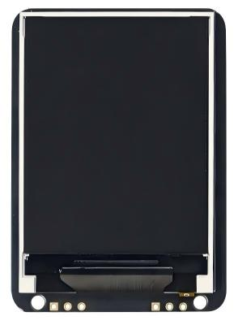
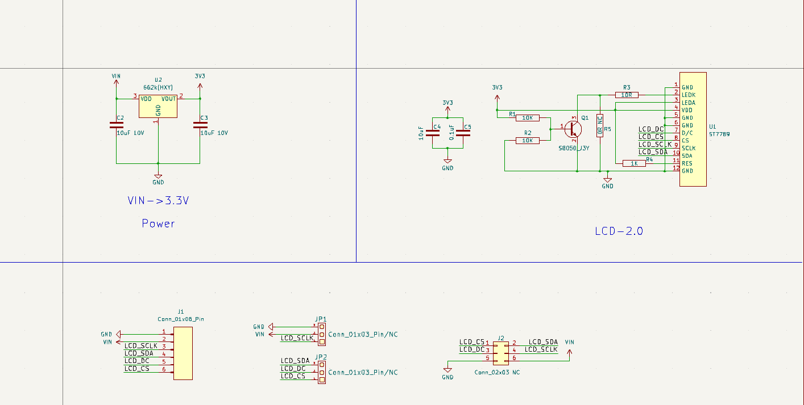
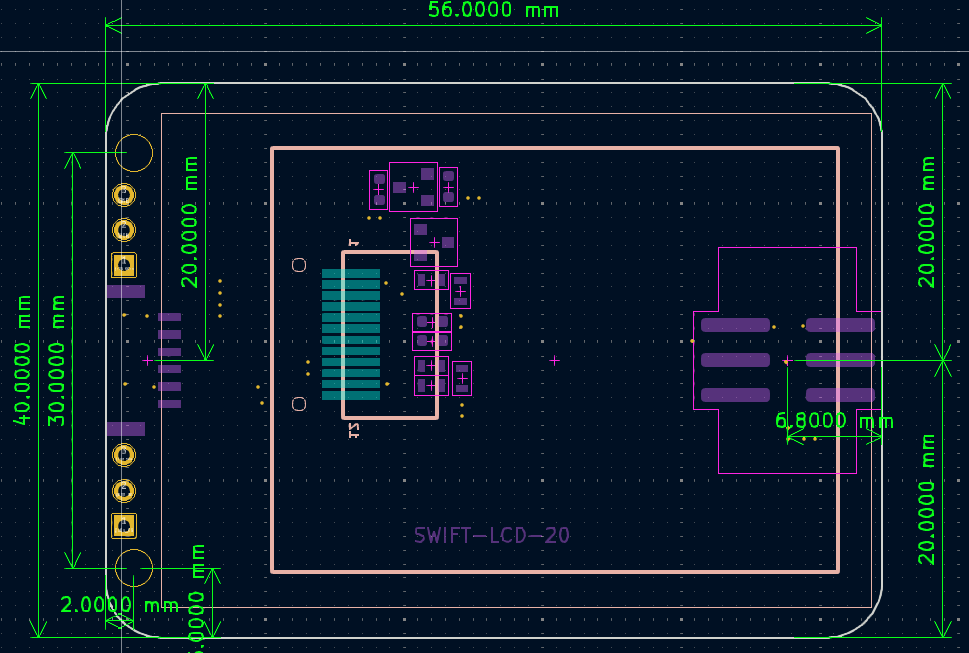
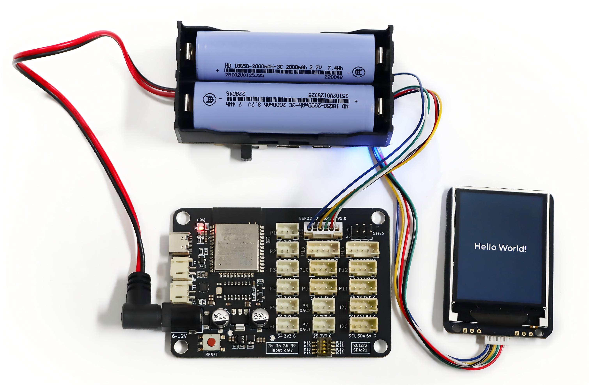

# SWIFT-LCD-20显示屏模块

## 实物图

## 概述

SWIFT-LCD-20显示屏模块是一款**2.0英寸**全彩TFT LCD显示屏模块，屏幕分辨率为**240\*320**像素。模块采用标准4线SPI通信接口和IPS硬屏技术，集成了高性能驱动芯片与背光电路，提供丰富的色彩显示和清晰的图像效果，具备色彩鲜艳、可视角度大、高对比度的特点。模块在确保高效通信的同时，通过内置电路简化了硬件连接，将**RES（复位）**与**BLK（背光控制）**引脚在模块内部上拉至高电平，显著降低了硬件连接与初始化的复杂度。适用于各类嵌入式人机交互界面、智能设备状态显示等需要丰富视觉内容的场景。

## 显示屏参数

- 屏幕尺寸：2.0英寸
- 屏幕分辨率：240*320像素
- 可视角度：全视角
- 显示颜色：全彩
- 功耗：80mA
- 背光类型：LED背光
- 驱动芯片：ST7789
- 通信接口：4线SPI
- 工作温度：-20°C ~ 70°C

## 原理图

<a href="zh-cn/ph2.0_sensors/displayers/swift_lcd_20/swift_lcd_20.pdf" target="_blank">点击此处查看原理图</a>

## 模块参数

- 工作电压：3.3V ~ 5V
- 接口：GH1.25间距接口
- 连接方式：GH1.25 转 PH2.0 6Pin 防反接连接线
- 模块尺寸：56*40mm，兼容乐高积木

| 引脚名称  | 描述                   |
| -------- | ---------------------- |
| G        | GND 地线               |
| V        | 3.3V ~ 5V电源引脚       |
| SCL      | 串行接口时钟            |
| SDA      | SPI接口输入/输出引脚     |
| DC       | 数据显示/命令选择引脚    |
| CS       | 片选信号引脚，低电平有效  |

**特别说明：RES（复位）和BLK（背光控制）引脚在模块内部默认拉高，不对外引出，无需外部连接。**

## 机械尺寸图

## ESP32 Arduino 使用示例

### 接线

| 显示屏模块  | ESP32  |
| ---------- | ------ |
| CS         | 14     |
| DC         | 15     |
| SDA        | 16     |
| SCL        | 17     |
| V          | 5V     |
| G          | GND    |

### 下载程序

下载后解压用ArduinoIDE打开swift_lcd_20_example.ino文件，主板选择ESP32

<a href="zh-cn/ph2.0_sensors/displayers/swift_lcd_20/swift_lcd_20_example.zip" download>示例程序下载</a>

### 依赖库安装

1. 打开库管理，安装相应库文件
2. 安装**lvgl** by kisvegabor，版本**9.2.2**
3. 安装**GFX Library for Arduino** by Moon On，版本**1.6.3**

### 示例显示效果

将示例程序烧录到主板之后，给主板通电，等待几秒后，可以看到SWIFT-LCD-20显示屏模块上会显示"Hello World!"字样，如下图

