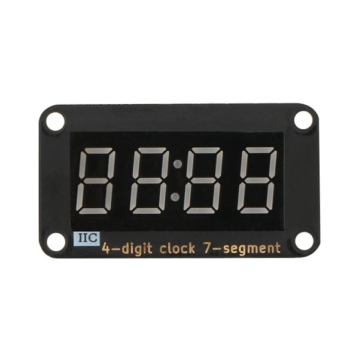
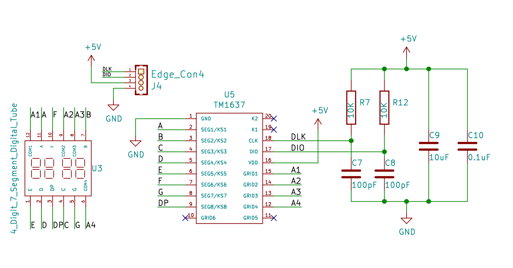
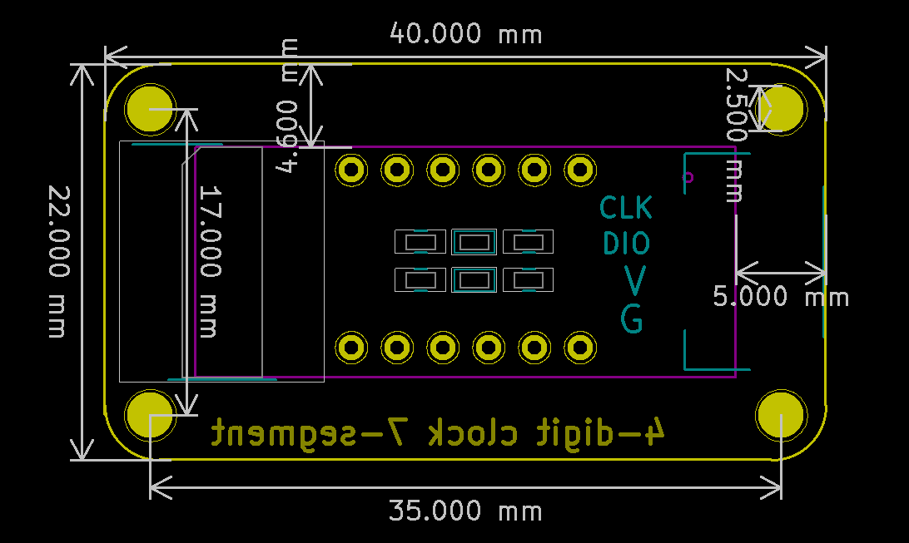

# TM1637时钟数码管显示模块规格书

## 模块图

## 概述

​   4位7段数码管由一个12管脚的4位7段共阳极数码管和一个控制芯片TM1637构成。该模块采用沉金工艺，外观更加美观，同时采用防插反接口，操作更加安全，插口一边有大写字母I表示该模块采用IIC协议通信，另一边是数码管的图标标志。此产品可以应用在时间显示，跑表显示以及其他需要显示数字的设备上。

## 原理图

[点击查看原理图](zh-cn/ph2.0_sensors/displayers/tm1637/TM1637.pdf ':ignore')

## 模块参数

| 引脚名称 | 描述     |
|------|--------|
| G    | GND 地线 |
| V    | 5V电源引脚 |
| DIO  | 数据引脚   |
| CLK  | 时钟引脚   |

* 1.供电电压:5V
* 2.连接方式:4PIN防反接杜邦线
* 3.模块尺寸:4*2.1cm
* 4.安装方式:M3螺钉兼容乐高插孔固定

## 机械尺寸

## Arduino IDE示例代码

<a href="zh-cn/ph2.0_sensors/displayers/tm1637/TM1637Test.zip" download>点击下载Arduino IDE示例程序</a>

## MicroPython示例代码

<a href="zh-cn/ph2.0_sensors/displayers/tm1637/tm1637_esp32_micropython.zip" download>点击下载ESP32 MicroPython示例程序</a>

<a href="zh-cn/ph2.0_sensors/displayers/tm1637/tm1637_microbit_micropython.zip" download>点击下载micro:bit MicroPython示例程序</a>

## micro:bit示例程序

<a href="https://makecode.microbit.org/_C2033f7z7WLL" target="_blank">动手试一试</a>
