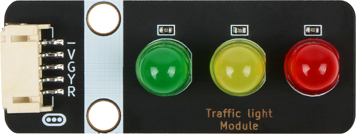
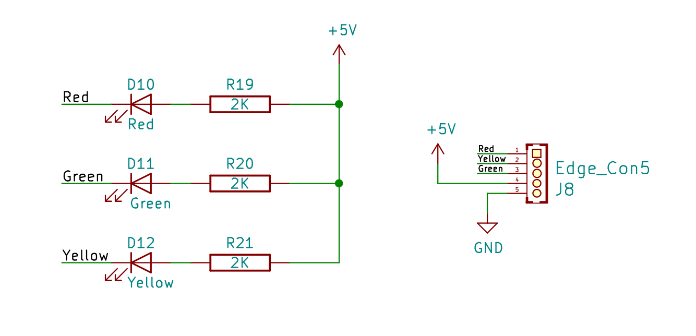
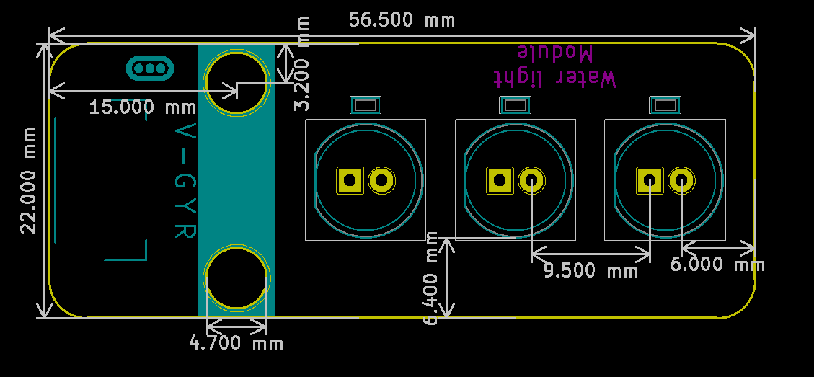

# 红绿交通灯规格书

## 模块图

## 概述

LED是发光二极管的缩写，由混合化合物制成，即镓（Ga），砷（AS），磷（P）。 磷化镓二极管发红光，磷化镓二极管发绿光，碳化硅二极管发黄光。发光二极管的反向击穿电压为5v。 其正伏安特性曲线太陡，模块上板载了限流电阻，以便在使用时控制流过管道的电流。交通灯就是板载了3个不同颜色的LED灯，通过控制对应的引脚就可以控制灯的亮灭。

## 原理图

[点击查看原理图](zh-cn/ph2.0_sensors/displayers/trafficlight_module/红绿交通灯.pdf ':ignore')

## 模块参数

| 引脚名称 | 描述       |
| -------- | ---------- |
| V        | 5V电源引脚 |
| -        | GND 地线   |
| G        | 绿灯引脚   |
| Y        | 黄灯引脚   |
| R        | 红灯引脚   |

## 结构尺寸

## micro:bit示例程序

<a href="https://makecode.microbit.org/_Kt8FkrJfR85T" target="_blank">动手试一试</a>
