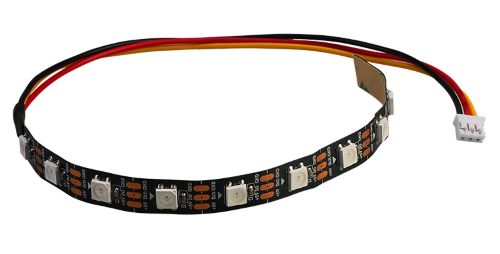
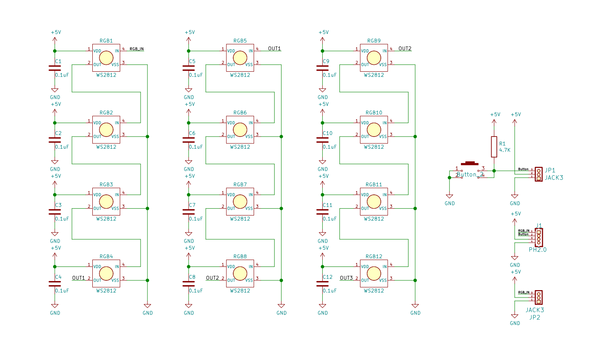

# WS2812B灯环、灯带、灯条规格书

### 12位RGB灯环


### 10位RGB灯带



### 8位RGB灯条


## 概述

​	WS2812B是一个集控制电路与发光电路于一体的智能外控LED光源。其外型与一个5050LED灯珠相同， 每个元件即为一个像素点。像素点内部包含了智能数字接口数据锁存信号整形放大驱动电路， 还包含有高精度的内部振荡器和可编程定电流控制部分，有效保证了像素点光的颜色高度一致。数据协议采用单线归零码的通讯方式，像素点在上电复位以后，DIN端接受从控制器传输过来的数据，首先送过来的24bit数据被第一个像素点提取后，送到像素点内部的数据锁存器，剩余的数据经过内部整形处理电路整形放大后通过DO端口开始转发输出给下一个级联的像素点，每经过一个像素点的传输，信号减少24bit。每一个灯珠信号由IN脚输入，OUT输出连接到下一个灯珠的IN脚。像素点采用自动整形转发技术，使得该像素点的级联个数不受信号传送的限制，仅仅受限信号传输速度要求。LED具有低电压驱动，环保节能，亮度高，散射角度大，一致性好，超低功率，超长寿命等优点。将控制电路集成于上面，电路变得更加简单，体积小，安装更加简便。

<a href="zh-cn/ph2.0_sensors/displayers/ws2812b/WS2812B_datesheet.pdf" target="_blank">详细原理查看ws28128b规格书</a>

## 原理图



<a href="zh-cn/ph2.0_sensors/displayers/ws2812b/rgb_ring_sch.pdf" target="_blank">点击rgb灯环查看原理图</a>

## 模块参数

| 引脚名称 | 描述             |
| -------- | ---------------- |
| V        | 3-5V电源引脚     |
| G        | GND 地线         |
| RGB/DI   | RGB信号输入引脚  |
| B        | 灯环按键信号引脚 |

## 机械尺寸


## Arduino Uno示例

```c++
#include "RGBLed.h"           // 引入RGB灯的库
#define RGB_PIN 6              // 定义Rgb信号引脚
#define RGB_NUM 12             // 设置Rgb灯环 或灯带的灯珠个数

RGBLed m_rgb(RGB_PIN, RGB_NUM);  // 初始化灯带或灯环 将灯带的IN脚接RgbPin引脚
                              // 或者灯环的RGB引脚接RgbPin引脚,12为灯环或灯带的灯珠个数
void setup() {
  m_rgb.setBrightness(50);  // 设置灯珠的亮度
}

void loop() {
  for (int i = 1 - 1; i < RGB_NUM; i++) {  // 通过for循环点亮每一个灯珠
    m_rgb.setColorAt(
        i, 255, 255, 0);  // 设置灯珠的颜色 第一个参数为灯珠的序号 第二个参数为三原色红色R的值 第三个参数为三原色绿色G的值 第二个参数为三原色蓝色B的值
    delay(50);            // 延时50ms点亮下一个灯珠
    m_rgb.show();          // 点亮灯珠
  }
}
```

<a href="zh-cn/ph2.0_sensors/displayers/ws2812b/WS2812B_arduino_demo.zip" download>Arduino uno程序下载</a>

为了方便大家更加清楚驱动WS2812B驱动原理图，我们提供了一个Uno R3精简库，如果主控是其他Arduino mega2560/ESP32/ESP8266等，推荐使用Arduino IDE自带库**Adafruit_NeoPixel**或者**FastLED**

## micro:bit示例

micro:bit ws2812b makecode扩展链接：<https://github.com/microsoft/pxt-neopixel>

 <a href="https://makecode.microbit.org/_ETYcpDRmPdFt" target="_blank">点击查看makecode示例</a>

 [点击查看micro:bit micropython neopixel像素库](http://bbcmicro.86x.net/neopixel.html) 

### ESP32 micropython

esp32 micropython固件已经包含了ws2812b驱动库请见说明： [esp32 micropython neopixel库](http://www.micropython.com.cn/en/latet/library/neopixel.html) 