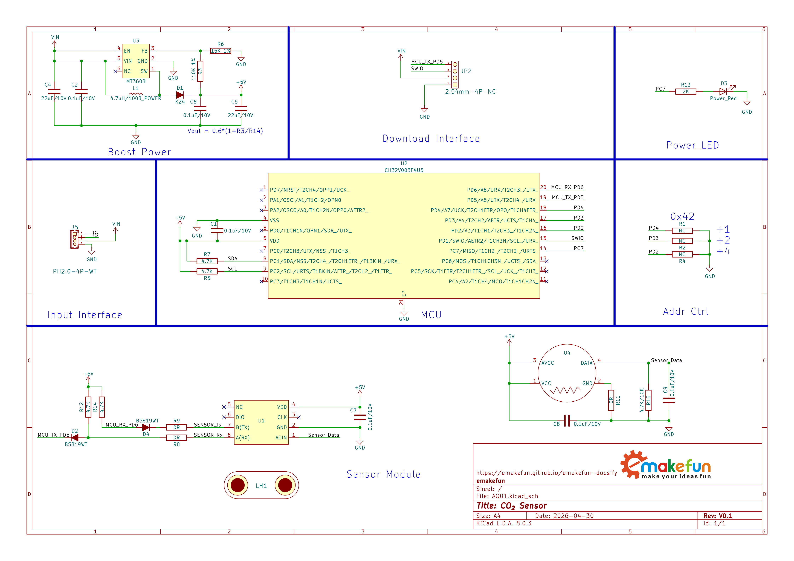
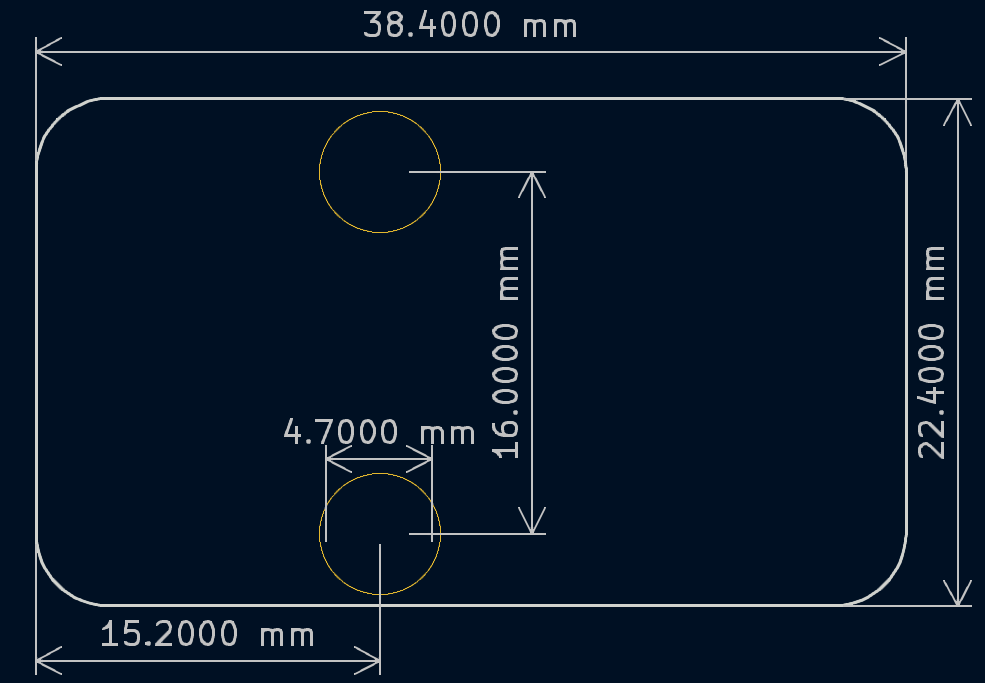
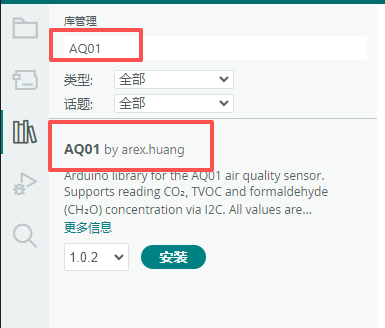
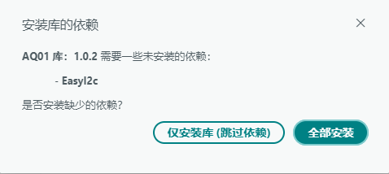

# AQ01空气质量传感器模块

## 实物图

待补充

## 概述

AQ01空气质量传感器是一款采用**金属氧化物半导体（MOS）气敏元件**、可测量**TVOC（总挥发性有机物）**、**CO₂（二氧化碳）**和**HCHO（甲醛）** 的三合一空气质量传感器模块。模块默认I2C地址为**0x42**，并可通过模块背部的地址配置接触点在**0x42**至**0x49**范围内调整I2C地址，极大地扩展了系统的传感器接入能力。模块内置自动校准算法，具有高灵敏度、响应快、成本低等特点，适用于空气净化器、新风系统、带净化功能的空调、多合一空气质量检测仪、烟雾/异味监测等消费类电子配套。

## 原理图

<a href="zh-cn/ph2.0_sensors/sensors/aq01/aq01.pdf" target="_blank">点击此处查看原理图</a>

## 检测的气体

| 检测项目 | 量程范围 | 分辨率 |
| :--- | :--- | :--- |
| TVOC（总挥发性有机物） | 0 ~ 2.000 mg/m³ | 0.001 mg/m³ |
| CO₂（二氧化碳） | 350 ~ 2000 ppm | 1 ppm |
| HCHO（甲醛） | 0 ~ 1.000 mg/m³ | 0.001 mg/m³ |

## 模块参数

- 供电电压：5V

- 工作电流：峰值 80 mA，平均 30 mA

- 工作温度：-10 ~ 40 ℃

- 工作湿度：≤ 95% RH（无凝结）

- 储存温度：-40 ~ +75 ℃

- 性能参数：

  - 数据更新周期：约 1 秒

  - 响应时间：≤ 10 秒

  - 恢复时间：≤ 120 秒
  
  - 预热时间：120 秒，建议首次上电预热 5 ~ 10 分钟

- 通信方式：I2C通信，地址0x42

- 连接方式：PH2.0-4Pin防反接杜邦线

- 模块尺寸：38.4 x 22.4 mm

- 安装方式：M4螺钉兼容乐高插孔固定

| 引脚名称 | 描述 |
| :--- | :--- |
| G | GND |
| 5V | 5V电源输入 |
| SDA | I2C数据引脚 |
| SCL | I2C时钟引脚 |

## 机械尺寸图

## I2C地址调整

模块通过背部的地址配置接触点来调整I2C地址，有三组接触点，每组接触点短接后的I2C地址不同，用于临时设置模块自身的I2C地址。这是一种通过短接相应的接触点才能生效的配置方式。

### 配置方法与地址对应关系

| 短接触点组合 | I2C 地址 | 说明 |
| :--- | :--- | :--- |
| 不短接任何触点 | **0x42 (默认)** | 松开所有触点时的默认地址 |
| 只短接 +1 | 0x43 | 短接+1触点期间有效 |
| 只短接 +2 | 0x44 | 短接+2触点期间有效 |
| 只短接 +4 | 0x46 | 短接+4触点期间有效 |
| 同时短接 +1 和 +2 | 0x45 | 同时短接+1和+2两个触点期间有效 |
| 同时短接 +1 和 +4 | 0x47 | 同时短接+1和+4两个触点期间有效 |
| 同时短接 +2 和 +4 | 0x48 | 同时短接+2和+4两个触点期间有效 |
| 同时短接 +1、+2、+4 | 0x49 | 同时短接三个触点期间有效 |

### 重要特性说明

1. 瞬态配置：地址改变仅在短接触点期间生效。一旦松开，地址立即恢复为默认的0x42。
2. 地址范围：地址仅能在0x42-0x49范围内调整，无法设置为更低地址或更高地址。
3. 短接操作：必须确保短接触点的两个口，I2C地址才会有变化。

### 使用示例

如果您需要让模块使用地址0x43，您需要按照如下说明进行操作：

1. 找到模块背部的 **+1触点**
2. 用工具短接 **+1触点**
3. 在短接期间，模块地址会变为 **0x43**
4. 主机此时可以与地址 **0x43** 进行通信
5. 松开 **+1触点** 后，地址会恢复为**0x42**

## 工作原理

AQ01空气质量传感器采用TVOC类型气敏元件，对不同浓度的有机挥发气体具有不同的响应特性。当环境中TVOC气体浓度发生变化时，传感器的电信号随之改变。模块内部微处理器采集该电信号，结合内置的校准曲线和算法，将电信号转换为对应的TVOC浓度值输出。

本模块TVOC检测的对象包括：氨气、氢气、酒精、一氧化碳、甲烷、甲醛等有机挥发气体，以及香烟、木材、纸张燃烧产生的烟雾和油烟等。

CO₂和甲醛浓度并非直接测量，而是模块微处理器基于TVOC检测结果，通过内置的换算算法计算得到的模拟参考值。

## 自校准说明

在产品使用过程中，由于运输、安装、焊接等操作以及环境温湿度变化可能引发传感器的基线漂移和检测精度降低，故传感器内置自动校准算法对漂移进行修正。模块在上电稳定后自动跟踪环境基线，定期执行零点校准，以维持输出数据的稳定性。

> **提示**：初次上电或模块长期未使用时，建议预热 5 ~ 10 分钟以上，待数据稳定后再进行浓度采集和判定。

## 注意事项

- 初次上电使用建议预热 **5 ~ 10 分钟** 以上进行测试，待数据稳定后再采集。

- 请避免震动和跌落，以及严禁液体流入传感器内部。

- 请勿将该模块应用于涉及人身安全的系统中。

- 请勿将该模块长时间置于高浓度有机气体中，以免传感器灵敏度加速衰减。

- 请勿将模块安装在强空气对流环境下使用。

## Arduino示例程序

### 库程序安装

1. **打开 Arduino IDE 库管理器**

   - 菜单栏：**工具** → **管理库...**
   - 快捷键：`Ctrl+Shift+I`（Windows/Linux）或 `Cmd+Shift+I`（Mac）

2. **搜索并安装**

   - 在搜索框中输入：`AQ01`
   - 找到 AQ01 库
   - **确保在下拉菜单中选择最新版本**
   - 点击 **安装** 按钮

    

    > **📌 注意：** 截图仅供参考。请务必安装最新可用版本。

3. **安装依赖库**

   - 当出现依赖库安装对话框时，选择 **全部安装**

    

> **⚠️ 重要版本说明**  
> 本文档中的截图可能显示较旧版本。**请始终安装以下两者的最新版本**：
>
> - `AQ01` 库
> - `EasyI2C` 依赖库
>
> 如果您跳过了依赖库安装，请手动安装最新版 `EasyI2C`：
>
> 1. 再次打开库管理器
> 2. 搜索 `EasyI2C`
> 3. 在下拉菜单中**选择最新版本**
> 4. 点击安装

### 示例说明

- **示例位置**：在 Arduino IDE 中，通过 **文件** → **示例** → **AQ01** → **aq01** 找到该示例。

- **示例说明**：通过 I2C 读取 AQ01 传感器，每秒输出一次 TVOC、HCHO（甲醛）和CO₂（二氧化碳）浓度值。

## MicroPython 示例程序

### ESP32 MicroPython示例程序

待补充

### micro:bit MicroPython示例程序

待补充

## micro:bit MakeCode示例程序

待补充
