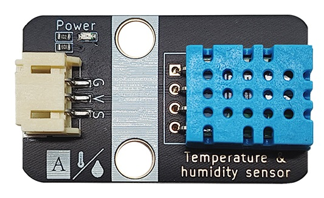
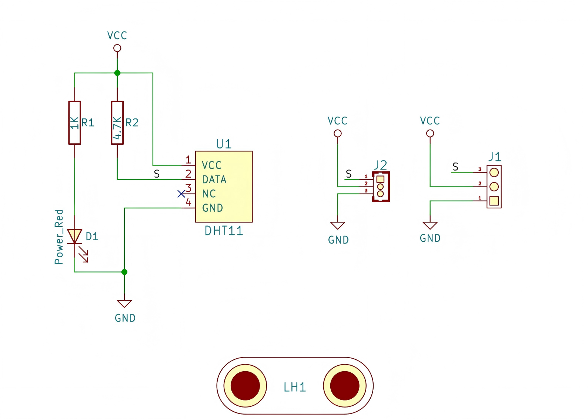
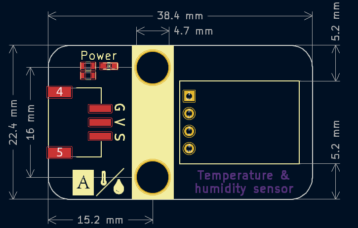
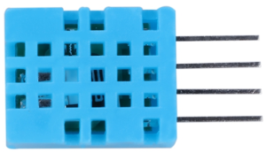

# DHT11温湿度传感器



## 概述

DHT11数字温湿度传感器是一款含有已校准数字信号输出的温湿度复合传感器。它应用专用的数字模块采集技术和温湿度传感技术，确保产品具有极高的可靠性与卓越的长期稳定性。

​传感器包括一个电阻式感湿元件和一个NTC测温元件，并与一个高性能8位单片机相连接。因此该产品具有品质卓越、超快响应、抗干扰能力强、性价比极高等优点。每个DHT11传感器都在极为精确的湿度校验室中进行校准。校准系数以程序的形式储存在OTP内存中，传感器内部在检测信号的处理过程中要调用这些校准系数。单线制串行接口，使系统集成变得简易快捷，超小的体积、极低的功耗，信号传输距离可达20米以上，使其成为各类应用甚至最为苛刻的应用场合的最佳选则，数字量输出，适用于简单的温湿度测量场景。

​单片机与 DHT11之间的通讯和同步，采用单总线数据格式，一次通讯时间4ms左右，数据分小数部分和整数部分，具体格式在下面说明。操作流程如下：

- 一次完整的数据传输为40bit，高位先出。

- 数据格式：8bit湿度整数数据+8bit湿度小数数据+8bit温度整数数据+8bit温度小数数据+8bit校验和数据传送正确时，校验和数据等于 ”湿度高位 + 湿度低位 + 温度高位 + 温度低位“ 所得结果的末8位。

更多原理细节请<a href="zh-cn/ph2.0_sensors/sensors/dht11/dht11_datesheet.pdf" target="_blank">**点击查看DHT11规格书**</a>

## 原理图



<a href="zh-cn/ph2.0_sensors/sensors/dht11/dht11_sch.pdf" target="_blank">点击此处查看原理图</a>

## 模块参数

- 供电电压：3.3~5V

- 连接方式：4pin-PH2.0接口

- 模块尺寸：38.4 x 22.4 mm

- 安装方式：M4螺钉兼容乐高插孔固定

| 引脚名称 | 描述                |
| :------- | :----------------- |
| G        | GND                |
| V        | 3.3~5V电源输入      |
| S        | DATA串行数据，单总线 |

## 机械尺寸图



<a href="zh-cn/ph2.0_sensors/sensors/dht11/dht11_3d.zip" target="_blank">点击下载2D和3D文件</a>

### 传感器参数



- **相对湿度**

  - 分 辨 率：1%RH，12Bit

  - 重 复 性：±1%RH

  - 量程范围：15~95 %RH

  - 精    度：0－50℃为±5%RH

  - 响应时间：1/e(63%)25℃ 6s 1m/s空气 6s

  - 迟    滞：<±0.3%RH

  - 长期稳定性：<±0.5%RH/yr

- **温度**

  - 分 辨 率：0.1℃,12Bit

  - 重 复 性：±2℃

  - 量程范围：-20.0℃~80.0℃

  - 精度：0～60℃ ±1℃

  - 响应时间：1/e(63%)   10S

- **电气特性**
  
  - 供    电：DC 3.3~5.5V

- 供电电流：测量2.5mA  待机 2μA
  
  - 采样周期：大于2秒/次

## Arduino示例程序

<a href="zh-cn/ph2.0_sensors/sensors/dht11/dht11_arduino_demo.zip" download>下载示例程序</a>

```c++
#include "dht11.h"  // 导入 DHT11 库

namespace {
constexpr uint8_t kDht11Pin = 3;  // 定义温湿度传感器引脚

dht11 g_dht;  // 创建 DHT11 对象
}  // namespace

void setup() {
  Serial.begin(115200);  // 设置串口波特率
}

void loop() {
  g_dht.read(kDht11Pin);  // 读取温湿度数据

  Serial.print("Tep: ");
  Serial.print(static_cast<float>(g_dht.temperature));  // 打印温度
  Serial.print("C");
  Serial.print("     Hum: ");
  Serial.print(static_cast<float>(g_dht.humidity));  // 打印湿度
  Serial.println("%");

  delay(200);
}
```

## MicroPython示例程序

### ESP32 MicroPython

<a href="zh-cn/ph2.0_sensors/sensors/temperature_humidity_sensor/dht11_esp32_micropython.zip" download>点击下载ESP32 MicroPython示例程序</a>

### micro:bit MicroPython

<a href="zh-cn/ph2.0_sensors/sensors/temperature_humidity_sensor/dht11_microbit_micropython.zip" download>点击下载micro:bit MicroPython示例程序</a>

## micro:bit MakeCode示例程序

<a href="https://makecode.microbit.org/_YiMV02Ksuc73" target="_blank">动手试一试</a>
