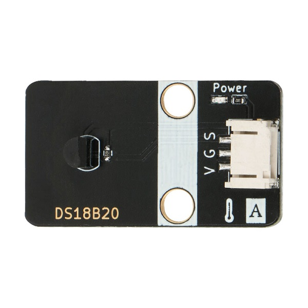
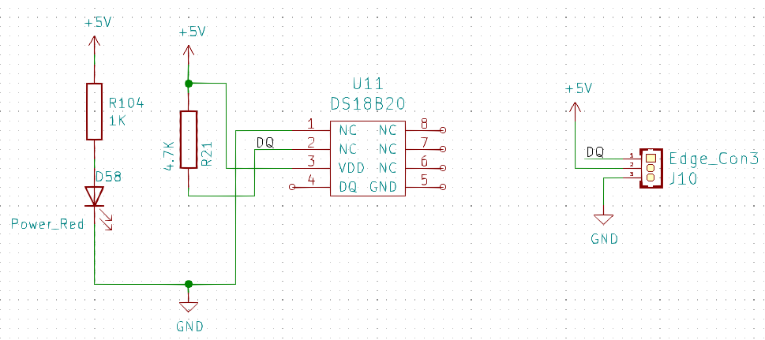
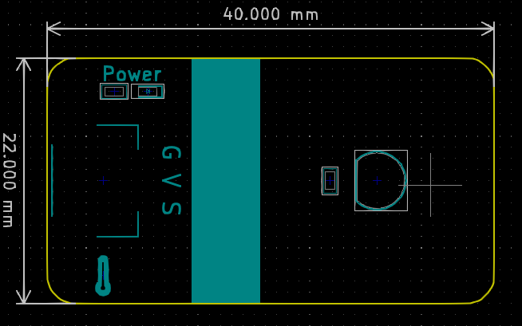

# DS18B20数字温度传感器

## 实物图



## 概述

 DS18B20是常用的数字温度传感器，其输出的是数字信号，具有体积小，硬件开销低，抗干扰能力强，精度高的特点。 DS18B20数字温度传感器接线方便，  封装后的DS18B20可用于电缆沟测温，高炉水循环测温，锅炉测温，机房测温，农业大棚测温，洁净室测温，弹药库测温等各种非极限温度场合。耐磨耐碰，体积小，使用方便，封装形式多样，适用于各种狭小空间设备数字测温和控制领域。

## 原理图



<a href="zh-cn/ph2.0_sensors/sensors/ds18b20_sensor/ds18b20_sensor_schematic.pdf" target="_blank">点击此处查看原理图</a>

## 模块参数

| 引脚名称| 描述 |
|---- |----|
| V | 5V电源引脚 |
| G | GND 地线 |
| S | 信号引脚 |

- 供电电压:5V
- 连接方式:3PIN防反接杜邦线
- 模块尺寸:4*2.1cm
- 安装方式:M134螺钉兼容乐高插孔固定模块尺寸

## 机械尺寸图



### Arduino示例程序

<a href="zh-cn/ph2.0_sensors/sensors/ds18b20_sensor/ds18b20_sensor.rar" download>下载示例程序</a>

```c++
#include "DallasTemperature.h"
#include "OneWire.h"

#define ONE_WIRE_BUS 4

OneWire one_wire(ONE_WIRE_BUS);
DallasTemperature sensors(&one_wire);

void setup() {
  Serial.begin(9600);
  sensors.begin();
}

void loop(void) {
  sensors.requestTemperatures();
  Serial.print("The temperature is:");
  Serial.print(sensors.getTempCByIndex(0));
  Serial.println("℃");
  delay(200);
}
```

## MicroPython示例程序

### ESP32 MicroPython示例程序

<a href="zh-cn/ph2.0_sensors/sensors/ds18b20_sensor/ds18b20_esp32_micropython.zip" download>下载示例程序</a>

## micro:bit MakeCode 示例程序

<a href="https://makecode.microbit.org/S67450-72708-82945-37048" target="_blank">动手试一试</a>
