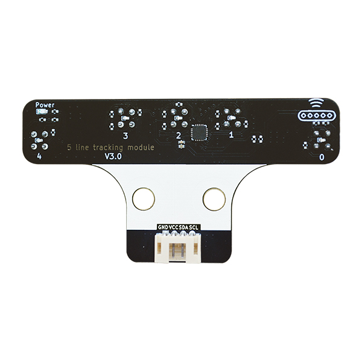
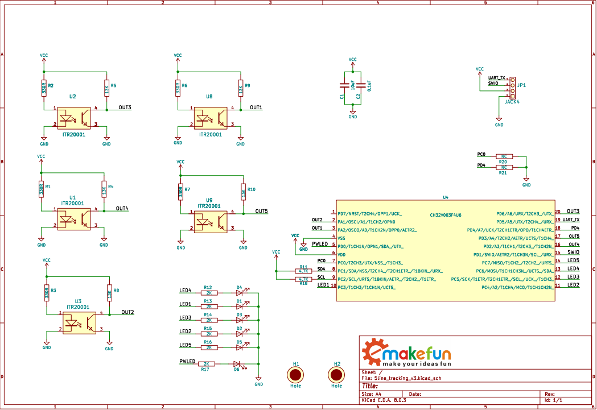
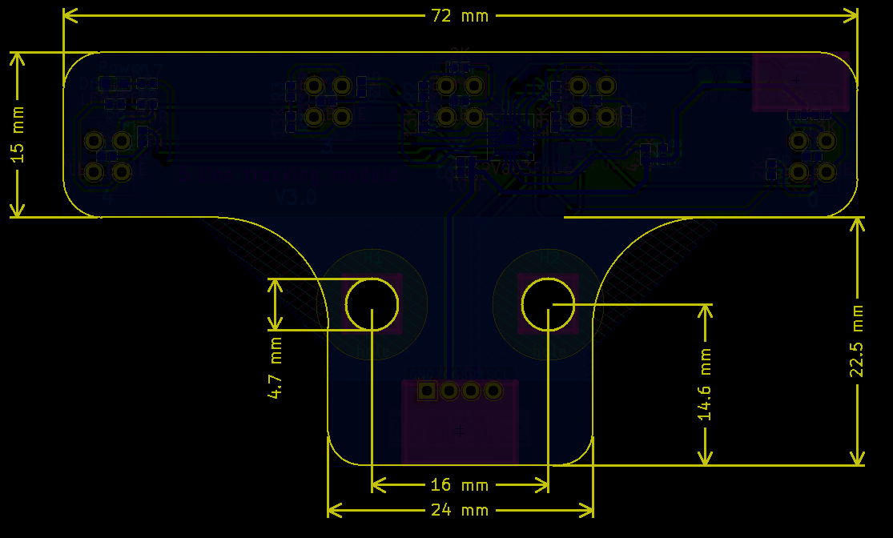
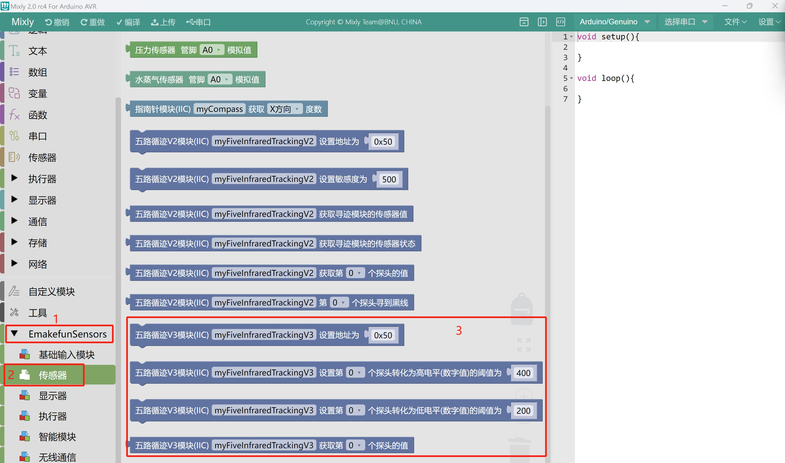

# 五路红外循迹模块V3.0

## 实物图

## 概述

五路红外循迹模块是智能机器人导航的核心传感器组件，采用五组红外对管阵列式排布，通过检测地面反射光强度差异实现路径识别。各探头独立输出数字/模拟信号，可精准判断黑线偏离方向及角度，具有高灵敏度、快速响应和抗干扰特性。模块支持实时反馈轨道位置信息，配合PID算法可优化运动控制精度，广泛应用于智能车竞赛、工业AGV及教育机器人领域，为自动化导航提供可靠的轨迹追踪解决方案。

## 原理图

<a href="zh-cn/ph2.0_sensors/sensors/five_line_tracker_v3/5line_tracking_v3.pdf" target="_blank">点击此处查看原理图</a>

## 尺寸图

## 产品参数

- 工作电压：3~5V
- 通信方式：IIC
- 接口类型：PH2.0-4Pin (G V SDA SCL)
- 检测高度：0.5cm ~ 4 cm
- 输出值：模拟值和数字值

## 引脚定义

| 引脚名称 | 描述       |
| ---- | -------- |
| V    | 3~5V电源引脚 |
| G    | GND 地线   |
| SDA  | IIC数据引脚  |
| SCL  | IIC时钟引脚  |

## 使用说明

循迹模块中可读取每个光敏探头的接收模拟值和数字值。每个探头设有高阈值和低阈值。当模拟值高于高阈值时，数字值为 0；当模拟值低于低阈值时，数字值为 1。若模拟值处于高阈值与低阈值之间，则数字值不会发生变化。换言之，模拟值增大时，需高于高阈值，数字值才会变为 0；模拟值减小时，需低于低阈值，数字值才会变为 1，从而达到延迟反向的效果。

高低阈值可以由用户根据实际场景自行设置。若用户未设置，则会采用出厂固件中的默认值。建议先将模块安装在小车上，使探头离地约 1CM。然后，将车放在线上，让所有探头能够检测到线，此时使用程序读取出模拟值并计算平均值，记为`X`。接着，把车放离线上，使所有探头能检测到非线地面，再次使用程序读取出模拟值并计算平均值，记为`Y`。高阈值可设置为`(X - Y) * 2 / 3 + Y`，低阈值设置为`(X - Y) / 3 + Y`。

如何设置阈值和如何读取数字值模拟值请参考后面使用章节

## Arduino(C/C++)示例代码

### Arduino库和示例代码

<a href="zh-cn/ph2.0_sensors/sensors/five_line_tracker_v3/emakefun_five_line_tracker_v3.zip" download>点击这里下载Arduino库和示例代码</a>

## MicroPython示例代码

### ESP32 MicroPython示例程序

<a href="zh-cn/ph2.0_sensors/sensors/five_line_tracker_v3/five_line_tracker_v3_esp32_micropython.zip" download>点击此处下载ESP32MicroPython示例代码</a>

### micro:bit MicroPython示例程序

<a href="zh-cn/ph2.0_sensors/sensors/five_line_tracker_v3/five_line_tracker_v3_microbit_micropython.zip" download>点击此处下载micro:bitMicroPython示例程序</a>

## Mixly图形化块

<a href="zh-cn/ph2.0_sensors/sensors/five_line_tracker_v3/mixly_get_analog.zip" download>点击下载米思齐五路循迹V3.0获取模拟值示例程序</a>

<a href="zh-cn/ph2.0_sensors/sensors/five_line_tracker_v3/mixly_get_digital.zip" download>点击下载米思齐五路循迹V3.0获取数字值示例程序</a>

## Mind+图形化

<a href="zh-cn/ph2.0_sensors/sensors/five_line_tracker_v3/mindplus_example.zip" download>点击下载Mind+五路循迹V3.0用户库以及示例程序</a>

## micro:bit MakeCode示例程序

Makecode扩展链接：https://github.com/emakefun-makecode-extensions/emakefun_five_line_tracker

<a href="https://github.com/emakefun-makecode-extensions/emakefun_five_line_tracker" target="_blank">点击查看用户库</a>

<a href="https://makecode.microbit.org/_8PsgrehRXdtY" target="_blank">点击查看示例程序</a>

