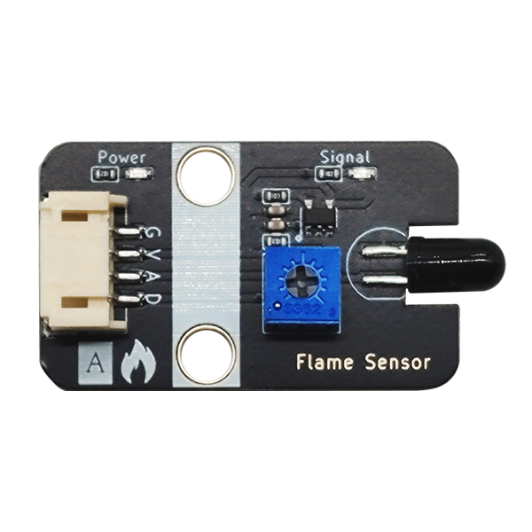
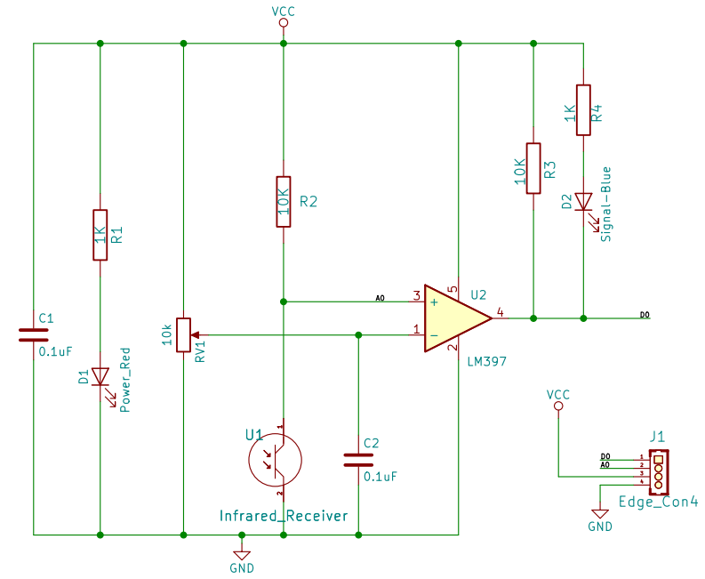

# 火焰传感器

## 实物图



## 概述

 在公共场所，比如酒店，建筑物和其他地方都配备了火灾报警器，那么它如何感知火灾？ 众所周知，当火灾爆发时，会有特别强烈的红外线，该设备可以通过红外线探测火灾。
​		火焰传感器是机器人专门用来搜寻火源的传感器，当然火焰传感器也可以用来检测光线的亮度，只是本传感器对火焰特别灵敏。火焰传感器利用红外线对对火焰非常敏感的特点，使用特制的红外线接受管来检测火焰，然后把火焰的亮度转化为高低变化的电平信号，输入到中央处理器中，中央处理器根据信号的变化做出相应的程序处理。

## 原理图

 [查看原理图](zh-cn/ph2.0_sensors/sensors/flame_sensor/flame_sensor_schematic.pdf ':ignore') 




## 模块参数

| 引脚名称 |     描述     |
| :------: | :----------: |
|    G     |     GND      |
|    V     |     VCC      |
|    A     | 模拟信号引脚 |
|    D     | 数字信号引脚 |

- 供电电压:3V3/5V

- 连接方式:4PIN防反接杜邦线

- 模块尺寸:40 x 22.5 mm

- 安装方式:M4螺钉兼容乐高插孔固定

## 机械尺寸图


## Arduino示例程序

[下载示例程序](zh-cn/ph2.0_sensors/sensors/flame_sensor/flame_sensor.rar) 

```c
#include "Buzzer.h"

#define FlamelDigitalPin  7//定义火焰传感器数字引脚
#define FlamelAnalogPin   A0//定义火焰传感器模拟引脚
#define BuzzerPin A3//定义无源蜂鸣器块引脚

Buzzer buzzer(BuzzerPin) ;
int  FlamelAnalogValue = 0 ;//定义数字变量,读取火焰模拟值
int  FlamelDigitalValue = 0 ;//定义数字变量,读取火焰数字值
void setup()
{
  Serial.begin(9600);//设置串口波特率
  pinMode(FlamelDigitalPin, INPUT);//设置火焰传感器数字引脚为输入
  pinMode(FlamelAnalogPin, INPUT);//设置火焰传感器模拟引脚为输入
  pinMode(BuzzerPin, OUTPUT);//设置无源蜂鸣器模块引脚为输出
}
void loop()
{
  buzzer.noTone();//蜂鸣器停止
  FlamelAnalogValue = analogRead(FlamelAnalogPin);//读取火焰传感器模拟值
  FlamelDigitalValue = digitalRead(FlamelDigitalPin);//读取火焰传感器数字值
  Serial.print("FlamelAnalog Data:  ");
  Serial.print(FlamelAnalogValue);//打印火焰传感器模拟值
  Serial.print("FlamelDigital Data:  ");
  Serial.println(FlamelDigitalValue);//打印火焰传感器数字值
  if (FlamelDigitalValue == 0) {//判断火焰传感器是否检测到火焰  检测到火焰  蜂鸣器报警 
     for(int i = 200; i <= 800; i++)
     {
       buzzer.tone(i, 10);
     }
     for(int i= 800; i >= 200; i--)
     {
        buzzer.tone(i, 10);
     }
  }
  delay(200);
}
```

## Micropython示例程序

### Esp32 Micropython示例程序

```python
from machine import ADC,Pin
import time

AnalogPin = 15  # 定义火焰传感器模拟接口引脚
DigitalPin = 14  # 定义火焰传感器数字接口引脚

p1 = ADC(AnalogPin)
p2 = Pin(DigitalPin, Pin.IN)  
buzzer_pin = Pin(2, Pin.OUT)  # 定义蜂鸣器引脚

def alarm():
    for i in range(100):
        # 设置频率声音
        buzzer_pin.on()
        time.sleep_ms(1)
        buzzer_pin.off()
        time.sleep_ms(1)
        
while True:
    AnalogValue = p1.read_u16()  # 读取火焰传感器模拟值
    print("Analog Data:", AnalogValue)  # 打印火焰传感器模拟值
    print("Digital Data:", p2.value())  # 打印火焰传感器数字值
    if p2.value() == 0:
        alarm()# 如果火焰传感器值为高电平则调用警报函数
    else:
        buzzer_pin.off() # 如果火焰传感器值为高电平则蜂鸣器输出低电平
    time.sleep_ms(200)


```

### micro:bit示例程序

```python
from microbit import *

AnalogPin = pin1  # 定义火焰传感器模拟接口引脚
DigitalPin = pin0  # 定义火焰传感器数字接口引脚

buzzer_pin = pin2  # # 定义蜂鸣器引脚

def alarm():
    for i in range(100):
        # 设置频率声音
        buzzer_pin.write_digital(1)
        sleep(1)
        buzzer_pin.write_digital(0)
        sleep(1)

while True:
    AnalogValue = AnalogPin.read_analog()  # 读取火焰传感器模拟值
    print("Analog Data:", AnalogValue)  # 打印火焰传感器模拟值
    print("Digital Data:", DigitalPin.read_digital())  # 打印火焰传感器数字值
    if DigitalPin.read_digital() == 0:
        alarm()  # 如果火焰传感器值为低电平则调用警报函数
    else:
        buzzer_pin.write_digital(0)  # 如果火焰传感器值为高电平则蜂鸣器输出低电平
    sleep(0.2)
```

## Makecode示例程序

<a href="https://makecode.microbit.org/_gmPdAJ7CX6zX" target="_blank">动手试一试</a>

