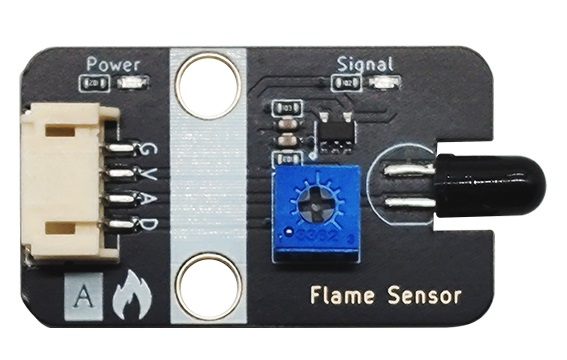
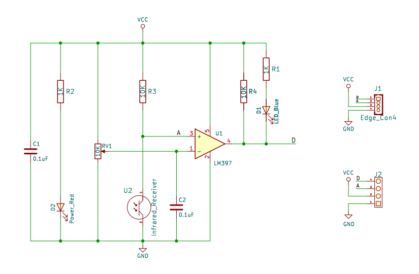
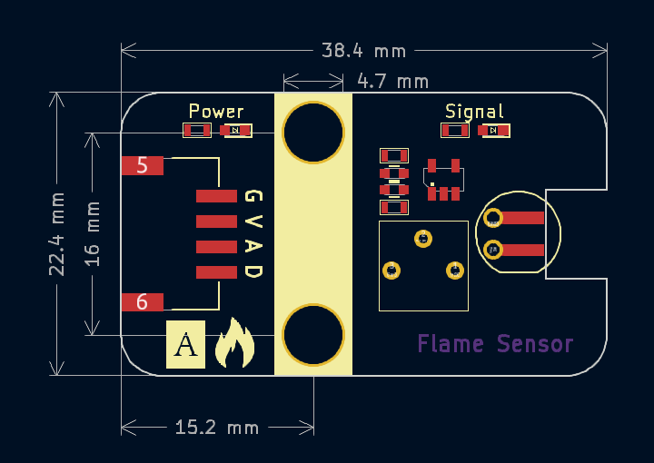

# 火焰传感器（红外线接收传感器）




## 概述

​	在公共场所，比如酒店，建筑物和其他地方都配备了火灾报警器，那么它是如何感知火灾？ 众所周知，当火灾爆发时，会有发散出特别强烈的红外线，火焰传感器利用红外线对对火焰非常敏感的特点，使用特制的红外线接受管来检测火焰，火焰传感器就是通过感知红外线强弱来判断火情的。
​	
​	本火焰传感器用的探头实际是红外线接收传感器，又称红外接收二极管， 一种用于接收红外光信号并将其转换为电信号的半导体器件。 工作原理基于光电效应：红外接收二极管的核心是一PN结。工作时需施加反向电压，当无红外光照射时，仅有极小的反向漏电流（暗电流）；当特定波长（通常940n）的红外光照射到PN结时，光子能量激发半导体产生电子-空穴对（光生载流子），在反向电压作用下形成随光强变化光电流，从而实现光电转换  。
​	
​	火焰传感器把火焰发射红外线亮度转化为模拟电压信号，通过板子上的电压比较器，当火焰红外线强度足够时，变压比较器输出低电平信号。板子上的蓝色信号灯亮起。

## 原理图



## 模块参数

| 引脚名称 |     描述     |
| :------: | :----------: |
|    G     |     GND      |
|    V     |    3 ~ 5V    |
|    A     | 模拟信号引脚 |
|    D     | 数字信号引脚 |

- 供电电压：3 ~ 5V
- 连接方式：4pin-PH2.0接口
- 模块尺寸：38.4 x 22.4 mm
- 安装方式：M4螺钉兼容乐高插孔
- 检测距离：20cm

## 机械尺寸图



<a href="zh-cn/ph2.0_sensors/sensors/flame_sensor/flame_sensor_3d.zip" download>下载2D和3D文件</a>

## Arduino示例程序

```c
#define FLAMEL_DIGITAL_PIN 7  // 定义火焰传感器数字引脚
#define FLAMEL_ANALOG_PIN A0  // 定义火焰传感器模拟引脚

int flamel_analog_value = 0;   // 定义数字变量,读取火焰模拟值
int flamel_digital_value = 0;  // 定义数字变量,读取火焰数字值

void setup() {
  Serial.begin(9600);                // 设置串口波特率
  pinMode(FLAMEL_DIGITAL_PIN, INPUT);  // 设置火焰传感器数字引脚为输入
  pinMode(FLAMEL_ANALOG_PIN, INPUT);   // 设置火焰传感器模拟引脚为输入
}

void loop() {
  flamel_analog_value = analogRead(FLAMEL_ANALOG_PIN);     // 读取火焰传感器模拟值
  flamel_digital_value = digitalRead(FLAMEL_DIGITAL_PIN);  // 读取火焰传感器数字值
  Serial.print("FlamelAnalog Data:  ");
  Serial.print(flamel_analog_value);  // 打印火焰传感器模拟值
  Serial.print("FlamelDigital Data:  ");
  Serial.println(flamel_digital_value);  // 打印火焰传感器数字值
  delay(200);
}
```

## MakeCode示例程序

<a href="https://makecode.microbit.org/_FoqM4TLuUdzW" target="_blank">动手试一试</a>
