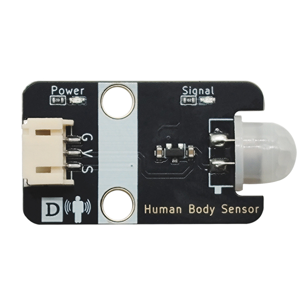
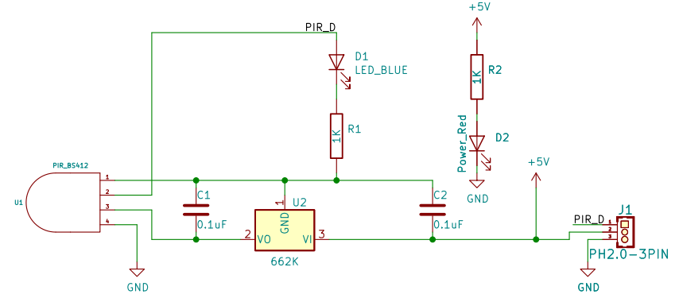
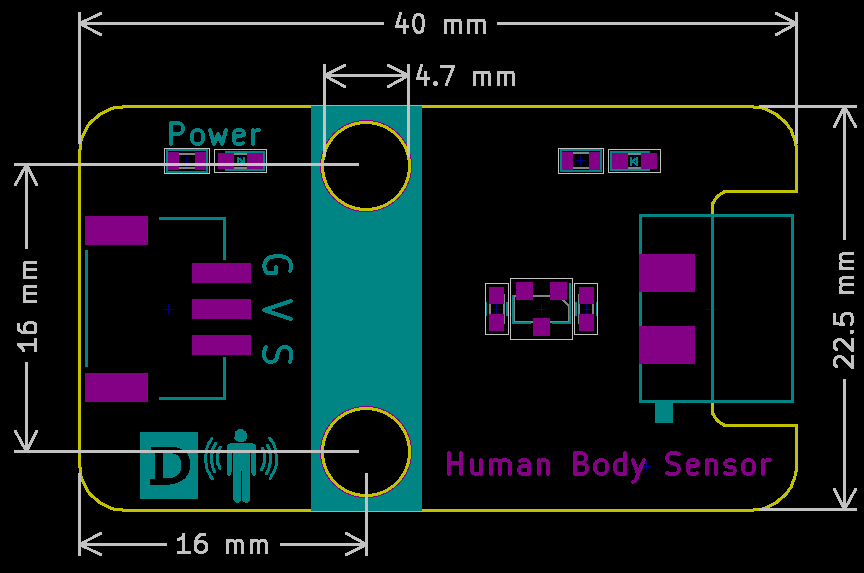
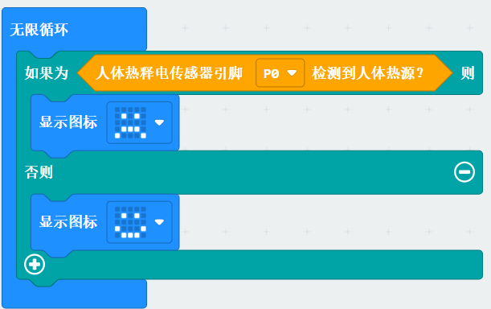

# 人体热释电传感器

## 实物图



## 概述

人体感应模块是基于红外线技术的自动控制产品,灵敏度高，可靠性强，超小体积，超低电压工作模式。广泛应用于各类自动感应电器设备,尤其是干电池供电的自动控制产品。全自动感应，人进入其感应范围则输出高电平，人离开感应范围则自动延时关闭高电平，输出低电平。可重复触发方式：即感应输出高电平后，在延时时间段内，如果有人体在其感应范围活动，其输出将一直保持高电平，直到人离开后才延时将高电平变为低电平，感应模块检测到人体的每一次活动后会自动顺延一个延时时间段（5S），并且以最后一次活动的时间为延时时间的起始点。

## 原理图

 [查看原理图](zh-cn\ph2.0_sensors\sensors\human_body_sensor\human_body_sensor_schematic.pdf ':ignore')




## 模块参数

| 引脚名称 |                         描述                          |
| :------: | :---------------------------------------------------: |
|    G     |                          GND                          |
|    V     |                          5V                           |
|    S     | 当前方有人时输出高电平，<br/>当前方没有人时输出低电平 |

- 供电电压:5V
- 连接方式:3PIN防反接杜邦线
- 模块尺寸:40 x 22.5 mm
- 安装方式:M4螺钉兼容乐高插孔固定

## 机械尺寸图



## Arduino示例程序

[下载示例程序](zh-cn\ph2.0_sensors\sensors\human_body_sensor\human_body_sensor.zip ':ignore') 

```c
void setup()
{
    Serial.begin(9600); 
	pinMode(A3, INPUT); 
	pinMode(3, OUTPUT); 
}

void loop()
{
    if (digitalRead(A3) == 1)   
    {  
        digitalWrite(3, HIGH);  
    } else {
        digitalWrite(3, LOW); 
    }
}
```

## Micropython示例程序

### Esp32 Micropython示例程序

```python
from machine import ADC,Pin
import time

DigitalPin = 2  # 定义人体热释电传感器模拟值引脚

p2 = Pin(DigitalPin, Pin.IN)
P4 = Pin(4, Pin.OUT)

while True:
    if p2.value() == 1:
        P4.on()	# 如果人体热释电传感器值为高电平则执行此处,LED引脚为高电平
    else:
        P4.off() # 如果人体热释电传感器值为低电平则执行此处,LED引脚为高电平
```

### micro:bit示例程序

```python
from microbit import *

while True:
    p = pin8.read_digital() # 读取传感器数字值
    if p == 1:
        print("human detected")
    else:
        print("no human detected")
    sleep(1000)
```

## Makecode示例程序

<a href="https://makecode.microbit.org/_C6J5cuMMF8FU" target="_blank">动手试一试</a>

